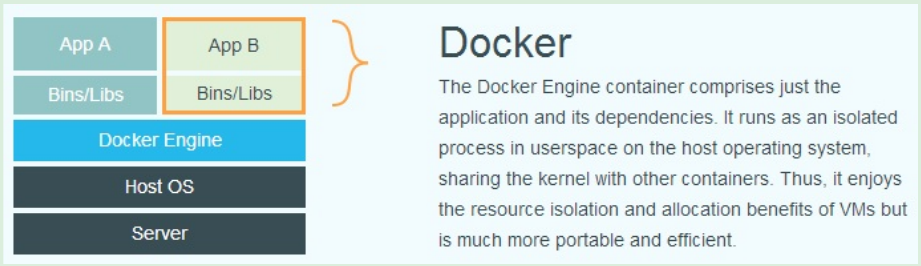

# Docker
Docker 技术比虚拟机技术更为轻便、快捷。
传统虚拟机技术是虚拟出一套硬件后，在其上运行一个完整的操作系统，在该系统上再运行所需用的应用进程；
而容器(container)内的应用进程直接运行于宿主的内核，容器内没有自己的内核，而且也没有进行硬件虚拟。
因此容器(container)比传统虚拟机更为轻便。

| Virtual Machine v.s. Docker               |
|:-----------------------------------------:|
|  |  
|             |

# 1. 基本概念
## 镜像(Image)
## 容器(Container)
## 仓库(Repository)


# 2. 使用镜像
## 2.1 获取镜像
Docker 运行容器前需要本地存在对应的镜像，如果本地不存在该镜像, Docker 会从镜像仓库下载该镜像。
`Docker Hub` 上有大量的高质量的 Image 可以用。从 Repository 获取 Image 的命令是 `docker pull`，其命令格式为：
```bash
$ docker pull [OPTIONS] NAME[:TAG|@DIGEST]  # From my docker
$ docker pull [选项] [Docker Registry	地址[:端口号]/]仓库名[:标签]

$ docker pull ubuntu:18.04
```
上面的命令中没有给出 Docker 镜像仓库地址,因此将会从 `Docker	Hub` 获取镜像。而镜像名称是
`ubuntu:18.04` ,因此将会获取官方镜像 `library/ubuntu` 仓库中标签为 18.04 的镜像。

有了 Image 之后，我们就能够以这个 Image 为基础启动一个 Container。例如，如果我们打算启动 Container 里的 `bash` 并且进行交互式的操作的话：
```bash
$ docker run -it --rm ubuntu:18.04 bash
```

`cat /etc/os-release`，Linux 常用的查看当前系统版本的命令。

## 2.2 列出镜像
想要列出已经下载的镜像，可以使用 `docker image ls` 命令。

### 镜像体积

### 需悬镜像
一般来说，虚悬镜像已经失去了存在的价值，是可以随意删除的，可以用下面命令删除：
```bash
$ docker image prune
```

### 中间层镜像
为了加速镜像构建、重复利用资源，Docker 会利用中间层镜像。
```bash
$ docker image ls -a
```
此时会看到很多无标签的镜像，与之前的虚悬镜像不行哦那个，这些无标签的镜像很多都是中间层，是其他镜像所依赖的镜像。这些无标签镜像不能被删除，否则会导致上层镜像因失去依赖丢失而出错。

### 列出部分镜像
不加任何参数时，`docker image ls` 会列出所有顶层镜像。
* 根据仓库名列出镜像：`docker image ls ubuntu`
* 列出特定的某个镜像，也就是仓库名和标签：`docker image ls ubuntu:18.04`
* 设置过滤器参数 `--filter` 或者 `-f`
```bash
$ docker image ls -f since=mongo:3.2
```

### 以特定格式显示

## 2.3 删除本地镜像
```bash
$ docker image rm [OPTIONS] IMAGE [IMAGE...]
```


# 3. 操作容器
简单的说，容器是独立运行的一个或一组应用，以及它们的运行态环境。

## 3.1 启动容器
启动容器有两种方式：
* 基于 Image 新建一个 Container 并启动
* 将在终止状态(stopped)的容器重新启动

### 新建并启动
所需命令 `docker run`
```bash
$ docker run ubuntu:18.04 /bin/echo 'Hello World'
$ docker run -it ubuntu:18.04 /bin/bash
```

1. 新建容器   
当使用 `docker run` 来创建 Container 的时候，Docker 在后台运行的标准操作包括：   
  * 检查本地是否存在指定的镜像,不存在就从公有仓库下载
  * 利用镜像创建并启动一个容器
  * 分配一个文件系统,并在只读的镜像层外面挂载一层可读写层
  * 从宿主主机配置的网桥接口中桥接一个虚拟接口到容器中去
  * 从地址池配置一个	ip	地址给容器
  * 执行用户指定的应用程序
  * 执行完毕后容器被终止

2. 启动已终止容器    
可以使用 `docker container start` 命令，直接将一个已经终止的容器启动运行。


## 3.2 守护态运行   
更多的时候,需要让	Docker 在后台运行而不是直接把执行命令的结果输出在当前宿主机下。此时,可以通过添加 `-d` 参数来实现。
```bash
$ docker run ubuntu:18.04 /bin/sh -c "while true; do echo hello world; sleep 1; done"
# 容器会把输出的结果(STDOUT)打印到宿主机上面
$ docker run -d ubuntu:18.04 /bin/sh -c "while true; do echo hello world; sleep 1; done"
$ docker logs [OPTIONS] CONTAINER
```

## 3.3 终止
可以使用 `docker container stop` 来终止一个运行中的容器。
此外,当 Docker 容器中指定的应用终结时,容器也自动终止。
用户通过 `exit` 命令或 `Ctrl+d` 来退出终端时,所创建的容器立刻终止。

终止状态的容器可以用 `docker container ls	-a` 命令看到。处于终止状态的容器,可以通过 `docker	container	start` 命令来重新启动。
此外, `docker	container	restart` 命令会将一个运行态的容器终止,然后再重新启动它。


## 3.4 进入容器
在使用 `-d` 参数时,容器启动后会进入后台。某些时候需要进入容器进行操作,包括使用 `docker	attach` 命令或	`docker exec` 命令,推荐大家使用 `docker	exec` 命令。

1. `attach` 命令  
注意：如果从这个 STDIN 中 `exit`，会导致容器的停止。

2. `exec` 命令  
`-i -t` 参数：`docker exec` 后边可以跟多个参数，这里主要说明 `-i -t` 参数。   
只用 `-i` 参数时，由于没有分配伪终端，界面没有我们熟悉的	Linux	命令提示符,但命令执行结果仍然可以返回。    
当 `-it` 参数一起使用时，则可以看到我们熟悉的 Linux 命令提示符。

如果从这个	stdin	中	`exit`，不会导致容器的停止。这就是为什么推荐大家使用 `docker	exec` 的原因。


## 3.5 导出和导入
`docker export` 和 `docker import`

## 3.6 删除
可以使用 `docker container rm` 来删除一个处于终止状态的容器。

清理所有处于终止状态的容器：用 `docker container ls -a` 命令可以查看所有已经创建的、包括终止状态的容器，如果数量太多要一个个删除会很麻烦，用下面的命令可以清理掉所有处于终止状态的容器。
```bash
$ docker container prune
```
