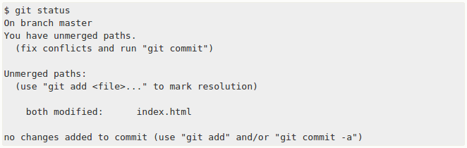

# 3. Git 分支
几乎所有的版本控制系统都以某种形式支持分支。 使用分支意味着你可以把你的工作从开发主线上分离开来，以免影响开发主线。
Git 处理分支的方式可谓是难以置信的轻量，创建新分支这一操作几乎能在瞬间完成，并且在不同分支之间的切换操作也是一样便捷。 与许多其它版本控制系统不同，Git 鼓励在工作流程中频繁地使用分支与合并，哪怕一天之内进行许多次。 理解和精通这一特性，你便会意识到 Git 是如此的强大而又独特，并且从此真正改变你的开发方式。

## 3.1 分支简介
 Git 保存的不是文件的变化或者差异，而是一系列不同时刻的**快照**。

 在进行提交操作时，Git 会保存一个**提交对象（commit object）**。该提交对象会包含一个指向暂存内容快照的指针。 但不仅仅是这样，该**提交对象**还包含了作者的姓名和邮箱、提交时输入的信息以及指向它的父对象的指针。首次提交产生的提交对象没有父对象，普通提交操作产生的提交对象有一个父对象， 而由多个分支合并产生的提交对象有多个父对象。

 
 Git 的分支，其实本质上仅仅是指向提交对象的可变指针。Git 的默认分支名字是 `master`。 在多次提交操作之后，你其实已经有一个指向最后那个提交对象的 `master` 分支。 `master` 分支会在每次提交时自动向前移动。


 ### 3.1.1. 分支创建
 Git 如何创建分支？ ==> 使用`git branch`创建一个可以移动的指针。
 ```bash
 $ git branch testing
 $ git branch -b testing  # 创建+切换
 ```
 Git 如何知道当前在哪一个分支上呢？它有一个名为`HEAD`的特殊指针。`git branch`命令仅仅**创建**一个分支，并不会自动切换到新的分支中。
 

 你可以简单地使用 `git log` 命令查看各个分支当前所指的对象。 提供这一功能的参数是 ``--decorate`。
 ```bash
$ git log --oneline --decorate
 ```


### 3.1.2. 分支切换
要使用`git checkout`命令。
```bash
$ git checkout <branch-name>
```

**Note:** 分支切换会改变你工作目录中的文件。
在切换分支时，一定要注意你工作目录里的文件会被改变。如果是切换到一个较旧的分支，你的工作目录会恢复到该分支最后一次提交时的样子。如果 Git 不能干净利落地完成这个任务，它将禁止切换分支。

你可以简单地使用 `git log` 命令查看分叉历史。 运行 `git log --oneline --decorate --graph --all` ，它会输出你的提交历史、各个分支的指向以及项目的分支分叉情况。


## 3.2. 分支的新建与合并
### 3.2.1. 新建分支
想要新建一个分支并同时切换到那个分支上，你可以运行一个带有 `-b` 参数的 `git checkout` 命令：
```bash
$ git checkout -b iss53
Switched to a new branch "iss53"

$ git branch -d hotfix
Deleted branch hotfix (3a0874c).
```

当完成运行测试，确保修改是正确的，然后将 `hotfix` 分支合并回你的 `master` 分支来部署到线上。 你可以使用 `git merge` 命令来达到上述目的：

合并后的效果即是将`master`移动到`hotfix`上


### 3.2.2 分支的合并
简单的合并可以分为两步，从当前修改的分支checkout到 `master` 分支，然后执行 `git merge <branch-name>` 进行合并。
```bash
$ git checkout master
Switched to branch 'master'
$ git merge iss53
Merge made by the 'recursive' strategy.
index.html |    1 +
1 file changed, 1 insertion(+)
```

如果当前分支和 `master` 分支之间存在分叉，又该如何合并呢？ Git 会找到两个分支的共同祖先，执行简单的三方合并。
合并前如下：

合并后的效果如下：

合并完成后，即和删除没有用的分支了： `git branch -d iss53`


### 3.2.3 遇到冲突时的分支合并
有时候合并操作不会如此顺利。**如果你在两个不同的分支中，对同一个文件的同一个部分进行了不同的修改，Git 就没法干净的合并它们。**

虽然 Git 做了合并，但是没有自动地创建一个新的合并提交。 Git 会暂停下来，等待你去解决合并产生的冲突。 你可以在合并冲突后的任意时刻使用 `git status` 命令来查看那些因包含合并冲突而处于未合并（unmerged）状态的文件：

出现冲突的文件会如下图所示，`=======` 的上下两个半部分分别属于不同的分支，用户需要自己决定保留哪一个，删掉哪一个。

