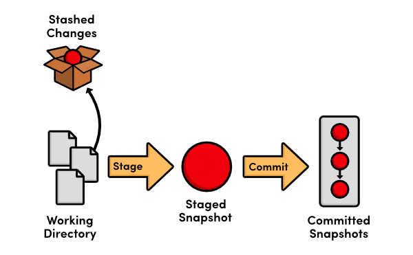

## git checkout
`git checkout`命令有多种用途.
```shell
# 1. 用于切换分支
$ git checkout			# 回到当前所在分支 TODO:不理解
$ git checkout develop	# 切换到develop分支

# 2. 钱换到指定快照(snapshot, commit)
$ git checkout <commit ID>

# 3. 将工作区指定的文件恢复到上次commit的状态
$ git checkout -- <filename> 		# 将指定文件从赞存区(staged)复制到工作区(working directory),用来丢弃工作区对该文件的修改
$ git checkout HEAD~ -- <filename>	# 指定从某个commit恢复指定文件,会同时改变赞存区和工作区
$ git checkout -p 					# -p 参数表示进入交互模式，只恢复部分变化。

# 4. 切换到某个tag
$ git checkout tags/1.1.4
# 或者
$ git checkout 1.1.4
```


## git branch
`git branch`是分支操作命令
```shell
# 列出所有本地分支
git branch 

# 列出所有分支,包括本地分支和远程分支
git branch -a

# 1. 创建新的分支: 直接在`git branch`后跟要创建的分支名称; 创建新分支后,还停留在原来的分支,需要切换到新的分支
$ git branch feature1

# 2. 创建并切换到新的分支
$ git branch -b feature2

# 3. 删除分支
$ git branch -d feature1	# 删除一个分支,前提是该分支没有uncommit changes
$ git branch -D feature2	# 强制删除一个分支,不管有没有commit changes

# 4. 修改分支名称
$ git checkout -b twitter-experiment feature123
$ git branch -d feature123	# 删除原有分支

$ git branch -m twitter-experiment	# 为当前分支修改名称
$ git branch -m feature123 twitter-experiment	# 为指定分支修改名称
$ git branch -m feature123 twitter-experiment	# 如果有重名分支,强制修改分支名称	TODO:不理解

# 查看merge情况
$ git branch --merged		# Shows branches that are merged into your current branch
$ git branch --no-merged	# Shows branches that are not merged into your current branch
```


## git stash
`git stash`命令用于暂时保存没有commit的工作. 运行该命令后,所有没有commit的代码,都会暂时从工作区移除,回到上次commit时的状态.
* `git reset --hard`,完全放弃修改了一半的代码; (Run `git reset --hard` to remove your uncommitted changes)
* `git commit`,提交代码; (Record your incomplete work as a new comit)
* `git stash`,类似于"暂停"按钮,介于`git reset --hard`和`git commit`之间.



**The Stash Stack**
Each time you run `git stash`, uncommitted changes are stored on a stack. This means that you can stash multiple 
changesets at the same time. This is useful in the early stages of development when you're not sure which direction 
you want to take. Instead of losing your changes with `git reset --hard`, you can keep your work-in-progress 
snapshots on the stash stack in case you want to re-apply one of them later.


```shell
# 暂时保存没有提交的工作. 使用`save <message>`添加信息,便于后期恢复.
$ git stash
$ git stash save '<message>'

# 列出所有暂时保存的工作. You can inspect the stash stack with the `list` parameter
$ git stash list
stash@{0}: WIP on workbranch:56cd5d4Revert"update old files"
stash@{1}: WIP on project1:1dd87ea commit "fix typos and grammar"

# 恢复某个暂时保存的工作
$ git stash apply stash@{1}	# 1 is an index, 取出某一次的修改

# 恢复某个暂时保存的工作
$ git stash pop

# 丢弃最近一次stash的工作
$ git stash drop

# 删除所有的stash
$ git stash clear # Be careful

git stash show
git stash show -P 
git stash branch <new branch> <index>	# Ready to commit
```
* [Git Tutorial: Using the Stash Command](https://www.youtube.com/watch?v=KLEDKgMmbBI&ab_channel=CoreySchafer)
* [Git stash tutorial. How to save changes for later in git.](https://www.youtube.com/watch?v=-aPoRU5W8lA&ab_channel=Ihatetomatoes)
* [阮一峰 Git 教程 -- git stash](https://www.bookstack.cn/read/git-tutorial/docs-commands-git-stash.md)
* [Quick Tip: Leveraging the Power of Git Stash](https://code.tutsplus.com/tutorials/quick-tip-leveraging-the-power-of-git-stash--cms-22988)

## git cherry-pick
`git cherry-pick`用于"复制"一个提交节点到当前分支.
```shell
git cherry-pick <SHA1>
```

## git merge
- [ ] TODO

## git pull
- [ ] TODO

## git rebase
- [ ] TODO
