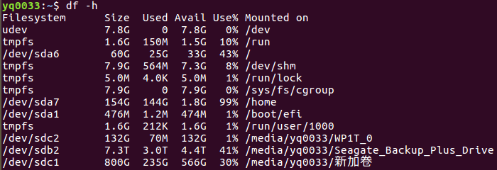
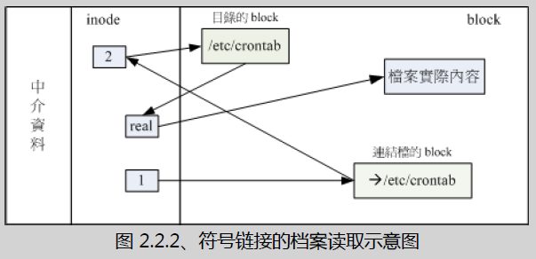
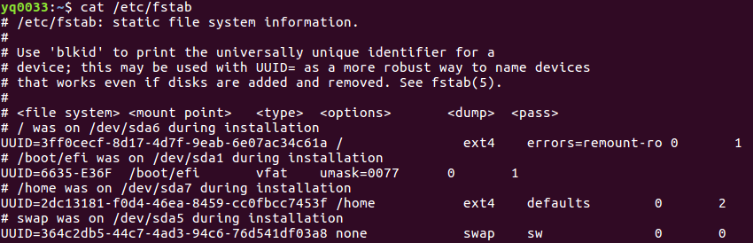

## 7.1 认识Linux文件系统
### 7.1.1 磁盘组成与分区复习
磁盘分区表主要有两种格式,一种是限制较多的**MBR分区表**,一种是较新且限制较少的**GPT分区表**。
* MBR分区表中,第一个扇区最重要,里面有:**主要开机区(Master	boot record, MBR)**及**分区表(partition table)**,	其中MBR占有446Bytes,而partition table则占有64 Bytes。
* GPT	分区表除了分区数量扩充较多之外,支持的磁盘容量也可以超过2TB。

至于磁盘的文件名部份,基本上,所有**实体磁盘的文件名**都已经被仿真成`/dev/sd[a-p]`的格式,第一颗磁盘文件名为`/dev/sda`。而**分区的文件名**若以第一颗磁盘为例,则为`/dev/sda[1-128]`。除了实体磁盘之外,虚拟机的磁盘通常为`/dev/vd[a-p]`的格式。

### 7.1.2 文件系统特性
为什么需要进行“格式化”呢?这是因为每种操作系统所设置的文件属性/权限并不相同,为了存放这些文件所需的数据,因此就需要将分区进行格式化,以成为操作系统能够利用的“文件系统格式(filesystem)”。

传统的磁盘与文件系统之应用中,一个分区就是只能够被格式化成为一个文件系统,所以我们可以说一个`filesystem`就是一个`partition`。
那么文件系统是如何运行的呢?这与操作系统的文件数据有关。较新的操作系统的文件数据除了文件实际内容外,通常含有非常多的属性,例如Linux操作系统的文件权限(rwx)与文件属性(拥有者、群组、时间参数等)。文件系统通常会将这两部份的数据分别存放在不同的区块,权限与属性放置到inode中,至于实际数据则放置到`data block`区块中。另外,还有一个超级区块(superblock)会记录整个文件系统的整体信息,包括inode与block的总量、使用量、剩余量等。
* superblock: 记录此filesystem的整体信息,包括inode/block的总量、使用量、剩余量,以及文件系统的格式与相关信息等;
* inode: 记录文件的属性,一个文件占用一个inode,同时记录此文件的数据所在的block号码;
* block:实际记录文件的内容,若文件太大时,会占用多个block。

### 7.1.3 Linux的EXT2文件系统(inode)
因此Ext2文件系统在格式化的时候基本上是区分为多个区块群组(block group)的,每个区块群组都有独立的`inode/block/superblock`系统。

### 7.1.4 与目录树的关系
每个文件(不管是一般文件还是目录文件)都会占用一个inode,且可依据文件内容的大小来分配多个	block给该文件使用。
* 目录: 当我们在Linux下的文件系统创建一个目录时,文件系统会分配一个inode与至少一块	block给该目录。其中,`inode`记录该目录的相关权限与属性,并可记录分配到的那块block号码;而`block`则是记录在这个目录下的文件名与该文件名占用的inode号码数据。
* 文件: 当我们在Linux下的ext2创建一个一般文件时,ext2会分配一个`inode`与相对于该文件大小的`block`数量给该文件。
* 目录树读取: 经过上面的说明你也应该要很清楚的知道inode本身并不记录文件名,文件名的记录
是在目录的block当中。因为文件名是记录在目录的block当中,	因此当我们要读取某个文件时,就务必会经过目录的inode与block,然后才能够找到那个待读取文件的inode号码,最终才会读到正确的文件的block内的数据。 
由于目录树是由根目录开始读起,因此系统通过挂载的信息可以找到挂载点的inode号码,此时就能够得到根目录的inode内容,并依据该inode读取根目录的block内的文件名数据,再一层一层的往下读到正确的文件名。

### 7.1.6	Linux文件系统的运行

### 7.1.7	挂载点的意义(mount point)
每个filesystem都有独立的inode/block/superblock等信息,这个文件系统要能够链接到目录树才能被我们使用。**将文件系统与目录树结合的动作我们称为“挂载”。重点是:挂载点一定是目录,该目录为进入该文件系统的入口。** 因此并不是你有任何文件系统都能使用,必须要“挂载”到目录树的某个目录后,才能够使用该文件系统的。

## 7.2 文件系统的简单操作
### 7.2.1 磁盘与目录的容量
* df: 列出文件系统的整体磁盘使用量;
* du: 评估文件系统的磁盘使用量(常用在推估目录所占容量)

* `Filesystem`指的是磁盘或相应的分区,代表该文件系统是在哪个partition,所以列出设备名称,
* `Mount Point`: 磁盘挂载的目录所在,即目录树上的文件地址。

> 几个基本信息文件访问的基本信息：
> * 每个文件都会占有一个inode,文件内容由inode的记录来指向;
> * 想要读取该文件,必须要经过目录记录的文件名来指向正确的inode号码才能读取。

### 7.2.2 实体连接与符号链接: ln
在Linux下面的链接文件有两种,一种是类似Windows的捷径功能的文件,可以让你快速的链接到目标文件(或目录);另一种则是通过文件系统的inode链接来产生新文件名,而不是产生新文件!这种称为实体链接(hard	link)。
1. Hard Link(实体链接,硬式链接或实际链接)  
其实**文件名**只与**目录**有关,但是**文件内容**则与inode有关。那么想一想,有没有可能有多个文件名对应到同一个inode号码呢?有的!那就是`hard link`的由来。所以简单的说: hard	link只是在某个目录下新增一笔文件名链接到某inode号码的关连记录而已。

事实上hard	link应该仅能在单一文件系统中进行的,应该是不能够跨文件系统才对!所以hard link是有限制的:
* 不能跨Filesystem
* 不能link目录

2. Symbolic Link(符号链接,亦是捷径)  
相对于hard	link,`Symbolic link`可就好理解多了,基本上,Symbolic link就是在创建一个**独立的文件**,而这个文件会让数据的读取指向他link的那个文件的文件名!由于只是利用文件来做为指向的动作,所以,当来源文件被删除之后,symbolic link的文件会“开不了”,	会一直说“无法打开某文件!”。实际上就是找不到原始“文件名”而已啦!

## 7.3 磁盘的分区、格式化、检验与挂载
1. 对磁盘进行分区,以创建可用的partition;
2. 对该partition进行格式化(format),以创建系统可用的filesystem;
3. 若想要仔细一点,则可对刚刚创建好的filesystem进行检验;
4. 在Linux系统上,需要创建挂载点(亦即是目录),并将他挂载上来.

### 7.3.1 观察磁盘分区状态
* lsblk 列出系统上的所有磁盘列表
* blkid 列出设备的UUID等参数
* parted 列出磁盘的分区表类型与分区信息

### 7.3.2 磁盘分区: gdisk/fdisk

### 7.3.3 磁盘格式化(创建文件系统)
* XFS	文件系统 mkfs.xfs
* XFS	文件系统for	RAID性能优化(Optional)
* EXT4 文件系统mkfs.ext4
* 其他文件系统 `mkfs`

### 7.3.4 文件系统检验
* `xfs_repair` 处理	XFS	文件系统当有 xfs	文件系统错乱才需要使用这个指令!
* `fsck.ext4`	处理 EXT4	文件系统 fsck	是个综合指令,如果是针对 ext4	的话,建议直接使用	fsck.ext4	来检测比较妥当!

### 7.3.5 文件系统挂载与卸载
**挂载点** 是目录,	而这个目录是进入磁盘分区(其实是文件系统啦!)的入口就是了。不过要进行挂载前,你最好先确定几件事:
* 单一文件系统不应该被重复挂载在不同的挂载点(目录)中;
* 单一目录不应该重复挂载多个文件系统;
* 要作为挂载点的目录,理论上应该都是空目录才是。

挂载文件按系统:
* 挂载 xfs/ext4/vfat 等文件系统
* 挂载 CD 或	DVD	光盘

卸载设备文件:
* umount

### 7.3.6 磁盘/文件系统参数修订

## 7.4 设置开机挂载
手动处理`mount`不是很人性化,我们总是需要让系统“自动”在开机时进行挂载的!

### 7.4.1	开机挂载	/etc/fstab	及	/etc/mtab
如何在开机的时候就让系统文件挂载好? ==> 直接到`/etc/fstab`里去修改。
系统挂载的一些限制：
1. 根目录`/`是必须挂载的,而且一定要先于其它	mount	point	被挂载进来。
2. 其它	mount	point	必须为已创建的目录,可任意指定,但一定要遵守必须的系统目录架构原则	(FHS)
3. 所有	mount	point	在同一时间之内,只能挂载一次。
4. 所有	partition	在同一时间之内,只能挂载一次。
5. 如若进行卸载,您必须先将工作目录移到	mount	point(及其子目录)	之外。

`/etc/fstab`文件中的信息:

| 设备/UUID等(Filesystem) | 挂载点(Mount Point) | 文件系统(type) | 文件系统参数(options) | dump | pass |
| :------------- | :------------- |:------------- |:------------- |:------------- |:------------- |
* 第一栏: 第一栏:磁盘设备文件名/UUID/LABEL name,
* 第二栏: 挂载点(mount point),挂载点一定是目录.
* 第三栏: 磁盘分区的文件系统,在手动挂载时可以让系统自动测试挂载,但在这个文件当中我们必须要手动写入文件系统才行! 包括	xfs, ext4, vfat, reiserfs, nfs等等。
* 第四栏:文件系统参数:
* 第五栏:能否被	dump	备份指令作用
* 第六栏:是否以	fsck	检验扇区

### 7.4.2	特殊设备	loop	挂载	(镜像文件不烧录就挂载使用)

<!--
=====================================================

-----------------------------------------------------
|  |
|:-------:|
| *df example* |

 a | Header Two     |
| :------------- | :------------- |
| Item One       | Item Two       |] -->
