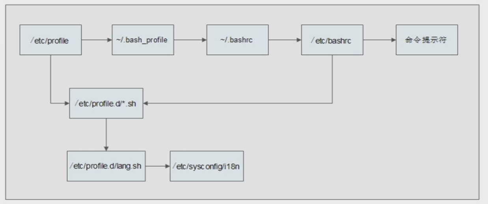

[TOC]

1. 什么是环境变量？简单来说，就是指定的一个或一些列目录。当需要运行一个程序的时候，相关程序会根据这些指定的目录需找并运行相关程序。
在 Linux 系统中，如果你下载并安装了程序，但是运行的时候却出现 "Command not found." 的报错，很可能就是环境变量中并不包含这个程序。
那么你要做的就是，把这个程序的路径添加到环境变量中。

2. Linux 环境变量启动过程

- [ ] TODO: Add more explanation

3. `export` command
4. 

Reference
1. [Linux 命令详解（一）export 命令](https://www.cnblogs.com/tinywan/p/7224011.html)