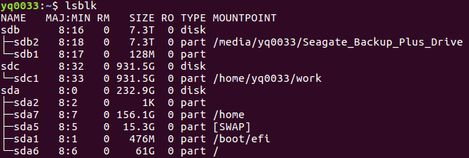
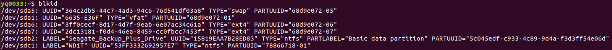
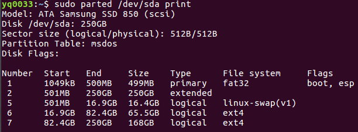

[TOC]

---
## 1. 文件系统(File System)

### 1.1 访问原理
* Windows 是通过**某个硬盘 --> 硬盘上的某个分区 --> 分区上的特定文件系统 --> 特定文件系统中的文件**这样的顺序访问到一个文件的。
* Linux 的文件系统实质上就是一棵目录树，最开始的目录叫做根目录(`/`)，根目录又有子目录，每个子目录都有特定的功能。

### 1.2 系统组织

### 1.3 例子
* Windows 中的盘符 vs Linux 中的**挂载**
* 安装和卸载程序 firefox:
    * Windows
    * Linux

### 1.4 优缺点
* Windows
* Linux
    * 缺点
        * Linux 系统缺点最开始虚拟文件系统中的每个子目录的功能是事先规定好了的，我们需要事先知道那些目录存放哪些文件，然后在相应的位置中创建自己的内容，这也是 Linux 系统入门门槛高的一个原因。
    * 优点
        * 目录结构反映系统运行机理当我们了解了这些目录的功能之后，我们对整个 Linux 操作系统的运行机理也会有一个大致的了解。
        * 结构清晰避免逻辑混乱这样的目录结构，有助于我们以一种高效的方式组织自己的数据，分类清晰并且不会对系统运行有任何影响，规定了最开始每个目录的功能，并没有限制我们的自由，因为我们知道我们可以在哪里创建自己的子目录并且在子目录中任意创建自己的文件。
        * 组织规范便于共享由于目录具有统一的组织结构，所以 Linux 上面的用户在共享数据的时候，能够很容易地猜测出他所需要的数据大致存放在什么位置，同时也不会影响到私有数据的保密性，毕竟具体来说，怎么存放自己的私有数据，那是用户自己决定的。
        
---
## 2. Linux 上面的虚拟文件系统目录组织
在 Linux 文件系统中的每一个子目录都有特定的目的和用途。

### 2.1 常用的重要目录
* `/` 根目录包含了几乎所的文件目录，相当于中央系统。进入的最简单方法是：`cd /`。
* `/boot` 引导程序，内核等存放的目录这个目录，包括了在引导过程中所必需的文件，引导程序的相关文件（例如 grub ， lilo 以及相应的配置文件）以及 Linux 操作系统内核相关文件（例如 vmlinuz 等）一般都存放在这里。
在最开始的启动阶段，通过引导程序将内核加载到内存，完成内核的启动（这个时候， 虚拟文件系统还不存在，加载的内核虽然是从硬盘读取的，但是没经过 Linux 的 虚拟文件系统，这是比较底层的东西来实现的）。
然后内核自己创建好 虚拟文件系统，并且从 虚拟文件系统的其他子目录中（例如 `/sbin` 和 `/etc` ）加载需要在开机启动的其他程序或者服务或者特定的动作（部分可以由用户自己在相应的目录中修改相应的文件来配制）。
如果我们的机器中包含多个操作系统，那么可以通过修改这个目录中的某个配置文件（例如 `grub.conf` ）来调整启动的默认操作系统，系统启动的择菜单，以及启动延迟等参数。
* `/sbin` 超级用户可以使用的命令的存放目录存放大多涉及系统管理的命令（例如引导系统的 `init` 程序），是超级权限用户 root 的可执行命令存放地，普通用户无权限执行这个目录下的命令（但是有时普通用户也可能会用到）。
这个目录和 `/usr/sbin` ,`/usr/X11R6/sbin` 或 `/usr/local/sbin` 等目录是相似的，我们要记住，凡是目录 `sbin` 中包含的都是 root 权限才能执行的，这样就行了。
* `/bin` 普通用户可以使用的命令的存放目录系统所需要的那些命令位于此目录，比如 `ls` 、 `cp` 、 `mkdir` 等命令；类似的目录还 `/usr/bin` ， `/usr/local/bin` 等等。这个目录中的文件都是可执行的、普通用户都可以使用的命令。作为基础系统所需要的最基础的命令就是放在这里。
* `/lib` 根目录下的所程序的共享库目录此目录下包含系统引导和在根用户执行命令时候所必需用到的共享库。
* `/dev` 设备文件目录在 Linux 中设备都是以文件形式出现，这里的设备可以是硬盘，键盘，鼠标，网卡，终端，等设备，通过访问这些文件可以访问到相应的设备。
* `/home` 普通用户的家目录（或 `$HOME` 目录、主目录）在 Linux 机器上，**用户主目录通常直接或间接地置在此目录下**。
其结构通常由本地机的管理员来决定。通常而言，系统的每个用户都有自己的家目录，目录以用户名作为名字存放在 `/home` 下面（例如 `quietheart` 用户，其家目录的名字为 `/home/quietheart`）。
**该目录中保存了绝大多数的用户文件(用户自己的配置文件，定制文件，文档，数据等)**， root 用户除外（参见后面的 `/root` 目录）。
**由于这个目录包含了用户实际的数据，通常系统管理员为这个目录单独挂载一个独立的磁盘分区**，这样这个目录的文件系统格式就可能和其他目录不一样了（尽管表面上看，这个目录还是属于根目录的一棵子树上），将系统文件和数据文件分开存放，有利于维护。
* `/root` 用户 root 的 `$HOME` 目录系统管理员(就是 root 用户或超级用户)的主目录比较特殊，不存放在 `/home` 中，而是直接放在 `/root` 目录下了。
* `/etc` 全局的配置文件存放目录系统和程序一般都可以通过修改相应的配置文件，来进行配置。
例如，要配置系统开机的时候启动那些程序，配置某个程序启动的时候显示什么样的风格等等。
通常这些配置文件都集中存放在 `/etc` 目录中，所以想要配置什么东西的话，可以在 `/etc` 下面寻找我们可能需要修改的文件。
一些大型套件，如 X11 ，在 `/etc` 下它们自己的子目录。系统配置文件可以放在这里或在 `/usr/etc`。 不过所有程序总是在 `/etc` 目录下查找所需的配置文件，你也可以将这些文件链接到目录 `/usr/etc`。
另外，**还一个需要注意的常见现象就是，当某个程序在某个用户下运行的时候，可能会在该用户的家目录中生成一个配置文件（一般这个文件最开始就是 `/etc` 下相应配置文件的拷贝，存放相应于“当前用户”的配置），这样当前用户可以通过配置这个家目录的配置文件，来改变程序的行为，并且这个行为只是该用户特有的**。
原因就是：一般来说一个程序启动，如果需要读取一些配置文件的话，它会首先读取当前用户家目录的配置文件，如果存在就使用；如果不存在它就到 `/etc` 下读取全局的配置文件进而启动程序。就是这个配置文件不自动生成，我们手动在自己的家目录中创建一个文件的话，也有许多程序会首先读取到这个家目录的文件并且以它的配置作为启动的选项（例如我们可以在家目录中创建 vim 程序的配置文件 `.vimrc`，来配置自己的 vim 程序）。
* `/usr` 这个目录中包含了命令库文件和在通常操作中不会修改的文件这个目录对于系统来说也是一个非常重要的目录。安装程序的时候，默认就是安装在此文件内部某个子文件夹内。输入命令后系统默认执行 /usr/bin 下的程序（当然，前提是这个目录的路径已经被添加到了系统的环境变量中）。此目录通常也会挂载一个独立的磁盘分区，它应保存共享只读类文件，这样它可以被运行 Linux 的不同主机挂载。
* `/usr/lib` 目标库文件，包括动态连接库加上一些通常不是直接调用的可执行文件的存放位置这个目录功能类似 `/lib` 目录，理说，这里存放的文件应该是 `/bin` 目录下程序所需要的库文件的存放地，也不排除一些例外的情况。
* `/usr/bin` 一般使用者使用并且不是系统自检等所必需可执行文件的目录此目录相当于根文件系统下的对应目录（`/bin`），非启动系统，非修复系统以及非本地安装的程序一般都放在此目录下。
* `/usr/sbin` 管理员使用的非系统必须的可执行文件存放目录此目录相当于根文件系统下的对应目录（`/sbin`），保存系统管理程序的二进制文件，并且这些文件不是系统启动或文件系统挂载 `/usr` 目录或修复系统所必需的。
* `/usr/share` 存放共享文件的目录在此目录下不同的子目录中保存了同一个操作系统在不同构架下工作时特定应用程序的共享数据(例如程序文档信息)。使用者可以找到通常放在 `/usr/doc` 或 `/usr/lib` 或 `/usr/man` 目录下的这些类似数据。
* `/usr/include` C程序语言编译使用的头文件 Linux 下开发和编译应用程序所需要的头文件一般都存放在这里，通过头文件来使用某些库函数。默认来说这个路径被添加到了环境变量中，这样编译开发程序的时候编译器会自动搜索这个路径，从中找到你的程序中可能包含的头文件。
* `/usr/local` 安装本地程序的一般默认路径当我们下载一个程序源代码，编译并且安装的时候，如果不特别指定安装的程序路径，那么默认会将程序相关的文件安装到这个目录的对应目录下。
例如，安装的程序可执行文件被安装（安装实质就是复制）到了 `/usr/local/bin` 下面，此程序（可执行文件）所需要依赖的库文件被安装到了 `/usr/local/lib` 目录下，被安装的软件如果是某个开发库（例如 Qt ， Gtk 等）那么相应的头文件可能就被安装到了 `/usr/local/include` 中等等。
也就是说，这个目录存放的内容，一般都是我们后来自己安装的软件的默认路径，如果择了这个默认路径作为软件的安装路径，被安装的软件的所文件都限制在这个目录中，其中的子目录就相应于根目录的子目录。
* `/proc` 特殊文件目录这个目录采用一种特殊的文件系统格式（ proc 格式），内核支持这种格式。其中包含了全部虚拟文件。它们并不保存在磁盘中，也不占据磁盘空间(尽管命令 `ls -c` 会显示它们的大小)。当您查看它们时，您实际上看到的是内存里的信息，这些文件助于我们了解系统内部信息。
* `/opt` 可择的文件目录这个目录表示的是可择的意思，些自定义软件包或者第方工具，就可以安装在这里。
* `/mnt` 临时挂载目录这个目录一般是用于存放挂载储存设备的挂载目录的，比如磁盘，光驱，网络文件系统等，当我们需要挂载某个磁盘设备的时候，可以把磁盘设备挂载到这个目录上去，这样我们可以直接通过访问这个目录来访问那个磁盘了。
一般来说，我们最好在 `/mnt` 目录下面多建立几个子目录，挂载的时候挂载到这些子目录上面，因为通常我们可能不仅仅是挂载一个设备吧?
* `/media` 挂载的媒体设备目录挂载的媒体设备目录，一般外部设备挂载到这里，例如 cdrom 等。比如我们插入一个U盘，我们一般会发现， Linux 自动在这个目录下建立一个 disk 目录，然后把U盘挂载到这个 disk 目录上，通过访问这个 disk 来访问U盘。
* `/var` 内容经常变化的目录此目录下文件的大小可能会改变，如缓冲文件，日志文件，缓存文件，等一般都存放在这里。
* `/tmp` 临时文件目录该目录存放系统中的一些临时文件，文件可能会被系统自动清空。的系统直接把 tmpfs 类型的文件系统挂载到这个目录上， tmpfs 文件系统由 Linux 内核支持，在这个文件系统中的数据，实际上是内存中的，由于内存的数据断电易失，当系统重新启动的时候我们就会发现这个目录被清空了。
* `/lost+found` 恢复文件存放的位置当系统崩溃的时候，在系统修复过程中需要恢复的文件，可能就会在这里被找到了，这个目录一般为空。

以上目录，是最常见的重要目录。其中，有些目录初学者容易混淆，这里简单区分一下：
1. `/bin`, `/sbin` 与 `/usr/bin`, `/usr/sbin` 
    * `/bin` 一般存放对于用户和系统来说**必需**的程序（二进制文件）。
    * `/sbin` 一般存放用于系统管理的**必需**的程序（二进制文件），一般普通用户不会使用，根用户使用。
    * `/usr/bin` 一般存放的只是对用户和系统来说**不是必需的**程序（二进制文件）。
    * `/usr/sbin` 一般存放用于系统管理的系统管理的**不是必需的**程序（二进制文件）。
2. `/lib` 与 `/usr/lib` 
* `/lib` 和 `/usr/lib` 的区别类似 `/bin`, `/sbin` 与 `/usr/bin`, `/usr/sbin`。
* `/lib` 一般存放对于用户和系统来说**必需**的库（二进制文件）。
* `/usr/lib` 一般存放的只是对用户和系统来说**不是必需的**库（二进制文件）。

### 2.2 对文件系统目录的分类标准
`man heir` 通过这个命令的输出，就知道“根目录”中所子目录的作用了。
```bash
NAME 名称
hier - 文件系统描述
 DESCRIPTION 描述
一个典型的Linux系统具以下几个目录结构：
/ 根目录，是所目录树开始的地方。
/bin 此目录下包括了单用户方式及系统启动或修复所用到的所执行程序。
/boot 包括了引导程序的静态文件。此目录下包括了在引导过程中所必需的文件。系统装载程序及配制文件在 /sbin 和 /etc 目录中找到。
/dev 对应物理设备的指定文件或驱动程序。参见mknod(1)。
/dos 如果MS-DOS和Linux共存于一台计算机时，这里通常用于存放DOS 文件系统。
/etc 用于存放本地机的配置文件。一些大型套件，如X11，在 /etc 下它们自己的子目录。系统配置文件可以放在这里或在 /usr/etc。 不过所程序总是在 /etc 目录下查找所需的配置文件，你也可以将这些文件链接到目录 /usr/etc.
/etc/skel 当建立一个新用户账号时，此目录下的文件通常被复制到用户的主目录下。
/etc/X11X11 window system所需的配置文件。
/home 在Linux机器上，用户主目录通常直接或间接地置在此目录下。其结构通常由本地机的管理员来决定。
/lib 此目录下包含系统引导和在根用户执行命令所必需用到的共享库。
/mnt 挂载临时文件系统的挂载点。
/proc 这是提供运行过程和核心文件系统 proc 挂载点。这一”伪”文件系统在以下章节中详细叙述 proc(5)。
/sbin 类似于 /bin 此目录保存了系统引导所需的命令，但这些命令一般使用者不能执行。
/tmp 此目录用于保存临时文件，临时文件在日常维护或在系统启动时无需通知便可删除
/usr 此目录通常用于从一个独立的分区上挂载文件。它应保存共享只读类文件，这样它可以被运行Linux的不同主机挂载。
/usr/X11R6 X-Window系统 Version 11 release 6.
/usr/X11R6/bin X-Windows系统使用的二进制文件；通常是在对更传统的 /usr/bin/X11 中文件的符号连接。
/usr/X11R6/lib 保存与X-Windows系统关数据文件。
/usr/X11R6/lib/X11 此目录保存与运行X-Windows系统关其他文件。通常是对来自 /usr/lib/X11 中文件的符号连接。
/usr/X11R6/include/X11 此目录保存包括使用X11窗口系统进行编译程序所需的文件。通常是对来自 /usr/lib/X11 中文件的符号连接。
/usr/bin 这是执行程序的主要目录，其中的绝大多数为一般使用者使用，除了那些启动系统或修复系统或不是本地安装的程序一般都放在此目录下。
/usr/bin/X11
X11执行文件放置的地方；在Linux系统中，它通常是对 /usr/X11R6/bin. 符号连接表
/usr/dict
此目录保存拼写检查器所使用的词汇表文件。
/usr/doc
此目录下应可以找到那些已安装的软件文件。
/usr/etc
此目录可用来那些存放整个网共享的配置文件。然而那可执行命令指向总是使用参照使用 /etc 目录下的文件。 /etc 目录下连接文件应指向 /usr/etc. 目录下适当的文件。
/usr/include
C程序语言编译使用的Include”包括”文件。
/usr/include/X11
C程序语言编译和X-Windows系统使用的 Include”包括”文件。它通常中指向 /usr/X11R6/include/X11. 符号连接表。
/usr/include/asm
申明汇编函数的Include”包括”文件，它通常是指向 /usr/src/linux/include/asm 目录的符号连接
/usr/include/linux
包含系统变更的信息通常是指向 /usr/src/linux/include/linux 目录的符号连接表，来获得操作系统特定信息。(注：使用者应在此自行包含那些保证自己开发的程序正常运行所需的libc 函数库。不管怎样，Linux核心系统不是设计用来执行直接运行用户程序的，它并不知道用户程序需要使用哪个版本的libc库 。如果你随意将 /usr/include/asm 和 /usr/include/linux 指向一个系统核心，系统很可能崩溃。Debian系统不这么做。它使用 libc*-dev运行包中提供的核心系统标识，以保证启动所正确的文件。)
 /usr/include/g++
GNU C++编译程序所使用的Include”包括”文件。
/usr/lib
目标库文件，包括动态连接库加上一些通常不是直接调用的可执行文件案。一些复杂的程序可能在此占用整个子目录。
/usr/lib/X11
存放X系统数据文件及系统配置文件的地方。 Linux中通常是指向 /usr/X11R6/lib/X11 目录的符号连接表。
/usr/lib/gcc-lib
GNU C 编译程序所使用的可执行文件案和”包括”文件。 gcc(1).
/usr/lib/groff
GNU groff 文件格式系统所使用的文件。
/usr/lib/uucp
uucp(1) 所使用的文件。
/usr/lib/zoneinfo
关时区信息文件文件。
/usr/local
安装在本地执行程序的地方。
/usr/local/bin
在此地放置本地执行程序的二进制文件。
/usr/local/doc
放置本地文件。
/usr/local/etc
安装在本地程序的配置文件。
/usr/local/lib
安装在本地程序的库文件。
/usr/local/info
安装在本地程序关信息文件。
/usr/local/man
安装在本地程序使用手册。
/usr/local/sbin
安装在本地的系统管理程序。
/usr/local/src
安装在本地程序的原始码。
/usr/man
手册页通常放在此目录，或相关子目录下。
/usr/man//man[1-9]
此目录在指定的地方以原始码形式存放手册页。系统在所的手册页中使用自己独特的语言及代码集，可能会省略 substring 子字符串。
/usr/sbin
此目录保存系统管理程序的二进制码，这些文件不是系统启动或文件系统挂载 /usr 目录或修复系统所必需的。
/usr/share
在此目录下不同的子目录中保存了同一个操作系统在不同构架下工作时特定应用程序的共享数据。使用者可以找到通常放在 /usr/doc 或 /usr/lib 或 /usr/man 目录下的这些数据。
/usr/src
系统不同组成部份的源文件包括参考数据报。不要将你自己与项目关的文件放这里，因为在安装软件外，/usr下的文件属性除通常设为只读。
/usr/src/linux
系统核心资源通常拆包安装于此。这是系统中重要的一环，因为 /usr/include/linux 符号连接表指向此目录。你应当使用其他目录来来编译建立新核心。
/usr/tmp
此目录不再使用了。它应指向目录 /var/tmp。 这个链接只是出于系统兼容的目的，一般不再使用。
/var
此目录下文件的大小可能会改变，如缓冲文件可日志文件。
/var/adm
此目录为 /var/log 甩替代，通常是指向 /var/log 的符号连接表。
/var/backups
此目录用来存放重要系统文件的后备文件
/var/catman/cat[1-9] or /var/cache/man/cat[1-9]
此目录存储根据手册分类预先格式化的参考手册页。(这些参考手册页是相互独立的)
/var/lock
此目录存储锁定文件。依据命名习惯，设备锁定文件是 LCKxxxxx xxxxx与在文件系统中该设备名相同，使用的格式是HDU UUCP锁定文件，例如包含进程标识PID的锁定文件是一个10字节的ASCII格式的数字，后面跟一个换行符。
/var/log
各种日志文件。
/var/preserve
这是 vi(1) 存放正在编辑中的文件，以便以后可以恢复。
/var/run
运行时的变量文件，如存放进程标识和登入使用者信息的文件。 (utmp) 此目录下文件在系统启动时被自动清除。
/var/spool
各种程序产生的缓冲或排除等待的文件
/var/spool/at
at(1) 的作业存缓区
/var/spool/cron
cron(1) 的作业存缓区
/var/spool/lpd
打印缓存文件。
/var/spool/mail
使用者邮箱。
/var/spool/smail
存放 smail(1) 邮件发送程序的缓冲文件。
/var/spool/news
新闻子系统的缓冲目录
/var/spool/uucp
uucp(1) 的缓冲文件
/var/tmp
类似 /tmp, 此目录保存未指定持续时间的临时文件。
```


* [比起Windows，怎样解读Linux的文件系统与目录结构？](https://www.techug.com/post/how-to-read-linux-file-system-and-directory-structure.html)

---
## 3. 逻辑卷管理 -- LVM: Logical Volume Manager
* 所有数据放在一个分区，如果该分区的 File System 发生了损坏，则所有数据都可能丢失；
* 如果划分了多个分区，则会为分区的大小而伤神；
* 有了 LVM 之后，则可以使用 LVM 创建**逻辑分区**。如果某个逻辑分区不够用，则可以对逻辑分区进行**动态扩容**(原有数据不受影响)。

* 用两块 500GB 的硬盘，却想搞一个 1TB 的分区。可以通过 LVM 实现。
* 用两块 500GB 的硬盘，却想搞三个 300GB 的分区。可以通过 LVM 实现。

* 综上，LVM 可以提高**空间利用率**。

### LVM 与 Linux 的关系
LVM 包含两部分：内核模块 & 命令行工具

软件包名称：`lvm2`

### LVM 的三个基本概念
* 物理卷 -- PV (Physical Volume)       
在 LVM 的术语中，“物理卷”（PV）用来对应【底层】的“物理硬盘 or 物理分区”。

* 卷组 -- GV (Volume Group)           
通过 LVM 的命令行工具，还可以把多个 PV 纳入到一个 VG（卷组）中。你不妨把 VG 想象成一个【存储池】，这个池子的容量也就是加入其中的所有 PV 的容量总和。

* 逻辑卷 -- LV (Logical Volume)
在 LVM 的术语中，“逻辑卷”（LV）用来对应【上层】的“逻辑分区”。
你可以从 VG 中创建多个 LV。每次创建 LV 都如同从这个存储池中分配空间，直到所有存储空间都被分配完。
创建好 LV 之后，你可以对这个 LV 进行格式化，就得到一个可用的逻辑分区。


* [扫盲 Linux 逻辑卷管理（LVM）——兼谈 RAID 以及“磁盘加密工具的整合”](https://program-think.blogspot.com/2020/06/Linux-Logical-Volume-Manager.html)


---
## 4. 挂载额外硬盘(Correct Way to Mount a Hard Drive)
### Problem:
电脑上只有一块 256G 的 SDD 硬盘，需要分区给 `/`,`/home/`,`/boot/` 等必要的目录。导致最终分给 `/home/` 的空间不够用。
我的习惯是在 `/home/<user>/` 目录下另设一个 `work/` 目录存放工作文件。由于训练的时候，训练记录文件比ijao大，常常空间不够用。
因此，我想另添加一块硬盘，单独挂载到 `/home/<user>/work/`。

### 前期准备
* `lsblk` 列出系统上的所有磁盘列表，可以看成“list block device”，就是列出所有存储设备的意思。

    * 从图中的输出结果可以看出，现在有三块磁盘，`sda`, `sdb` and `sdc`。
      其中 `sda` 是最初的 256G 的 SDD 硬盘，可以看出分别有 `/`, `/home/`, `/swap/`, `/boot/`等分区；
      `sdb` 是 8T 的移动硬盘，没有特别指定挂载的目录，因此默认挂载到 `/media/<user>/`；
      `sdc` 是 1T 的移动硬盘，因对其进行了特别的挂载处理，所以其挂载在了 `/home/<user>/work/` 目录上。
    * 每个栏目的具体含义如下：
        * `NAME` 表示设备的文件名，会省略 `/dev/` 等前导目录；
        * `MAJ:MIN` 分别是主要：次要设备代码，还未深入了解；
        * `RM` 表示是否为可卸载设备(removeable device)，如管盘、USB磁盘等等；
        * `SIZE` 给出了磁盘的大小信息；
        * `RO` 表示是否为只读设备；
        * `TYPE` 表示是磁盘(disk)，分区(part)还是只读存储器(rom)等输出。
        * `MOUNTPOINT` 给出了磁盘的挂在点。比如 `sdc1` 是个 1T 的分区，挂载在 `/home/<user>/work/`；`sda6` 是个 60G 的分区并挂载在 `/`，也就是根目录；`sda7` 是个 150G 左右的分区，挂载在 `/home/` 目录。 
* `blkid` 列出设备的UUID等参数

    * 一块磁盘可以被分成多个分区，而`blkid` 给出了磁盘的每个分区的一些信息，比如 UUID，TYPE等。
      其中 UUID 在设置开机自动挂载的时候会用到；TYPE 列出了磁盘的格式。
    * UUID (Universally Unique Identifier，通用唯一识别码)，目的是让分布式系统中的所有元素都能有唯一的辨识信息。
    * TYPE
* `parted` 列出磁盘的分区表类型与分区信息

    * `parted device_name print`，可以获知磁盘的分区类型。
    * `Model`，磁盘的模块名称（厂商）
    * `Disk`，磁盘的总容量
    * `Sector size`，磁盘的每个逻辑/物理扇区的容量
    * `Partition Table`，分区表的格式（MBR/GPT等），此时为 MSDOS
    * `Disk Flags`，每个分区的信息。
  

综上，通过 `lsblk` 可以获知所有的存储设备，通过 `blkid` 可以知道所有的文件系统，最后可以通过 `parted` 可以获知磁盘的分区类型。

### 挂载
下面就可以进行挂载，或是开机自动挂载。


进行挂载前，先要确定几件事：
* 单一文件系统不应该被重复挂载在不同的挂载点(目录)中;
* 单一目录不应该重复挂载多个文件系统;
* 要作为挂载点的目录,理论上应该都是空目录才是。

进行简单挂载（关于 mount 的命令实际更复杂，可以指定各种参数，此处仅是简单的挂载）：
```bash
mount device_name mountpoint
```

进行简单的卸载
```bash
umount [-fn] device_name/mountpoint

umount /dev/vda4    # 用设备文件名(device_name)进行卸载
umount /data/ext4   # 用挂载点(mountpoint)进行卸载
```

如果每次开机后都要进行手动挂载就太不人性了，所以我们需要让系统**自动**在开机的时候进行挂载。
那就需要直接到 `/etc/fstab` 进行设置。
系统挂载有一些限制：
* 根目录	`/` 是必须挂载的,而且一定要先于其它	`mount point` 被挂载进来。
* 其它 `mount point` 必须为已创建的目录,可任意指定,但一定要遵守必须的系统目录架构原则(FHS)
* 所有 `mount point` 在同一时间之内,只能挂载一次。
* 所有 `partition` 在同一时间之内,只能挂载一次。
* 如若进行卸载,您必须先将**工作目录(pwd)**移到 `mount point(及其子目录)`之外。

下面查看写 `/etc/fstab` 文件：

`/etc/fstab`文件中的信息:

| 设备/UUID等(Filesystem) | 挂载点(Mount Point) | 文件系统(type) | 文件系统参数(options) | dump | pass |
| ----------------------- | ------------------- | -------------- | --------------------- | ---- | ---- |
| 1                       | 2                   | 3              | 4                     | 5    | 6    |

* 第一栏: 第一栏:磁盘设备文件名/UUID/LABEL name,
* 第二栏: 挂载点(mount point),挂载点一定是目录.
* 第三栏: 磁盘分区的文件系统,在手动挂载时可以让系统自动测试挂载,但在这个文件当中我们必须要手动写入文件系统才行! 包括	xfs, ext4, vfat, reiserfs, nfs等等。
* 第四栏:文件系统参数:
* 第五栏:能否被	dump	备份指令作用
* 第六栏:是否以	fsck	检验扇区

`/etc/fastab` 的最后一行就是我的进行开机自动挂载的设置命令。

---
## References
* [比起Windows，怎样解读Linux的文件系统与目录结构？](https://www.techug.com/post/how-to-read-linux-file-system-and-directory-structure.html)
* [扫盲 Linux 逻辑卷管理（LVM）——兼谈 RAID 以及“磁盘加密工具的整合”](https://program-think.blogspot.com/2020/06/Linux-Logical-Volume-Manager.html)