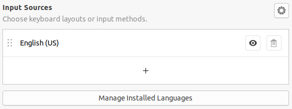
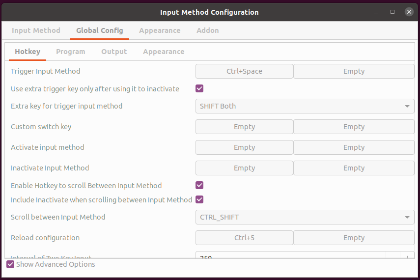

[TOC]


## Common Configuration

### Chinese Input
* [Fcibutx Chinese Input Setup on Ubuntu for Gaming](https://leimao.github.io/blog/Ubuntu-Gaming-Chinese-Input/)
* [How To Uninstall ibus On Ubuntu 16.04 LTS](https://installlion.com/ubuntu/xenial/main/i/ibus/uninstall/index.html)
* 在安装 `fictx` 后，系统默认有两种输入法，`fixtx` and `ibux`。此时 `Ctrl + Shift` 无法切换 `fictx` 的中英文。此时应该删掉
`Settings -> Region & Language -> Input Sources` 中加入的中文输入，只留下 `English(US)` 就好了。
    * 
* [Can't change from iBus to fcitx](https://askubuntu.com/a/1194876)
* [ubuntu设置fcitx快捷键实现中英文输入法切换](https://blog.csdn.net/jumpingpig/article/details/104743917)
* [禁用 fcitx 额外键切换输入法 ](http://einverne.github.io/post/2019/08/disable-fcitx-extra-key-for-trigger-input-method.html)
* fcitx 无法在 firefox 使用 googlepinyin
* 
    * `Trigger Input Method = Ctrl + Space`, 按下 `Ctrl + Spce` 的时候，会启动中文输入，随后可以通过 `Shift` 切换中英文输入。
    * 如果没有提前按过 `Ctrl + Space` 启动的话，单独按下 `Shift` 是没有反映的。
* [Ubuntu安装搜狗输入法后修改默认英文输入状态的方法](https://blog.csdn.net/ameyume/article/details/87091652)


### Install Firefox-ESR

* 不同用户使用不同配置文件的 Firefox 安装：[如何使用两个Firefox配置文件？](https://qastack.cn/ubuntu/660147/how-can-i-use-two-firefox-profiles)

* [How To Install Firefox ESR In Ubuntu Or Linux Mint (PPA Or Snap) ](https://www.linuxuprising.com/2018/11/how-to-install-firefox-esr-in-ubuntu-or.html)

* `sudo apt install firefox-esr --fix-missing`

* firefox versions

  ```bash
  ylqi007:~$ ll /usr/bin/firefox*
  lrwxrwxrwx 1 root root 25 Oct 13 12:42 /usr/bin/firefox -> ../lib/firefox/firefox.sh*
  lrwxrwxrwx 1 root root 29 Oct 13 08:14 /usr/bin/firefox-esr -> ../lib/firefox-esr/firefox.sh*
  ```

* 此时我的电脑上有两个版本的 firefox (firefox, i.e. normal version 81; firefox-esr, i.e. 78.4 esr version).

* Set `firefox-esr` as the default `firefox` and development firefox version as `firefox-dev`.
  此时将 firefox 添加到 dock 后，点击打开 firefox 就是 firefox-esr。

  ```bash
  sudo mv /usr/bin/firefox /usr/bin/firefox-dev     # Alias normal firefox as firefox-dev
  sudo mv /usr/bin/firefox-esr /usr/bin/firefox     # Alias firefox esr as default firefox
  ```


### Install Chrome

[How to Install Google Chrome Web Browser on Ubuntu 20.04](https://linuxize.com/post/how-to-install-google-chrome-web-browser-on-ubuntu-20-04/)

```bash
$ wget https://dl.google.com/linux/direct/google-chrome-stable_current_amd64.deb
$ sudo apt install ./google-chrome-stable_current_amd64.deb
```


## Development Environment Installation

### Install VS Code

* [Visual Studio Code on Linux](https://code.visualstudio.com/docs/setup/linux)
  
    * Once installed, the `Snap` daemon will take care of automatically updating S Code in the background.
    ```bash
    sudo snap install --classic code
    ```

### [Install Typora](https://typora.io/#linux)
```bash
# or run:
# sudo apt-key adv --keyserver keyserver.ubuntu.com --recv-keys BA300B7755AFCFAE
wget -qO - https://typora.io/linux/public-key.asc | sudo apt-key add -

# add Typora's repository
sudo add-apt-repository 'deb https://typora.io/linux ./'
sudo apt-get update

# install typora
sudo apt-get install typora
```


### Install JetBrains (including PyCharm, Idea)

Install JetBrains Toolbox and then install Pycharm and Idea from Toolbox.

### Install Git
* Install
    ```bash
    sudo apt install -y git
    ```
    
* [廖雪峰 - Git - 远程仓库](https://www.liaoxuefeng.com/wiki/896043488029600/896954117292416)
  
    * 因为 GitHub 需要识别出你推送的提交确实是你推送的，而不是别人冒充的，而 Git 支持 SSH 协议，所以，GitHub 只要
    知道了你的公钥，就可以确认只有你自己推送。
    * GitHub 允许添加多个 Key。可以把公司和家里的每台电脑都添加到 GitHub，就可以在每台电脑上往 GitHub 推送。
    * 在 GitHub 上免费托管的 Git 仓库，任何人都可以看到（但是只有自己才能修改），所以不要把敏感信息放上去。
    * 如果不想让别人看到自己的 Git 仓库，有两个方法：1.交钱购买 private 仓库，这样别人就不可读，更不可写；2.自己
    手动搭建 Git 服务器。
    
* [Connecting to GitHub with SSH](https://docs.github.com/en/free-pro-team@latest/github/authenticating-to-github/connecting-to-github-with-ssh)
    * Using the SSH protocol, you can connect and authenticate to remote servers and services. With SSH keys,
    you can connect to GitHub without supplying your username or password at each visit.
    * Checking for existing SSH keys.
    * Generating and adding a new SSH key to your GitHub account. 
    
* [Adding a new SSH key to your GitHub account](https://docs.github.com/en/enterprise-server@2.20/github/authenticating-to-github/adding-a-new-ssh-key-to-your-github-account)

* [Git push requires username and password](https://stackoverflow.com/questions/6565357/git-push-requires-username-and-password)

### Gitkraken installation

#### Method 1. Install by snap

GitKraken
`sudo snap install gitkraken --classic`


#### Method 2. Install from official website

[Install GitKraken on Linux](https://support.gitkraken.com/how-to-install/#linux-deb-rpm-and-targz-files)

```bash
wget https://release.gitkraken.com/linux/gitkraken-amd64.deb
sudo dpkg -i gitkraken-amd64.deb
```


### Install Anaconda
* [Installing on Linux](https://docs.conda.io/projects/conda/en/latest/user-guide/install/linux.html)
* [Anaconda vs. miniconda](https://stackoverflow.com/questions/45421163/anaconda-vs-miniconda)
* [Python Installation - Conda Install](https://developers.google.com/earth-engine/guides/python_install-conda), 如果出现 `Conda: command not found` 可以参考这个 Google 文档的建议。
* [Conda command not found](https://stackoverflow.com/questions/35246386/conda-command-not-found/44319368)
* [How do I prevent Conda from activating the base environment by default?](https://stackoverflow.com/questions/54429210/how-do-i-prevent-conda-from-activating-the-base-environment-by-default)
    * `conda config --set auto_activate_base false`


### Install Mendeley
* Downlonad `deb` file.
* `sudo apt install ./mendeley*.deb`

### Install Foxit

[How To Install Foxit Reader on Ubuntu 20.04 LTS](https://idroot.us/install-foxit-reader-ubuntu-20-04/)

### Install Dropbox

[Install Dropbox to get the most out of your account](https://www.dropbox.com/install-linux)

[Ubuntu 20.04 Dropbox installation and desktop integration](https://linuxconfig.org/ubuntu-20-04-dropbox-installation-and-desktop-integration)

### Todoist instllation

* Todoist
    `sudo snap install todoist`

### Telegram installation

```bash
sudo add-apt-repository ppa:atareao/telegram
sudo apt-get update
sudo apt-get install telegram
```

[2 Ways to Install Telegram Messenger on Ubuntu: PPA & Snap Package](https://www.linuxbabe.com/desktop-linux/install-telegram-ubuntu)


## Ubuntu Config

### Ubuntu Shell 命令行路径缩短

* [Ubuntu shell 命令行路径缩短](https://blog.csdn.net/aiqianqi1796/article/details/101835940)
* [To change it for the current terminal instance only](https://askubuntu.com/a/145626)
  * 将 `\w` 改为 `\W`;
  * 删除 `@\h`.

### Tweak Tool Installation

**Ubuntu Tweak** 是一款 Ubuntu 系统配置工具。Ubuntu Tweak 工具主要提供以下四个大功能：

* 系统信息概览
* 部分系统功能调整
* 部分系统管理
* 清道夫(系统文件清理)

[How to install Tweak Tool on Ubuntu 20.04 LTS Focal Fossa Linux ](https://linuxconfig.org/how-to-install-tweak-tool-on-ubuntu-20-04-lts-focal-fossa-linux)

```bash
$ sudo apt install gnome-tweak-tool
```

### Ubuntu Hot Corners

* [How to Set up Hot Corners in Ubuntu 20.04 Gnome Shell](http://ubuntuhandbook.org/index.php/2020/07/set-up-hot-corners-ubuntu-20-04/)

### Extensions
* Dash to dock
* Lock screen background
    * [Ubuntu 18.04 - Preferences not opening](https://github.com/paradoxxxzero/gnome-shell-system-monitor-applet/issues/456) 	`sudo apt install gir1.2-clutter-1.0`

### Ubuntu 18.04 Desktop – How to set ‘view items as a list’ as default

`gsettings set org.gnome.nautilus.preferences default-folder-viewer 'list-view'`

### 锁屏dock显示问题

[Dock in lock screen (Ubuntu 18.04)](https://www.reddit.com/r/Ubuntu/comments/8gd6bx/dock_in_lock_screen_ubuntu_1804/)

```bash
$ sudo mv /usr/share/gnome-shell/extensions/ubuntu-dock@ubuntu.com ~/
```


## FAQ

### Copy and Paste in Terminal

* [为什么Ctrl + V不能粘贴在Bash（Linux Shell）中？](https://qastack.cn/superuser/421463/why-does-ctrl-v-not-paste-in-bash-linux-shell)

* [Gnome-Terminal - How do I reset keyboard shortcuts?](https://askubuntu.com/a/891203)

  ```
  dconf reset -f /org/gnome/terminal/legacy/keybindings/
  ```

### Ubuntu 20.04 Press ctrl c to cancel all filesystem checks in progress

* [How to skip filesystem checks during boot](https://askubuntu.com/questions/1250119/how-to-skip-filesystem-checks-during-boot)

* http://ubuntuhandbook.org/index.php/2019/07/enable-hot-corners-ubuntu-18-04-19-04/)

### Reset Shortcuts

* [Gnome-Terminal - How do I reset keyboard shortcuts?](https://askubuntu.com/questions/891199/gnome-terminal-how-do-i-reset-keyboard-shortcuts)

### 使用 `snap` 安装程序

* [Ubuntu 中 snap 包的安装、删除，更新使用入门教程](https://m.linuxidc.com/Linux/2018-05/152385.htm)
* [Ubuntu 推出的Snap应用架构有什么深远意义?](https://www.zhihu.com/question/47514122)
* [How Microsoft Lost the API War](https://www.joelonsoftware.com/2004/06/13/how-microsoft-lost-the-api-war/)

### Launch using Dedicated Graphics Card

* [Add "Launch using Dedicated Graphics Card" option when using proprietary Nvidia Graphics](https://gitlab.gnome.org/GNOME/gnome-shell/-/issues/280)
* Currently the option to right click an app and "Launch using Dedicated Graphics Card" is only available
  **when using grapics drivers**, as it reliefs of the detection of switcheroo for power management. 


## References

* [The Ubuntu lifecycle and release cadence](https://ubuntu.com/about/release-cycle)
* [在 Linux 环境下能用 Homebrew 吗？](https://www.zhihu.com/question/20022687)
* [廖雪峰 - Git教程](https://www.liaoxuefeng.com/wiki/896043488029600)
* [Here’s How to Find Out Which Desktop Environment You are Using](https://itsfoss.com/find-desktop-environment/)
* [Fish shell 入门教程](http://www.ruanyifeng.com/blog/2017/05/fish_shell.html)
* [rsync 用法教程](http://www.ruanyifeng.com/blog/2020/08/rsync.html)
* [How to Install GitKraken Git GUI](https://support.gitkraken.com/how-to-install/)
* [How to install Tweak Tool on Ubuntu 20.04 LTS Focal Fossa Linux ](https://linuxconfig.org/how-to-install-tweak-tool-on-ubuntu-20-04-lts-focal-fossa-linux)
* [How to install a deb file, by dpkg -i or by apt?](https://unix.stackexchange.com/questions/159094/how-to-install-a-deb-file-by-dpkg-i-or-by-apt)