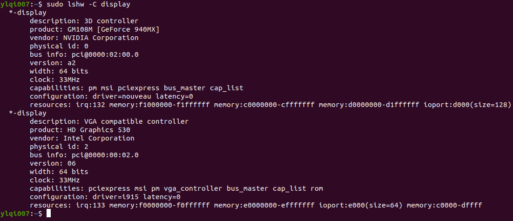
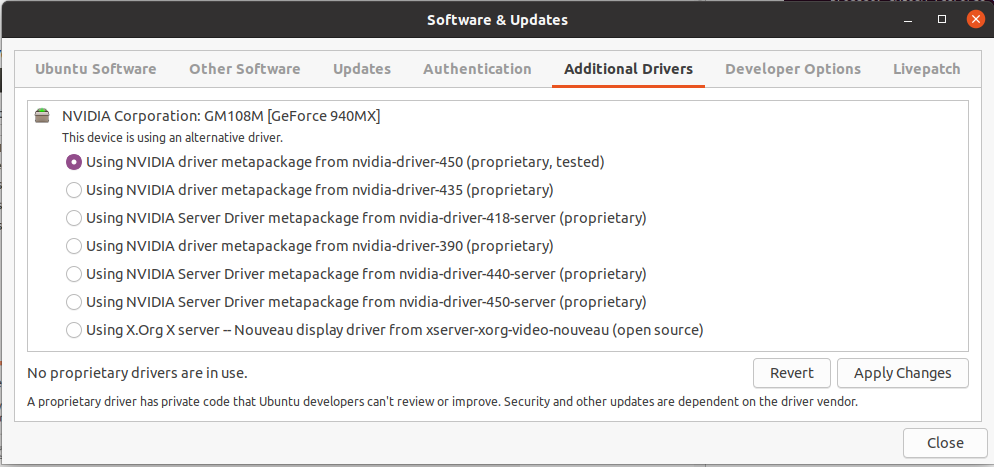

[TOC]

## Development Environment

### Nvidia Driver

By default X.org, X server use nouveau free/libre shotware drivers for Nvidia cards.

#### Step 1. Find out information about your GPU

```bash
sudo lshw -C display
```



#### Step 2. Install Nvidia dirver using GUI method

* Method 1. `Software & Updater` --> `Additional Drivers` --> `Additional Drivers`, choose **proprietary, tested**, and then reboot.

  

* Method 2. CLI method. 

  ```bash
  apt search nvidia-driver
  apt-cache search nvidia-driver
  sudo apt install nvidia-driver-390
  ```

#### Step 3. Verify

```bash
$ nvidia-smi
$ sudo nvidia-settings
```

### Cuda

#### Step 1. Pre-installation

#### Step 2. Installation

[Installation on Ubuntu](https://docs.nvidia.com/cuda/cuda-quick-start-guide/index.html#ubuntu-x86_64)

[the CUDA Toolkit download website](https://developer.nvidia.com/cuda-downloads?target_os=Linux&target_arch=x86_64&target_distro=Ubuntu&target_version=1604&target_type=deblocal): Installation instructions

```bash
$ wget https://developer.download.nvidia.com/compute/cuda/repos/ubuntu2004/x86_64/cuda-ubuntu2004.pin
$ sudo mv cuda-ubuntu2004.pin /etc/apt/preferences.d/cuda-repository-pin-600
$ wget https://developer.download.nvidia.com/compute/cuda/11.1.1/local_installers/cuda-repo-ubuntu2004-11-1-local_11.1.1-455.32.00-1_amd64.deb
$ sudo dpkg -i cuda-repo-ubuntu2004-11-1-local_11.1.1-455.32.00-1_amd64.deb
$ sudo apt-key add /var/cuda-repo-ubuntu2004-11-1-local/7fa2af80.pub
$ sudo apt-get updatesudo apt-get -y install cuda
```

After installation, we still need to set up the development environment by modifying the `PATH` and `LD_LIBRARY_PATH`:

```bash
$ export PATH=/usr/local/cuda-11.1/bin${PATH:+:${PATH}}
$ export LD_LIBRARY_PATH=/usr/local/cuda-11.1/lib64${LD_LIBRARY_PATH:+:${LD_LIBRARY_PATH}}
```


#### Step 3. Post-installation

Install sample demos and verify:

```bash
$ cuda-install-samples-11.1.sh ~
$ cd ~/NVIDIA_CUDA-11.1_Samples/5_Simulations/nbody
$ make
$ ./nbody
```


### Conda

* [Installing on Linux](https://docs.conda.io/projects/conda/en/latest/user-guide/install/linux.html)

* [Anaconda vs. miniconda](https://stackoverflow.com/questions/45421163/anaconda-vs-miniconda)

* [Python Installation - Conda Install](https://developers.google.com/earth-engine/guides/python_install-conda), 如果出现 `Conda: command not found` 可以参考这个 Google 文档的建议。

* [Conda command not found](https://stackoverflow.com/questions/35246386/conda-command-not-found/44319368)

* [How do I prevent Conda from activating the base environment by default?](https://stackoverflow.com/questions/54429210/how-do-i-prevent-conda-from-activating-the-base-environment-by-default)

   `conda config --set auto_activate_base false`


### Driver, CUDA and cuDNN

[显卡，显卡驱动,nvcc, cuda driver,cudatoolkit,cudnn区别？](https://cloud.tencent.com/developer/article/1536738)

[GPU，CUDA，cuDNN的理解](https://blog.csdn.net/u014380165/article/details/77340765)


### Reference

* [Ubuntu Linux Install Nvidia Driver (Latest Proprietary Driver)](https://www.cyberciti.biz/faq/ubuntu-linux-install-nvidia-driver-latest-proprietary-driver/)
* [How to install the NVIDIA drivers on Ubuntu 20.04 Focal Fossa Linux](https://linuxconfig.org/how-to-install-the-nvidia-drivers-on-ubuntu-20-04-focal-fossa-linux)
* [When installing CUDA, how to determine distro,version and architecture parameters?](https://askubuntu.com/questions/927640/when-installing-cuda-how-to-determine-distro-version-and-architecture-parameter)
* [CUDA Toolkit 11.1 Update 1 Downloads](https://developer.nvidia.com/cuda-downloads?target_os=Linux&target_arch=x86_64&target_distro=Ubuntu&target_version=1604&target_type=deblocal)
* [CUDA安装完成后测试部分报错bash: ./nbody: No such file or directory](https://www.codeleading.com/article/77313998501/)
* [Installation on Ubuntu](https://docs.nvidia.com/cuda/cuda-quick-start-guide/index.html#ubuntu-x86_64)
* [the CUDA Toolkit download website](https://developer.nvidia.com/cuda-downloads?target_os=Linux&target_arch=x86_64&target_distro=Ubuntu&target_version=1604&target_type=deblocal)
* [Is it still necessary to install CUDA before using the conda tensorflow-gpu package?](https://stackoverflow.com/questions/61533291/is-it-still-necessary-to-install-cuda-before-using-the-conda-tensorflow-gpu-pack)
* [The Best Way to Install TensorFlow with GPU Support on Windows 10 (Without Installing CUDA)](https://www.pugetsystems.com/labs/hpc/The-Best-Way-to-Install-TensorFlow-with-GPU-Support-on-Windows-10-Without-Installing-CUDA-1187/)