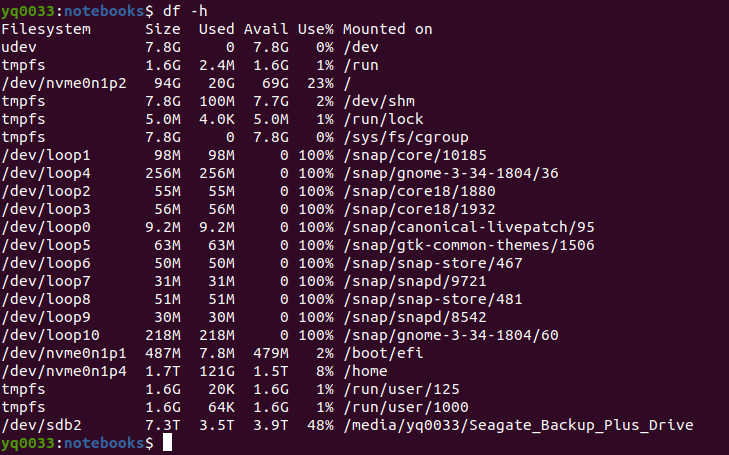
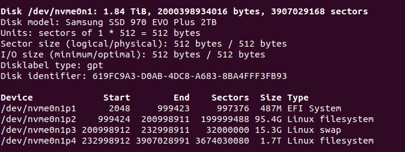

[TOC]

## Linux 磁盘管理

Linux 磁盘管理好坏直接关系到系统的性能。磁盘管理常用到下面的命令

### `df`, 查看文件系统的整体磁盘使用情况

### `du`，检查磁盘空间使用量。

Linux `du` 命令也是查看使用空间的，但是与 `df` 命令不同的是 Linux `du` 命令是对文件和目录磁盘使用的空间的查看，还是和 `df` 命令有一些区别的。

### `fdisk`， 用于磁盘分区。

但是使用 `-l` 参数，也可以列出所有的分区内容。不加 `-l` 则会进入分区模式。

`sudo fdisk -l`

### `mount/unmount` 挂载/卸载

## References:
* [linux 的 磁盘管理](https://www.cnblogs.com/greentomlee/p/9918047.html)
* [Linux磁盘管理](https://cshihong.github.io/2018/06/20/Linux%E7%A3%81%E7%9B%98%E7%AE%A1%E7%90%86/)
* [Linux allocated devices (4.x+ version)](https://www.kernel.org/doc/html/latest/admin-guide/devices.html)