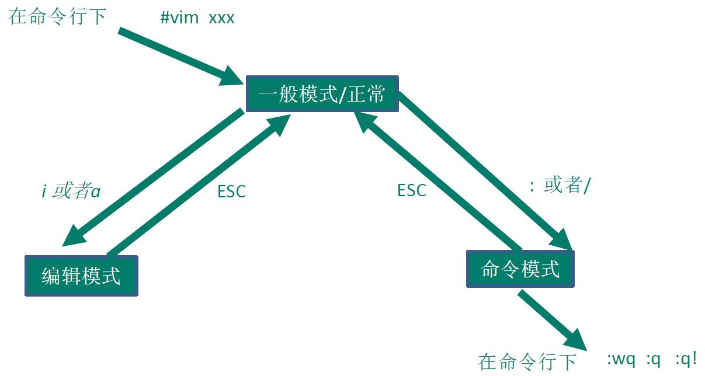
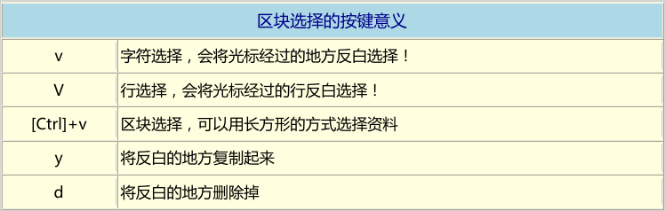

[TOC]

TODO
- [ ] rescue from `.swp` file.

## vim 程序编辑器

### 1. vi 与 vim
在 Linux 世界中，绝大多数的配置文件都是以 ASCII 的纯文本形式存在，因此利用简单的文字编辑软件就能够修改设定，
因此也一直建议使用文本模式处理 Linux 的系统设定问题。

什么是纯文本档？其实文件记录的就是 0 和 1，而我们通过编码系统来将这些 0 和 1 转成我们认识的文字。ASCII 就是
其中一种广为使用的文字编码系统。

Linux 的文件编辑器有很多，比如 emacs，pico，nano，joe 等等。但是为什么一定要学 vi/vim？

1. 所有的 Unix Like 系统都会内建 vi 文件编辑器，其他的文件编辑器不一定会存在；
2. 很多软件的编辑接口都会主动呼叫 vi（比如 crontab，visudo，edquota 等指令）；
3. vim 具有程序编辑能力，可以主动的以字体颜色辨别语法的正确性，方便程序设计；
4. 因为 vi/vim 程序简单，编辑速度相当快。

其实重点是上述的第二点，因为有太多 Linux 指令都默认使用 vi 作为数据编辑的接口，所以一定要学会 vi，否则有
很多指令根本无法操作。

vim 是 vi 的进阶版本，vim 可以用颜色或底线等方式显示一些特信息。此外 vim 可以使用各种插件，可以实现很多
额外的功能。

### 2. vi 的使用
#### 三种模式
vi 共分为三种模式：一般模式，编辑模式，指令列命令模式。这三种模式的作用分别是：
* 一般模式(command mode)：以 vi 打开一个文件就直接进入一般模式(这是默认的模式)。在这个模式中，可以使用
上下左右按键移动光标，可以使用“删除字符”或“删除整行”来处理文件内容，也可以使用“复制、粘贴”来处理文件。
* 编辑模式(insert mode)：在一般模式中可以进行删除、复制、粘贴等动作，但是无法编辑文件内容。要等到你按下
“i, I, o, O, a, A,r, R” 等任何一个字母后才会进入编辑模式。在 Linux 中按下这些按键，左下方会出现 “INSERT” 
或 “REPLACE” 的字样，此时可以进行编辑。如果要回到一般模式，必须按下 “Esc” 按键退出编辑模式。
* 指令列命令模式(command-line mode)：在一般模式中，输入 “: / ?” 三个中的任何一个按键，就可以将光标移动到
最低下一行。在这个模式当中，可以实现搜索动作，读取、存盘、大量取代字符、离开 vi、显示行号等动作。
* 注意：一般模式可以与编辑模式或命令模式切换，但是编辑模式与指令模式之间不可相互切换。

#### 常见按键说明
* 在一般模式中，按下 `:wq` 保存后离开 vi/vim。当权限不对的时候，可以使用 `:wq!` 强制写入。 
* `:set nu` or `:set nonu`，设置或取消行号。

- [ ] 光标移动的方法，hjkl 等，找一张 cheet sheet

### 3. vim 的额外功能
#### vim 的额外功能
* 颜色显示，程序语法
* 区块选择(Visual Block)

* 多窗口功能

#### vim 的暂存档、救援恢复与开启是的警告信息
在目前的主要编辑软件中都会有“恢复”功能，亦即当你的系统因为某些原因导致类似当机的情况时，还可以通过某些特殊的
机制来将之前未存储的数据“救”回来。vim 也有这个功能，vim 可以通过“暂存档”实现救援。

- [ ] recover from `.swp` file. Not success

#### vim 环境设定与记录：~/.vimrc, ~/.viminfo
vim 会主动将你曾经做过的行为记录下来，好让你下次可以轻松的作业。记录动作的文件就是 `~/.viminfo`。如果你曾经
使用过 vim，那么你的 Home 目录会有这个文件，这个文件是自动产生的，不必自行建立。你在 vim 中所有做过的动作，
可以在这个文件中查询到。

我们可以通过配置文件来直接规定我们习惯的 vim 操作环境。整体的 vim 的设定值一般是放置在 `/etc/vimrc` 这个
文件中，不过不建议你修改它。你可以修改 `~/.vimrc` 这个文档(如果不存在，可以自行手动建立)，将自己所希望的
设定值写入。

### 4. 其他 vim 的使用事项
#### 中文编码问题
有时候 vim 中无法显示正常的中文。这很可能是因为编码问题。因为中文编码有 big5 和 utf8 两种，如果文件使用的
是 big5 编码制作的，但是在 vim 的终端接口使用的万国码(utf8)，由于编码的不同，中文文档显示的内容当然是一堆乱码。
如何解决呢？可以考虑的角度有这些：

1. Linux 系统默认支持的语系数据：这些与 `/etc/sysconfig/i18n` 有关；
2. 终端界面 (bash) 的语系：这与 LANG 这个变量有关；
3. 档案原本的编码；
4. 开启终端的软件，例如在 GNOME 底下的窗口接口。

事实上重要的是第三、第四两点，只要这两点的编码一致，就能够正确的看到并编辑中文文档，否则就是一段乱码。

#### DOS 与 Linux 的断行字符

## References
1. [Vim Cheat Sheet ](https://vim.rtorr.com/)
2. [Vim Commands Cheat Sheet](https://www.fprintf.net/vimCheatSheet.html)
3. [Vi IMproved](http://bruxy.regnet.cz/programming/vim_cheatsheet/vim_cheatsheet.html)

