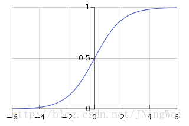
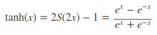
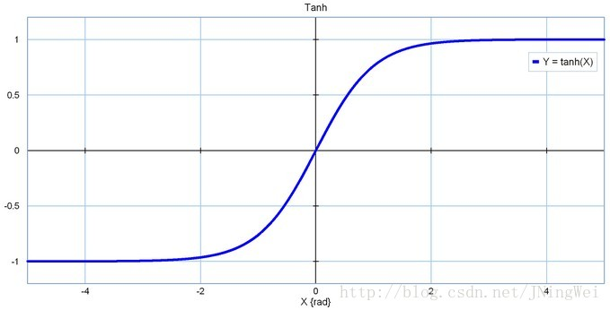
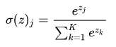
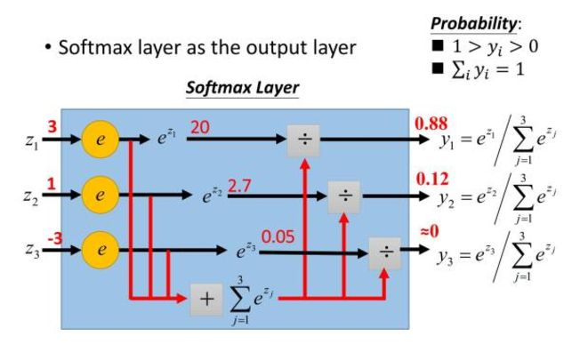
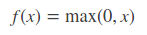
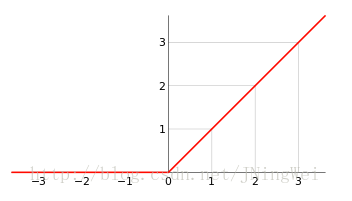
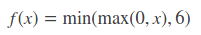
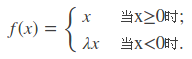
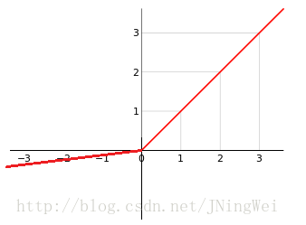

# [深度学习: 激活函数 (Activation Functions)](https://blog.csdn.net/JNingWei/article/details/79210904)

## 1. Introduction
* 激活函数（activation function）层又称 非线性映射 (non-linearity mapping) 层，作用是 增加整个网络的非线性（即 表达能力 或 抽象能力）。
* 深度学习之所以拥有 强大的表示能力 ，法门便在于 激活函数 的 非线性 。
* 然而物极必反。由于 非线性设计 所带来的一系列 副作用（如 期望均值不为0、死区），迫使炼丹师们设计出种类繁多的激活函数来 约束 非线性 的 合理范围 。
* 由于激活函数接在bn之后，所以激活函数的输入被限制在了 (-1, 1) 之间。因此，即使是relu这种简易的激活函数，也能很好地发挥作用。

## 2. 激活函数类型
激活函数中，常用的有Sigmoid、tanh(x)、Relu、Relu6、Leaky Relu、参数化Relu、随机化Relu、ELU。        
其中，最经典的莫过于 Sigmoid函数 和 Relu函数 。

### 2.1 Sigmoid
Sigmoid函数，即著名的 Logistic 函数。
被用作神经网络的阈值函数，将变量映射到 (0，1) 之间

| Sigmoid  |
|:------------:|
|  |
|  |

* 期望均值为0.5, 不符合**均值为0**的理想状态。
* 当 Sigmoid 函数落到`(-inf, -5) U (5, inf)` 时候，梯度几乎为0，发生**梯度弥散**。因此也就存在两块**死区**。
* Sigmoid 函数饱和会使梯度消失(梯度弥散)
* Sigmoid函数的输出不是零中心的。

### 2.2 tanh (双曲正切)
| tanh  |
|:------------:|
|  |
|  |

* 期望的均值移动到了 0。
* 无法回避两块死区，并且略有扩大。

> **为了防止饱和，现在主流的做法会在激活函数前多做一步batch normalization，尽可能保证每一层网络的输入具有均值较小的、零中心的分布。**

### 2.3 Softmax
| Softmax  |
|:------------:|
|  |
|  |
* Softmax 用于多分类神经网络的输出，目的是让大概率的更大。
* Softmax 是 sigmoid 的扩展。当类别数 k==2 的时候，softmax 回归退化为 Logistic 回归。
*

### 2.3 Relu (Rectified Linear Unit， 修正线性单元)
| Relu  |
|:------------:|
|  |
|  |

* 当下设计的标配，与 Relu 一起应用的有两个一下的标配
    * He初始化(对 relu 网络有利)
    * conv -> bn -> relu (默认采用 relu)

优点：
* 彻底消灭正半轴的死区
* 计算超简单
* 有助于是模型参数稀疏

缺陷：
* 期望距离 0 更远了。
* 负半轴的死区范围更广了。

### 2.4 Relu6
| Relu6  |
|:------------:|
|  |

优点：
* 对 正半轴 施加 **非线性约束**
* 计算简单

缺点：
* 期望不为 0
* 正半轴死区重现

BN 出现后，activation 的输入被归一化到(-1, 1)，所以死区的影响就没有那么打了，relu6 也就没有必要了。

### 2.5 LeakyRelu
| Leaky_Relu  |
|:------------:|
|  |
|  |

优点：
* 没有死区

缺点：
* 期望依然不为 0
* 参数 lambda 难以设定，导致**性能不稳定**

### 2.6 参数化Relu

### 2.7 随机化Relu

### 2.8 ELU (Exponential Linear Unit, 指数化线性单元)
| ELU  |
|:------------:|
|  |

优点：
* 没有死区

缺点：
* 期望不为 0
* 计算复杂

## 简单总结
* Sigmoid 和 tanh 不建议
* Relu 最常用
* CNN 标配的module："conv -> bn -> relu"

## Reference:
1. [tensorflow: 激活函数(Activation_Functions) 探究](https://blog.csdn.net/JNingWei/article/details/77855733)
2. [常用激活函数的比较](https://zhuanlan.zhihu.com/p/32610035)
3. [CS231n课程笔记翻译：神经网络笔记1（上）](https://zhuanlan.zhihu.com/p/21462488?refer=intelligentunit)
4. [【机器学习】神经网络-激活函数-面面观(Activation Function)](https://blog.csdn.net/cyh_24/article/details/50593400)
5. [Sigmoid vs Softmax 输出层选择](https://zhuanlan.zhihu.com/p/22159946)
6. [Cross-Entropy or Log Likelihood in Output layer](https://stats.stackexchange.com/questions/198038/cross-entropy-or-log-likelihood-in-output-layer)
7. [Comparison between Softmax and Sigmoid for classification output.](https://www.reddit.com/r/MachineLearning/comments/32iyt9/question_comparison_between_softmax_and_sigmoid/)
8. [Sigmoid 函数和 Softmax 函数的区别和关系](https://blog.nex3z.com/2017/05/02/sigmoid-%E5%87%BD%E6%95%B0%E5%92%8C-softmax-%E5%87%BD%E6%95%B0%E7%9A%84%E5%8C%BA%E5%88%AB%E5%92%8C%E5%85%B3%E7%B3%BB/)
9. [深度学习常用激活函数之— Sigmoid & ReLU & Softmax](https://blog.csdn.net/Leo_Xu06/article/details/53708647)

