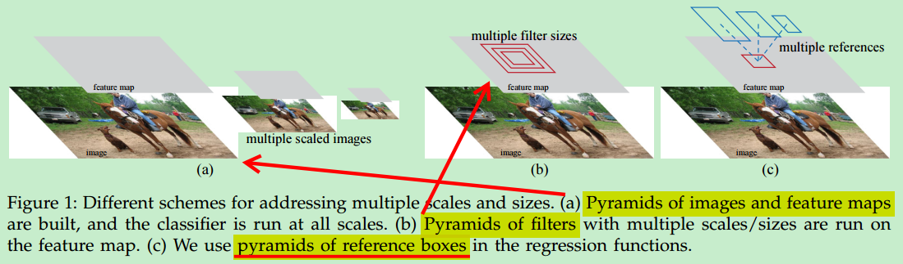
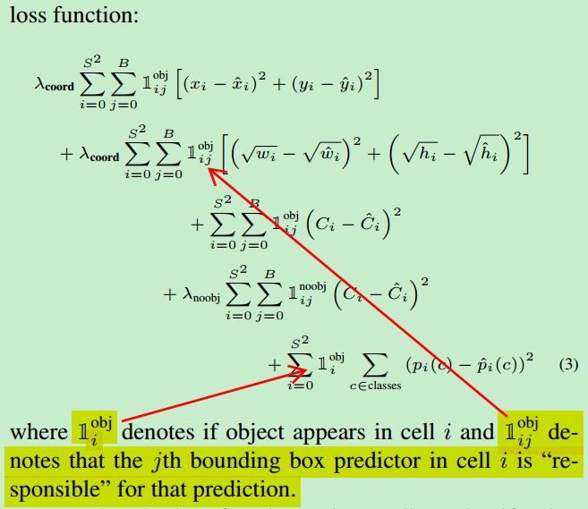
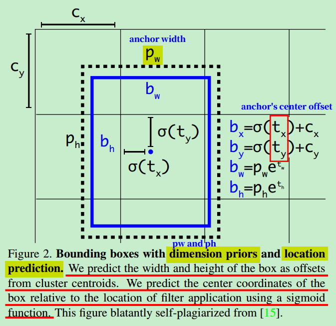
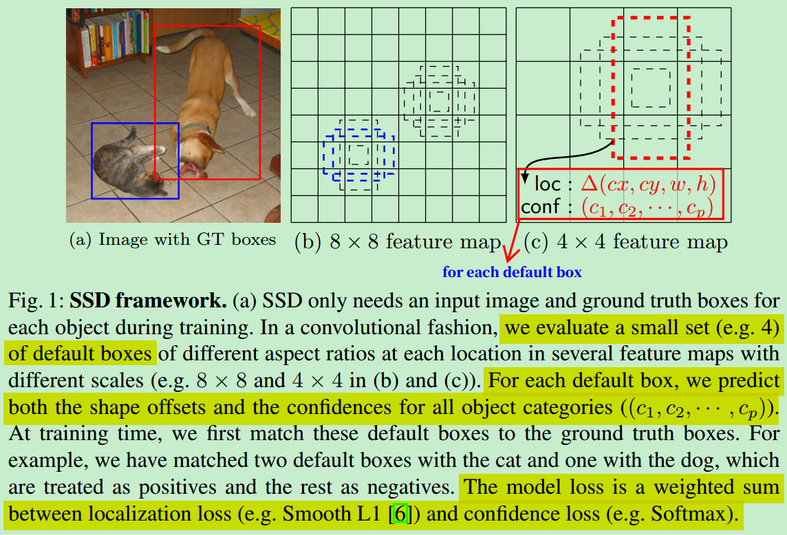
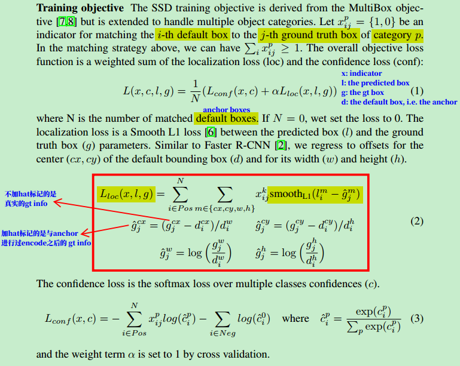

[toc]

有 TODO 需要补充


## Paper
### Fast R-CNN 中关于 Multi-task loss 的内容

> A Fast R-CNN network has two sibling output layers. 
> The first outputs a discrete probability distribution (per RoI), $p=(p_{0},...,p_{K})$, over $K+1$ categories. As usual, $p$ is computed by a softmax over the $K+1$ outputs of a fully connected layer. 
> The second sibling layer outputs bounding-box regression offsets, $t^{k}=(t^{k}_{x},t^{k}_{y},t^{k}_{w},t^{k}_{h})$, for each of the $K$ object classes, indexed by $k$. 
> $t^{k}$ specifies a scale-invariant translation and log-space height/width shift relative to an object proposal.
>
> Each training RoI is labeled with a ground-truth class $u$ and ==a ground-truth bounding-box regression target $v$.== We use a multi-task loss $L$ on each labeled RoI to jointly train for classification and bounding-box regression:
>
> $$L(p, u, t^{u}, v) = L_{cls}(p, u) + \lambda[u \geq 1]L_{loc}(t^{u}, v)$$
>
> in which $L_{cls}(p, u) = - log(p_{u})$ is log loss for true class $u$.
>
> The second task loss, $L_{loc}$, is defined over a tuple of true bounding-box regression targets for class $u$, $v = (v_{x},v_{y}, v_{w},v_{h})$, 
>
> and a predicted tuple $t^{u}=(t^{u}_{x},t^{u}_{y},t^{u}_{w},t^{u}_{h})$, again for class $u$.
>
> For bounding-box regression, we use the loss
> $$
> L_{loc}(t^{u}, v) = \sum_{i \in \{ x,y,w,h \} } smooth_{L_{1}}(t^{u}_{i} - v_{i})
> $$
> in which
> $$
> smooth_{L_{1}} = 
> \begin{cases} 
> 0.5x^{2}, & if \lvert x \rvert < 1 \\
> \lvert x \rvert - 0.5, & otherwise,
> \end{cases}
> $$
> is a robust $L_{1}$ loss that is less sensitive to outliers than $L_{2}$ loss used in R-CNN ans SPPnet. When the regression targets are unbounded, training with $L_{2}$ loss can require careful of learning of learning rate in order to prevent exploding gradients. The $smoothe_{L_{1}}$ eliminates this sensitivity.

* 关于 $smooth_{L_{1}}$ 的定义。


### Faster R-CNN 中关于 Anchor 的内容

> ==At each sliding-window location, we simultaneously predict multiple region proposals, where the number of maximum possible proposals for each location is denoted as $k$.== So the *reg* layer has $4k$ outputs encoding the coordinates of $k$ boxes, and the *cls* layer outputs $2k$ scores that estimate probability of object or not object for each proposal. The $k$ proposals are parameterized *relative* to $k$ reference boxes, which we call **anchor**. An anchor is centered as the sliding window in question, and is associated with a scale and aspect ration.

* At each sliding-window location, the model 同时 predict $k$ region proposals; 
* **每个 proposal** 对应4个 *loc* 坐标，所以 reg layer 输出 $4k$ outputs for this location, 后续计算 loc regression loss 的时候会用到这里的输出;
* **每个 proposal** 对应2个 scores，分别对应 of object 和 not object，所以 *cls* layer 输出 $2k$ outputs, 后续计算 cls loss 的时候会用到这里的输出; 
* 输出的 $k$ 个 proposals 的参数都是相对于 $k$ 个参考坐标，也就是 `k` anchors.


> **Translation-Invariant Anchors**
>
> An important property of our approach is that is is ***translation invariant***, both in terms of the anchors and the functions that compute proposals relative to the anchors.
>
> The translation-invariant property also reduces the model size. MultiBox has a $(4+1)\times800$ dimensional fully-connected output layer, whereas our model has a $(4+2)\times9$ dimensional convolutional output layer in the case of $k=9$ anchors.

* 在每个 feature map 上的所有 position 上，default 的 anchors 都是一样的；在同一个 feature map 上的 anchors，都是经过相同的 function 处理，比如都是相同的 conv layers。
* 由于在每个 anchor 上采用的是 conv layers，所以 parameter size 要比 fully connected layer 小很多。


> **Multi-Scale Anchors as Regression References**
>
> There have been two popular ways for multi-scale predictions. The first way is based on image/feature pyramids. The images are resized at multiple scales, and feature maps are computed for each scale. The second way is to use sliding windows of multiple scales (and/or aspect ratios) on the feature maps. The second way is usually adopted jointly with the first way.
>
> 
>
> As a comparison, our anchor-based method is built on ***a pyramid of anchors***, which is more cost-efficient. ==Our method classifies and regresses bounding boxes with reference to anchor boxes of multiple scales and aspect ratios.==

* Method 1. Rescale image，然后在 rescaled image 上计算 feature map; 
* Method 2. 用不同 scales 的 sliding window.
* 对 bounding boxes 的分类和回归是以不同 scales 和 ratios 的 anchors。


> **Loss Function (Encode anchor with gt_box)**
>
> For training RPNs, we assign a binary class label (of being an object or not) to each anchor. ==We assign a positive label to two kinds of anchors: (i) the anchor/anchors with the highest Intersection-over-Union (IoU) overlap with a ground-truth box, or (ii) an anchor that has an IoU overlap higher than 0.7 with any ground-truth box. Note that a single ground-truth box may assign positive labels to multiple anchors.== Usually the second condition is sufficient to determine the positive samples; but we still adopt the first condition for the reason that in some rare cases the second condition may find no positive sample. We assign a negative label to ==a non-positive anchor== if its IoU ratio is lower than 0.3 for all ground-truth boxes. Anchors that neither positive nor negative do not contribute to the training objective.

* Anchors assigned positive labels:
  * Have the highest IoU with a ground-truth box.
  * Have an IoU overlap higher than 0.7 with any ground-truth box.
  * A single ground-truth box may assign positive labels to multiple anchors.
  * (i) 与任何 gt box 的 IoU 有大于 0.7 的 anchor boxes，都设置为 positive label；(ii) 有些 anchor boxes 与 gt boxes 最大的 IoU 不超过设定的阈值(0.5)，但是也将其设置为 positive。
* Anchors assigned negative labels:
  * If its IoU is lower than 0.3 for all ground-truth boxes, i.e. the max IoU is lower than 0.3.
* Anchors that neither positive nor negative do not contribute to the training objective. 也就是 ignored anchors 对训练目标没有贡献。


> **Loss Function**
>
> Our loss function for an image is defined as:
>
> $$L({p_{i}},{t_{i}})=\frac{1}{N_{cls}} \sum_{i}L(p_{i}, p^{*}_{i})+\lambda \frac{1}{N_{reg}} \sum_i p^{*}_{i} L_{reg}(t_{i}, t^{*}_{i})$$
>
> Here, $i$ is the index of an anchor in a mini-batch and $p_{i}$ is the predicted probability of anchor $i$ being an object. The ground-truth label $p^{*}_{i}$ is 1 if the anchor is positive, and is 0 is the anchor is negative. ==$t_{i}$ is a vector representing the 4 parameterized coordinates of the predicted bounding box, and $t^{*}_{i}$ is that of the ground-truth box associated with a positive anchor.== 
>
> The classification loss $L_{cls}$ is log loss over two classes (object vs. not object). For the regression loss, we use $L_{reg}(t_{i}, t^{*}_{i}) = R(t_{i} - t^{*}_{i})$ where $R$ is the robust loss function (smooth $L_{i}$)  defined in *Fast R-CNN*.
>
> The two terms are normalized by $N_{cls}$ and $N_{reg}$ and weighted by a balancing parameter $\lambda$. By default we set $\lambda = 10$, and thus both $cls$ and $reg$ terms are roughly equally weighted. We also note that the normalization as above is not required and could be simplified.
>
> For bounding box regression, we adopt the parameterizations of the 4 coordinates following R-CNN:
> $$
> t_{x} = (x - x_{a}) / w_{a},t_{y} = (y - y_{a}) / h_{a},t_{w}=log(w/w_{a}), t_{h}=log(h/h_{a})	\\
> t^{*}_{x} = (x^{*} - x_{x}) / w_{a}, t^{*}_{y} = (y^{*} - y_{a}) / h_{a},t^{*}_{w}=log(w^{*}/w_{a}), t^{*}_{h}=log(h^{*}/h_{a})
> $$
> where $x, y, w$ and $h$ denote the **predicted box's** center coordinates and its width and height. 
> where $x^{*}, y^{*}, w^{*}$ and $h^{*}$ denote the **ground trubh box's** center coordinates and its width height.
>
> Variable $x, x_{a}$ and $x^{*}$ are for the predicted box, anchor box, and ground-truth box respectively (likewise for $y, w, h$).

* $L_{cls}$ is log loss; $L_{reg}$ uses the robust loss function (like smooth $L_{1}$).
* ==在 $L_{reg}(t_{i}, t^{*}_{i})$ 中，$t_{i}$ 是distance between predicted box and anchor box; $t^{*}_{i}$ 是 distance betwwen gt_box and anchor box.==
* 在计算 box regression loss 的时候，$t_{x}$ and $t^{*}_{x}$ 都是经过与 anchor box 编码过的，其中中心点坐标 $(x, y)$ 是经过平移、伸缩变换的，大小 $(w, y)$ 是经过 $log$ 处理的。==[原因？为什么这么做？]==
* $t_{x}, t_{y}, t_{w}, t_{h}$ 都是 predicted info 与 anchor box 的 parameterized info; 
  $t^{*}_{x}, t^{*}_{y}, t^{*}_{w}, t^{*}_{h}$ 搜是 ground truth info 与 anchor box 的 parameterized info;
  最后计算 regression loss 的时候就是计算 $t_{x}, t_{y}, t_{w}, t_{h}$ 与 $t^{*}_{x}, t^{*}_{y}, t^{*}_{w}, t^{*}_{h}$ 之间的差异。


### YOLO 中关于 loss 的内容

> 
>
> Note that the loss function only penalizes classification error if an object is present in that grid cell (hence the conditional class probability discussed earlier). It also only penalizes bounding box coordinate error if that predictor is "responsible" for the ground truth box (i.e. has the highest IOU of any predictor in that grid cell).

* Increase the loss from bounding box coordinate predictions and decrease the loss from confidence predictions for the boxes that don't contain objects. Use two parameters, $\lambda_{coord}=5$ and $\lambda_{noobj}=0.5$ to accomplish this.


### YOLO9000 中关于 anchor 的内容

> **Convolutional With Anchor Boxes** 
>
> YOLO predicts the coordinates of bounding boxes directly using ==fully connected layers== on top of the convolutional feature extractor. Instead of predicting coordinates directly, Faster R-CNN predicts bounding boxes using hand-picked priors. Using only convolutional layers the region proposal (RNP) in Faster R-CNN predict offsets and confidences for anchor boxes. Since the prediction layer is convolutional, the RPN predicts these offsets at every location in a feature map. ==Predicting offsets instead of coordinates simplifies the problem and makes it easier for the network to learn.==
>
> We remove the fully connected layers from YOLO and use anchor boxes to predict bounding boxes. First we eliminate one pooling layer to make the output of the network's convolutional layers higher resolution. We also shrink the network to operate on 416 input images instead of $448 \times 448$. We do this because we want an odd number of locations in our feature map so there is a single center cell.
>
> When we move to anchor boxes we also decouple the class prediction mechanism from the spatical location and instead ==predict class and objectness for every anchor box==. Following YOLO, the objectness prediction still predicts the IOU of the ground truth and the proposed box and the class predictions predict the conditional probability of that class given that there is an object.

* YOLO 中在 feature map 上采用 fully connected layers 直接 predict the coordinates of bounding boxes.
* Faster R-CNN 并组直接 predicting coordinates directly，而是 predict bounding boxes using hand-picked priors. 也就是 predict offsets and confidences for anchor boxes.
* Predict offsets 而不是直接 predict coordinates 会简化问题，让 training 变得简单。
* 在 YOLOv2 中也开始对每个 anchor boxes 进行 predict；但是依然是在 objectness 的基础上在预测 conditional probability。


> **Direct location prediction.**
>
> When using anchor boxes with YOLO we encounter a second issue: model instability, especially during early iterations. Most of the instability comes from predicting the $(x, y)$ locations for the box. ==In region proposal networks== the network predicts values $t_{x}$ and $t_{y}$ and the center $(x, y)$ center coordinates are calculated as:
> $$
> x = (t_{x} * w_{a}) - x_{a}	\\
> y = (t_{y} * w_{a}) - y_{a}
> $$
> This fomulation is unconstrained so any anchor box can end up at any point in the image, regardless of what location predicted the box. With random initialization the model takes a long time to stabilize to predicting sensible offsets.
>
> Instead of predicting offsets we follow the approach of YOLO and ==predict location coordinates relative to the location of the grid cell.== This bounds the ground truth to fall between 0 and 1.
>
> The network predicts 5 bounding boxes at each cell in the output feature map. The network predicts 5 coordinates for each bounding box, $t_{x}, t_{y}, t_{h}, t_{w}$, and $t_{o}$. If the cell is offset from the top left corner of the image by $(c_{x}, c_{y})$ and the bounding box prior has width and height $p_{w}, p_{h}$, then the predictions correspond to:
> $$
> \begin{align*}
> b_{x} &= \sigma(t_{x}) + c_{x}	\\
> b_{y} &= \sigma(t_{y}) + c_{y}	\\
> b_{w} &= p_{w}e^{t_{w}}	\\
> b_{h} &= p_{h}e^{t_{h}}	\\
> Pr(object)*IOU(b, object) &= \sigma(t_{o})
> \end{align*}
> $$
> Since we constrain the location prediction the parametrization is eaiser to learn, making the network more stable. Using dimension clusters along with directly predicting the bounding box center location improves YOLO by almost $5\%$ over the version with anchor boxes.

* Predict 输出 $t_{x}, t_{y}, t_{h}, t_{w}$, and $t_{o}$, decode 之后是 $b_{x}, b_{y}, b_{h}, b_{w}$。


### YOLOv3 中关于 anchor 的内容

> Following YOLO9000 our system predicts bounding boxes using dimension clusters an anchor boxes. The network predicts 4 coordinates for each bounding boxes, $t_{x}, t_{y}, t_{w}, t_{h}$. If the cell is offset from the top left corner of the image by $(c_{x}, c_{y})$ and the bounding box prior has width and height  $p_{w}, p_{h}$, then the predictions correspond to:
> $$
> \begin{align*}
> b_{x} &= \sigma(t_{x}) + c_{x}	\\
> b_{y} &= \sigma(t_{y}) + c_{y}	\\
> b_{w} &= p_{w}e^{t_{w}}	\\
> b_{h} &= p_{h}e^{t_{h}}
> \end{align*}
> $$
> During training we use sum of squared error loss. If the ground truth for some coordinate prediction is $\hat{t}_{*}$, our gradient is the ground truth value (computed from the ground truth box) minus our prediction: $\hat{t}_{*} - t_{x}$. This ground truth value can be easily computed by inverting the equation above.
>
> YOLOv3 predicts an objectness score for each bounding box using logistic regression. This should be 1 if the bounding box prior overlaps a ground truth object by more than any other bounding box prior. If the bounding box prior is not the best but does overlap a ground truth object by more than some threshold we ignore the prediction, following Faster R-CNN. We use the threshold of 0.5. ==Unlike Faster R-CNN, our system only assigns one bounding box prior for each ground truth object.== If a bounding box prior is not assigned to a ground truth object it incurs no loss for coordinate or class predictions, only objectness.
>
> 
>
> 

* 在 YOLOv3 中, assign one anchor for each ground truth box, 也就是每个 gt_box 只与一个 anchor box 匹配。这与一个 gt_box 可以与多个 anchor box 匹配是不同的。
* loss 由三部分组成：coordinate loss, class predictions loss, and objectness loss. 如果一个 anchor box 没有与任何 gt_box 成功匹配，则该 anchor box 对 coordinate and class predictions loss 没有影响，只对 objectness loss 产生影响。


### SSD 中关于 Anchor 的内容

> 
>
> 
>
> **Default boxes and aspect ratios** 
>
> We associate a set of default bounding boxes with each feature map cell, for multiple feature maps at the top of the network. The default boxes tile the feature map in a convolutional manner, so that the position of each box relative to its corresponding cell is fixed. ==At each feature map cell, we predict the offsets relative to the default box shapes in the cell, as well as the per-class scores that indicate the presence of a class instance in each of those boxes.== Specifically, for each box out of $k$ at a given location, we compute $c$ class scores and the 4 offsets relative to the original default box shape. This results in a total of $(c+4)k$ filters that are applied around each location in the feature map, yielding $(c+4)kmn$ outputs for a $m \times n$ feature map. Our default boxes are similar to the *anchor boxes* used in Faster R-CNN, however, we apply them to several feature maps of different resolutions. Allowing different default box shapes in several feature maps let us efficiently discretize the space of possible output box shapes.

* 在 base network 的基础上生成几层不同 scales 的 feature maps，然后在这几层 feature maps 上平铺一些 default bounding box (i.e. anchor box), 然后在每个feature map cell 模型预测与 anchor boxes 的 offsets 和 per-class scores.
* $(c+4)$ for each default box (i.e. each anchor box); $(c+4)k$ for each cell; $(c+4)kmn$ for each feature map.
* 在不同 scale 上的 feature map 可以有不同 size, shape and ratio 的 default boxes.


> **Training**
>
> The key difference between training SSD and training a typical detector that uses region proposals, is that ==ground truth information needs to be assigned to a specific outputs in the fixed set of detector outputs.== Some version of this is also required for training in YOLO and for the region proposal stage of Faster R-CNN and MultiBox. Once this assignment is determined, the loss function and back propagation are applied end-to-end. Training also involves choosing the set of default boxes and scales for detection as well as the hard negative mining and data augmentation strategies.

* 关键点：ground truth information needs to be assigned to a specific outputs in the fixed set of detector outputs. 也就是 **gt_boxes** 和 **anchor_boxes** 应该进行 ==encode==。


> **Matching strategy**
>
> During training, we need to determine which default boxes correspond to a ground truth detection and train the network accordingly. For each ground truth box we are selecting from default boxes that vary over location, aspect ratio, and scale. ==We begin by matching each ground truth box to the default box with the best jaccard overlap (as in MultiBox).== ==Unlike MultiBox, we then match default boxes to any ground truth with jaccard overlap higher than a threshold (0.5).== This simplifies the learning problem, allowing the network to predict high scores for multiple overlapping default boxes rather than requiring it to pick only the one with maximum overlap.

* 在每个 feature map 上有众多的 anchor boxes，到底哪一个与 gt_box 进行匹配，然后计算 training 需要的 loss？
* Like MultiBox: 将 gt_box 与所有的 anchor boxes 计算 Jaccard Overlap, 然后选择与 Jaccard Overlap 最大的进行匹配。
* Unlike MultiBox: 将 anchor boxes 与任何一个与其 Jaccard Overlap 大于 0.5 的 gt_box 匹配。
* MultiBox 中只进行了一次 matching，但是在 SSD 中却进行了两次。
* 简化训练问题，可以为多个 anchor boxes 输出predictions，而不仅仅是对 overlap 最高的 anchor 进行预测输出。


> **Training objective**
>
> 这部分与 loss 函数有关，在 loss 总结中再细写
>
> 
>
> 


## Post

### Bounding Box Encoding and Decoding in Object Detection

> **Bounding Box Regression**
>
> Most recently object detection programs have the concept of anchor boxes, also called prior boxes, which are pre-defined fix-sized bounding boxes on image input or feature map. The bounding box regressor, instead of predicting the bounding box location on the image, predicts the offset of the ground-truth/predicted bounding box to the anchor box. For example, if the anchor box representation is [0.2, 0.5, 0.1, 0.2], and the representation of the ground-truth box corresponding to the anchor box is [0.25, 0.55, 0.08, 0.25], the prediction target, which is the offset, should be [0.05, 0.05, -0.02, 0.05]. The object detection bounding box regressor is trying to learn how to predict this offset. If you have the prediction and the corresponding anchor representation, you could easily calculate back to predicted bounding box representation. This step is also called decoding.
>
> **Bounding Box Representation**
>
> * Centroids Representation: [x, y, w, h]
> * Corners Representation: [xmin, ymin, xmax, ymax]
> * MinMax Representation: [xmin, ymin, xmax, ymax]
> * There is little difference between corners represetation and minmax representation
>
> **Bounding Box Encoding**
>
> * Centroids Representation Encoding
> * Corners Representation Encoding
> * MinMax Representation Encoding
> * Representation Encoding with Variance
> * Centroids Representation Encoding With Variance
> * Corners Representation Encoding With Variance
> * MinMax Representation Encoding With Variance
>
> **Bounding Box Decoding**
>
> * Centroids Representation Decoding With Variance
> * Corners Representation Decoding With Variance
> * MinMax Representation Decoding With Variance

* prediction (i.e. offsets) + anchor representation ==> predicted bounding box representation (i.e. offsets), this process is called **decoding**.


## Code
### How to generate anchor boxes?

#### Fast AI？

> Object detection algorithms usually sample a large number regions in the input image or feature maps, determine whether these regions contain objects of interest, and adjust the edges of the regions so as to predict the ground-truth bounding box of the target more accurately. Different models use different region sampling method.
>
> 物体识别算法通常会在 image or feature map 上采样一些 regions，判断这些 regions 是否包含我们感兴趣的目标，然后调整 regions‘ edges，让预测 bounding box 更加准确。
>
> Assume that the input image has a height of *h* and width of *w*. We generate anchor boxes with different shapes and ratios centered on each pixel of the image.
>
> * height of *h* and width of *d*, then there will be *hw* pixels, i.e. *hw* centers.
>
> Assume that the size is $s \in (0,1]$, the aspect ratio is $r > 0$, and the width and height of the anchor box are $ws\sqrt(r)$ and $hs/\sqrt(r)$ , respectively, then the area of an anchor will be $whs^{2}$. 
>
> Assume that we have a set of sizes $\{s_{1},..., s_{n}\}$ and a set of aspect of ratios $\{r_{1},..., r_{m}\}$. 
>
> * If we use a combination of all sizes and aspect ratios with each pixel as the center, then the input image will have $whnm$ anchors.
> * Although the above all combinations may cover all gt_boxes, the computational complexity is often excessive. Therefore, we are usually only interested in a combination containing $s_{1}$ or $r_{1}$ sizes and aspect ratios, then there will be $n + m - 1$ anchors for this image. This time, the number of anchors for this image centered on each pixel will be $wh(n+m-1)$. 
>
> ```python
> # https://d2l.ai/chapter_computer-vision/anchor.html    
> #@save
> def multibox_prior(data, sizes, ratios):
>     """ Generate prior anchor boxes.    
>     """
>     in_height, in_width = data.shape[-2:]	# Get the height and width of this image
>     device, num_sizes, num_ratios = data.device, len(sizes), len(ratios)
>     boxes_per_pixel = (num_sizes + num_ratios - 1)
>     size_tensor = torch.tensor(sizes, device=device)	# sizes, like [0.75, 0.5, 0.25]
>     ratio_tensor = torch.tensor(ratios, device=device)	# ratios, like [1, 2, 0.5]
>     # Offsets are required to move the anchor to center of a pixel
>     # Since pixel (height=1, width=1), we choose to offset our centers by 0.5
>     offset_h, offset_w = 0.5, 0.5
>     steps_h = 1.0 / in_height  	# Scaled steps in y axis, i.e. 1.0 / 224
>     steps_w = 1.0 / in_width  	# Scaled steps in x axis, i.e. 1.0 / 224
> 
>     # Generate all center points for the anchor boxes
>     center_h = (torch.arange(in_height, device=device) + offset_h) * steps_h
>     center_w = (torch.arange(in_width, device=device) + offset_w) * steps_w
>     shift_y, shift_x = torch.meshgrid(center_h, center_w)
>     shift_y, shift_x = shift_y.reshape(-1), shift_x.reshape(-1)
> 
>     # Generate boxes_per_pixel number of heights and widths which are later
>     # used to create anchor box corner coordinates (xmin, xmax, ymin, ymax)
>     # size_tensor = [s0, s1, ..., s(n-1)], ratio_tensor[1:]=[r1, r2, ..., r(m-1)]
>     # w = [s0, s1, ..., s(n-1), s[0]*r1, s[0]*r2, ..., s[0]*r(m-1)], len=n+m-1
>     # h = [s0, s1, ..., s(n-1), s[0]/r1, s[0]/r2, ..., s[0]/r(m-1)], len=n+m-1
>     w = torch.cat((size_tensor, sizes[0] * torch.sqrt(ratio_tensor[1:])))\
>                 * in_height / in_width / 2
>     h = torch.cat((size_tensor, sizes[0] / torch.sqrt(ratio_tensor[1:]))) / 2
>     # torch.stack((-w, -h, w, h)) is of shape (4, len), where len=(n+m-1)
>     # anchor_manipulattion.shape = (in_height * in_width * len, 4)
>     anchor_manipulations = torch.stack((-w, -h, w, h)).T.repeat(
>                                         in_height * in_width, 1)
> 
>     # Each center point will have boxes_per_pixel number of anchor boxes, so
>     # generate grid of all anchor box centers with boxes_per_pixel repeats
>     out_grid = torch.stack([shift_x, shift_y, shift_x, shift_y],
>                 dim=1).repeat_interleave(boxes_per_pixel, dim=0)
> 
>     output = out_grid + anchor_manipulations
>     # the returned tensor is (batch_size, number of anchor boxes, 4)
>     return output.unsqueeze(0)	# Returns a new tensor with a dimension of size one inserted at the specified position.
> 
> ```
>
> * 在上面代码中生成 `center_h` and `center_w` 的代码，比较难懂，可以参考下面的写法
>
> ```
>     # now the centers will be 0.5 offset from top left corner
> 	center_h = (torch.arange(in_height, device=device) + offset_h) / in_height
>     center_w = (torch.arange(in_width, device=device) + offset_w) / in_width
> ```
>
> * [`stack` vs `cat`](https://stackoverflow.com/questions/54307225/whats-the-difference-between-torch-stack-and-torch-cat-functions/54307331)
>   * Assume `A` and `B` are of shape (3, 4)
>   * `stack`, concatenates sequence of tensors along a **new dimension**, `torch.cat([A, B], dim=0)` will be of shape (6, 4).
>   * `cat`, concatenates the given sequence of sequence tensors in the **given dimension**, `torch.stack([A, B], dim=0)` will be of shape (2, 3, 4).
> * [PyTorch -- repeat() & expand()](https://zhuanlan.zhihu.com/p/58109107)
> * After changing the shape of the anchor box variable to `(img_height, img_width, anchors_per_pixel, 4)`, we can obtain all the anchor boxes centered on a specified pixel position.


> The appropriate bounding box is selected as the bounding box with the highest IOU between the gt_box and anchor_box. Note that this trick of assignment ensures that an anchor box predicts ground truth for an object centered at its own grid center, and not a grid cell far away.
>
> Note that the anchor box that is responsible to predict a ground truth label is chosen as the box that gives maximum IOU when placed at the center of the ground truth box, i.e. only size is consider while assigning ground truth boxes.


> In fact, if anchor boxes are not tuned correctly, your neural network will never even know that certain small, large or irregular objects exist and will never have a chance to detect them.


#### [ssd_anchors_all_layers](https://github.com/balancap/SSD-Tensorflow/blob/e0e3104d3a2cc5d830fad041d4e56ebcf84caac3/nets/ssd_vgg_300.py#L361)

```python
# link, https://github.com/balancap/SSD-Tensorflow/blob/e0e3104d3a2cc5d830fad041d4e56ebcf84caac3/nets/ssd_vgg_300.py#L306
def ssd_anchor_one_layer(img_shape,
                         feat_shape,
                         sizes,
                         ratios,
                         step,
                         offset=0.5,
                         dtype=np.float32):
    """Computer SSD default anchor boxes for one feature layer.
    Determine the relative position grid of the centers, and the relative
    width and height.
    Arguments:
      feat_shape: Feature shape, used for computing relative position grids;
      size: Absolute reference sizes;
      ratios: Ratios to use on these features;
      img_shape: Image shape, used for computing height, width relatively to the
        former;
      offset: Grid offset.
    Return:
      y, x, h, w: Relative x and y grids, and height and width.
    """
    # Compute the position grid: simple way.
    # y, x = np.mgrid[0:feat_shape[0], 0:feat_shape[1]]
    # y = (y.astype(dtype) + offset) / feat_shape[0]
    # x = (x.astype(dtype) + offset) / feat_shape[1]
    # Weird SSD-Caffe computation using steps values...
    y, x = np.mgrid[0:feat_shape[0], 0:feat_shape[1]]
    y = (y.astype(dtype) + offset) * step / img_shape[0]
    x = (x.astype(dtype) + offset) * step / img_shape[1]

    # Expand dims to support easy broadcasting.
    y = np.expand_dims(y, axis=-1)
    x = np.expand_dims(x, axis=-1)

    # Compute relative height and width.
    # Tries to follow the original implementation of SSD for the order.
    num_anchors = len(sizes) + len(ratios)
    h = np.zeros((num_anchors, ), dtype=dtype)
    w = np.zeros((num_anchors, ), dtype=dtype)
    # Add first anchor boxes with ratio=1.
    h[0] = sizes[0] / img_shape[0]
    w[0] = sizes[0] / img_shape[1]
    di = 1
    if len(sizes) > 1:
        h[1] = math.sqrt(sizes[0] * sizes[1]) / img_shape[0]
        w[1] = math.sqrt(sizes[0] * sizes[1]) / img_shape[1]
        di += 1
    for i, r in enumerate(ratios):
        h[i+di] = sizes[0] / img_shape[0] / math.sqrt(r)
        w[i+di] = sizes[0] / img_shape[1] * math.sqrt(r)
    return y, x, h, w
```


#### [YOLOv3, decode](https://github.com/YunYang1994/tensorflow-yolov3/blob/f9fb4baa16bd7422e4a3733b72268789032bf3f7/core/yolov3.py#L97)

```python
def decode(self, conv_output, anchors, stride):
        """
        return tensor of shape [batch_size, output_size, output_size, anchor_per_scale, 5 + num_classes]
               contains (x, y, w, h, score, probability)
        """

        conv_shape       = tf.shape(conv_output)
        batch_size       = conv_shape[0]
        output_size      = conv_shape[1]
        anchor_per_scale = len(anchors)

        conv_output = tf.reshape(conv_output, (batch_size, output_size, output_size, anchor_per_scale, 5 + self.num_class))

        conv_raw_dxdy = conv_output[:, :, :, :, 0:2]
        conv_raw_dwdh = conv_output[:, :, :, :, 2:4]
        conv_raw_conf = conv_output[:, :, :, :, 4:5]
        conv_raw_prob = conv_output[:, :, :, :, 5: ]

        y = tf.tile(tf.range(output_size, dtype=tf.int32)[:, tf.newaxis], [1, output_size])
        x = tf.tile(tf.range(output_size, dtype=tf.int32)[tf.newaxis, :], [output_size, 1])

        xy_grid = tf.concat([x[:, :, tf.newaxis], y[:, :, tf.newaxis]], axis=-1)
        xy_grid = tf.tile(xy_grid[tf.newaxis, :, :, tf.newaxis, :], [batch_size, 1, 1, anchor_per_scale, 1])
        xy_grid = tf.cast(xy_grid, tf.float32)

        pred_xy = (tf.sigmoid(conv_raw_dxdy) + xy_grid) * stride
        pred_wh = (tf.exp(conv_raw_dwdh) * anchors) * stride
        pred_xywh = tf.concat([pred_xy, pred_wh], axis=-1)

        pred_conf = tf.sigmoid(conv_raw_conf)
        pred_prob = tf.sigmoid(conv_raw_prob)

        return tf.concat([pred_xywh, pred_conf, pred_prob], axis=-1)
```


#### [Retina, AnchorBox](https://keras.io/examples/vision/retinanet/#implementing-anchor-generator)

```python
class AnchorBox:
    """Generates anchor boxes.

    This class has operations to generate anchor boxes for feature maps at
    strides `[8, 16, 32, 64, 128]`. Where each anchor each box is of the
    format `[x, y, width, height]`.

    Attributes:
      aspect_ratios: A list of float values representing the aspect ratios of
        the anchor boxes at each location on the feature map
      scales: A list of float values representing the scale of the anchor boxes
        at each location on the feature map.
      num_anchors: The number of anchor boxes at each location on feature map
      areas: A list of float values representing the areas of the anchor
        boxes for each feature map in the feature pyramid.
      strides: A list of float value representing the strides for each feature
        map in the feature pyramid.
    """

    def __init__(self):
        self.aspect_ratios = [0.5, 1.0, 2.0]
        self.scales = [2 ** x for x in [0, 1 / 3, 2 / 3]]

        self._num_anchors = len(self.aspect_ratios) * len(self.scales)
        self._strides = [2 ** i for i in range(3, 8)]
        self._areas = [x ** 2 for x in [32.0, 64.0, 128.0, 256.0, 512.0]]
        self._anchor_dims = self._compute_dims()

    def _compute_dims(self):
        """Computes anchor box dimensions for all ratios and scales at all levels
        of the feature pyramid.
        """
        anchor_dims_all = []
        for area in self._areas:
            anchor_dims = []
            for ratio in self.aspect_ratios:
                anchor_height = tf.math.sqrt(area / ratio)
                anchor_width = area / anchor_height
                dims = tf.reshape(
                    tf.stack([anchor_width, anchor_height], axis=-1), [1, 1, 2]
                )
                for scale in self.scales:
                    anchor_dims.append(scale * dims)
            anchor_dims_all.append(tf.stack(anchor_dims, axis=-2))
        return anchor_dims_all

    def _get_anchors(self, feature_height, feature_width, level):
        """Generates anchor boxes for a given feature map size and level

        Arguments:
          feature_height: An integer representing the height of the feature map.
          feature_width: An integer representing the width of the feature map.
          level: An integer representing the level of the feature map in the
            feature pyramid.

        Returns:
          anchor boxes with the shape
          `(feature_height * feature_width * num_anchors, 4)`
        """
        rx = tf.range(feature_width, dtype=tf.float32) + 0.5
        ry = tf.range(feature_height, dtype=tf.float32) + 0.5
        centers = tf.stack(tf.meshgrid(rx, ry), axis=-1) * self._strides[level - 3]
        centers = tf.expand_dims(centers, axis=-2)
        centers = tf.tile(centers, [1, 1, self._num_anchors, 1])
        dims = tf.tile(
            self._anchor_dims[level - 3], [feature_height, feature_width, 1, 1]
        )
        anchors = tf.concat([centers, dims], axis=-1)
        return tf.reshape(
            anchors, [feature_height * feature_width * self._num_anchors, 4]
        )

    def get_anchors(self, image_height, image_width):
        """Generates anchor boxes for all the feature maps of the feature pyramid.

        Arguments:
          image_height: Height of the input image.
          image_width: Width of the input image.

        Returns:
          anchor boxes for all the feature maps, stacked as a single tensor
            with shape `(total_anchors, 4)`
        """
        anchors = [
            self._get_anchors(
                tf.math.ceil(image_height / 2 ** i),
                tf.math.ceil(image_width / 2 ** i),
                i,
            )
            for i in range(3, 8)
        ]
        return tf.concat(anchors, axis=0)
```


## Conclusion

Anchor 首先在 Faster R-CNN (2016) 中提出，在之前的 R-CNN 和 Fast R-CNN 中还没提及到。在 Faster R-CNN 中提出 Anchor 之后，就需要额外的 sub-network 生成 proposals。每个 feature map 上有众多的 cells，以每个 cell 为中心会有设定多个 predifined size 和 ratio 的 anchors，然后将 anchor boxes 与 gt boxes 进行匹配 (也就是 encode)。

但是 anchor boxes 如何与 gt boxes 之间如何进行 encode，又有些不同：

1. 如在 Faster R-CNN 中，一个 gt boxes 可以被 assign 到多个 anchor boxes；对于 IoU 小于 0.3 的 anchor 设置为 nagative label；既不是 positive 又不是 negative 的则设置为 ignore。
   将 positive anchor box 与相应的 gt box encode 之后，生成 target boxes，这也就是 model 输出的 predicted box 要接近的目标。
2. 在 SSD 中，match gt box to anchor box with the best jaccard overlap (IoU). 然后 match anchor box to any gt box with jaccard overlap (IoU) higher than 0.5. 
   也就是满足两个条件即可：a) assign GT box to Anchor box which has the highes IoU with this GT box; b). assign Anchor to any GT when their IoU is higher than 0.5。


* The Intersection-Over-Union (IoU), also known as Jaccard Index, is one of the most commonly used metrics in sematic segmentation.


## Reference

1. [Implementing Anchor generator](https://keras.io/examples/vision/retinanet/#implementing-anchor-generator)
2. [13.4. Anchor Boxes](https://d2l.ai/chapter_computer-vision/anchor.html#anchor-boxes)
3. [(Part 1) Generating Anchor boxes for Yolo-like network for vehicle detection using KITTI dataset.](https://medium.com/@vivek.yadav/part-1-generating-anchor-boxes-for-yolo-like-network-for-vehicle-detection-using-kitti-dataset-b2fe033e5807), 不清晰，没有 generate anchors 的代码
4. [Anchor Boxes — The key to quality object detection](https://towardsdatascience.com/anchor-boxes-the-key-to-quality-object-detection-ddf9d612d4f9), 一些 anchor box 的要点
5. [kuangliu](https://github.com/kuangliu)/**[pytorch-retinanet](https://github.com/kuangliu/pytorch-retinanet)**, `encoder.py` 中有 generate anchor box 的代码
6. [The End of Anchors — Improving Object Detection Models and Annotations](https://towardsdatascience.com/the-end-of-anchors-improving-object-detection-models-and-annotations-73828c7b39f6)
7. [Face detection - An overview and comparison of different solutions](https://www.liip.ch/en/blog/face-detection-an-overview-and-comparison-of-different-solutions-part1)
8. [Stephenfang51](https://github.com/Stephenfang51)/**[faster_RCNN_anchor_box](https://github.com/Stephenfang51/faster_RCNN_anchor_box)**  , Faster R-CNN 生成 anchor box 的思路
9. Faster R-CNN: Towards Real-Time Object Detection with Region Proposal Networks
10. [Bounding Box Encoding and Decoding in Object Detection](https://leimao.github.io/blog/Bounding-Box-Encoding-Decoding/)
11. [Object Detections中Anchors的那些事](https://zhuanlan.zhihu.com/p/42314266)
12. [RetinaNet的Anchor生成策略](https://yinguobing.com/anchor-boxes-of-retinanet/)
13. [一文读懂Faster RCNN](https://zhuanlan.zhihu.com/p/31426458)
14. [K-means聚类生成Anchor box](https://zhuanlan.zhihu.com/p/109968578)
15. [Metrics to Evaluate your Semantic Segmentation Model](https://towardsdatascience.com/metrics-to-evaluate-your-semantic-segmentation-model-6bcb99639aa2)
16. 


