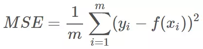
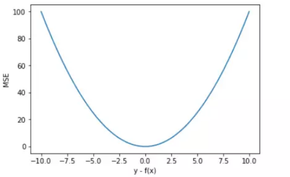
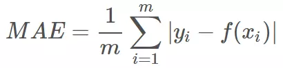

就我目前的了解，在机器学习和深度学习中，主要有两种问题：分类和回归。
**分类**是对`test-case`给出预测的类别; **回归**则是要求 model 给出一个预测的实数值。

* Cross-Entropy
* Hinge
* Huber
* Kullback-Leibler
* MAE(L1)
* MSE(L2)

## 1. Cross-Entropy Loss
信息量 --> 熵 --> 相对熵(KL散度) --> 交叉熵 [Ref.3]
1. 信息量： 对于一个概率`p`来说，它是包含一些信息的。通常来说，越不可能发生的事情偏偏发生了，就说明包含了很大的信息量。
比如说，飞机坠毁本身是一件非常小概率的事情，如果它偏偏发生了，则说明很有可能存在安全隐患，这时候就需要重点排查了。
然后，如何定义概率里包含有多少信息呢？这就引出了**信息量**的概念。
2. 熵：如果一个事件有多种可能的结果，每种可能的结果都有一定的概率，就引入**熵**来表示整个事件整体的信息量。
有了**信息量**的定义，就用所有信息量的期望来表示**熵**。
3. 相对熵(KL散度)：对于一个随机变量X，一个是真实的概率分布P(x)，另一个是预测的概率分布Q(x)。
如何度量两个分布之间的差异？这就要用到`Kullback-Leibler divergence`，也就是KL散度。
4. 交叉熵：交叉熵是**相对熵**的一部分，并且用它评估`label`和`predict`之间的差距刚刚好。
* `Cross-Entropy Loss` 可以描述两个不同分布之间的距离；
* 可以用与分类问题，包括二分类和多分类。
* softmax使用的即为交叉熵损失函数；
* binary_cossentropy为二分类交叉熵损失；
* categorical_crossentropy为多分类交叉熵损失；
* 当使用多分类交叉熵损失函数时，标签应该为多分类模式，即使用one-hot编码的向量。

## 2. Hinge Loss
1. Used for classification;
2. 在机器学习中，`hinge loss`作为一个损失函数(loss function)，通常被用于最大间隔算法`(maximum-margin)`，而最大间隔算法又是SVM(支持向量机support vector machines)用到的重要算法(注意：SVM的学习算法有两种解释：1. 间隔最大化与拉格朗日对偶；2. Hinge Loss)。
3. `Hinge Loss`专用于**二分类问题**，标签值`y=±1`，预测值属于实数。二分类的目标函数要求如下：当预测值大于等于+1或小于等于-1时，都是分类器确定的分类结果，此时的损失loss=0；当预测值在(-1, +1)时，分类器对分类结果不确定，loss就不为0。当预测值为0的时候，loss达到最大。
4. `Hinge Loss`在SVM中的应用：SVM在简单情况下（线性可分情况下）使用的就是一个最大间隔算法。
5. `loss(y)=max(0, 1-y*y_)`，其中`y_`为预测值。通过一个`max()`函数，忽略了预测值`y_`过高的情况。
6. 可以拓展到SVM的多分类问题？

## 3. Mean-Square Loss(MSE, L2)
| Mean Square Loss (MSE, L2 Loss) |
|:------------:|
|  |
|  |

1. MSE 曲线的特点是光滑连续、可导，便于使用梯度下降算法，是比较常用的一种损失函数。而且，MSE 随着误差的减小，梯度也在减小，这有利于函数的收敛，即使固定学习因子，函数也能较快取得最小值。
2. 平方误差有个特性，就是当 yi 与 f(xi) 的差值大于 1 时，会增大其误差；当 yi 与 f(xi) 的差值小于 1 时，会减小其误差。这是由平方的特性决定的。也就是说， MSE 会对误差较大（>1）的情况给予更大的惩罚，对误差较小（<1）的情况给予更小的惩罚。从训练的角度来看，模型会更加偏向于惩罚较大的点，赋予其更大的权重。
3. 如果样本中存在离群点，MSE 会给离群点赋予更高的权重，但是却是以牺牲其他正常数据点的预测效果为代价，这最终会降低模型的整体性能。我们来看一下使用 MSE 解决含有离群点的回归模型。
4. 使用 MSE 损失函数，受离群点的影响较大。

## 4. Mean Absolute Loss(MAE, L1)
| Mean Absolute Loss (MAE, L1 Loss) |
|:------------:|
|  |
|  |

1. 直观上来看，MAE 的曲线呈 V 字型，连续但在 y-f(x)=0 处不可导，计算机求解导数比较困难。而且 MAE 大部分情况下梯度都是相等的，这意味着即使对于小的损失值，其梯度也是大的。这不利于函数的收敛和模型的学习。
2. 值得一提的是，MAE 相比 MSE 有个优点就是 MAE 对离群点不那么敏感，更有包容性。因为 MAE 计算的是误差 y-f(x) 的绝对值，无论是 y-f(x)>1 还是 y-f(x)<1，没有平方项的作用，惩罚力度都是一样的，所占权重一样。

* 选择 MSE 还是 MAE 呢？  
实际应用中，我们应该选择 MSE 还是 MAE 呢？从计算机求解梯度的复杂度来说，MSE 要优于 MAE，而且梯度也是动态变化的，能较快准确达到收敛。但是从离群点角度来看，如果离群点是实际数据或重要数据，而且是应该被检测到的异常值，那么我们应该使用MSE。另一方面，离群点仅仅代表数据损坏或者错误采样，无须给予过多关注，那么我们应该选择MAE作为损失。

## 5. Huber Loss
| Huber Loss  |
|:------------:|
|  |
|  |

1. Huber Loss 是对二者的综合，包含了一个超参数 δ。δ 值的大小决定了 Huber Loss 对 MSE 和 MAE 的侧重性，当 |y−f(x)| ≤ δ 时，变为 MSE；当 |y−f(x)| > δ 时，则变成类似于 MAE，因此 Huber Loss 同时具备了 MSE 和 MAE 的优点，减小了对离群点的敏感度问题，实现了处处可导的功能。
2. Huber Loss 在 |y−f(x)| > δ 时，梯度一直近似为 δ，能够保证模型以一个较快的速度更新参数。当 |y−f(x)| ≤ δ 时，梯度逐渐减小，能够保证模型更精确地得到全局最优值。因此，Huber Loss 同时具备了前两种损失函数的优点。
3. Huber loss是为了增强平方误差损失函数（squared loss function）对噪声（或叫离群点，outliers）的鲁棒性提出的。

## 6. Kullback-Leibler Loss
* `Cross-Entropy Loss` 是 `Kullback-Leibler Loss` 的一部分，且具有相同的单调性。因此常常考虑直接用 `Cross-Entropy Loss`。

---
References:     
1. [Loss Functions](https://ml-cheatsheet.readthedocs.io/en/latest/loss_functions.html)        
2. [Loss functions for classification](https://en.wikipedia.org/wiki/Loss_functions_for_classification)        
3. [一文搞懂交叉熵在机器学习中的使用，透彻理解交叉熵背后的直觉](https://blog.csdn.net/tsyccnh/article/details/79163834)     
4. [Why You Should Use Cross-Entropy Error Instead Of Classification Error Or Mean Squared Error For Neural Network Classifier Training](https://jamesmccaffrey.wordpress.com/2013/11/05/why-you-should-use-cross-entropy-error-instead-of-classification-error-or-mean-squared-error-for-neural-network-classifier-training/)  
Classification error is a very crude measure of error. After training, to get an estimate of the effectiveness of the neural network, classification error is usually preferable to MSE or ACE. The idea is that classification error is ultimately what you’re interested in.  
To summarize, for a neural network classifier, during training you can use mean squared error or average cross-entropy error, and average cross-entropy error is considered slightly better. If you are using back-propagation, the choice of MSE or ACE affects the computation of the gradient. After training, to estimate the effectiveness of the neural network it’s better to use classification error.
5. [为什么交叉熵（cross-entropy）可以用于计算代价？](https://www.zhihu.com/question/65288314/answer/244557337)       
6. [常见的损失函数(loss function)总结](https://zhuanlan.zhihu.com/p/58883095)        
7. [Hinge loss](https://blog.csdn.net/hustqb/article/details/78347713)
8. [机器学习基础（四十二）—— 常用损失函数的设计（multiclass SVM loss & hinge loss）](https://blog.csdn.net/lanchunhui/article/details/51073745)       
9. [MSE, MAE, Huber loss详解](https://www.cnblogs.com/hansjorn/p/11458031.html)
10. [Huber Loss](https://en.wikipedia.org/wiki/Huber_loss)  
11. [机器学习大牛是如何选择回归损失函数的？](https://mp.weixin.qq.com/s/Xbi5iOh3xoBIK5kVmqbKYA)      
12. [机器学习大牛最常用的5个回归损失函数，你知道几个？](https://www.jiqizhixin.com/articles/2018-06-21-3)

