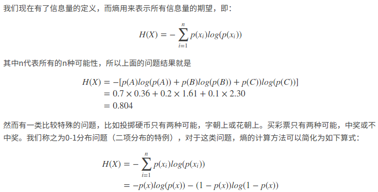
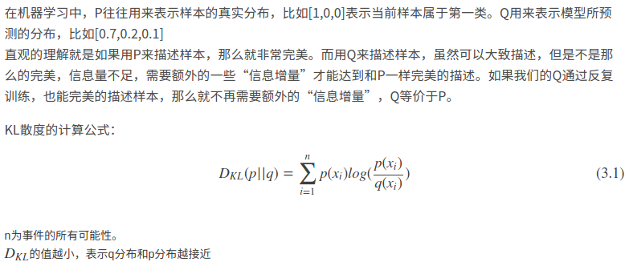
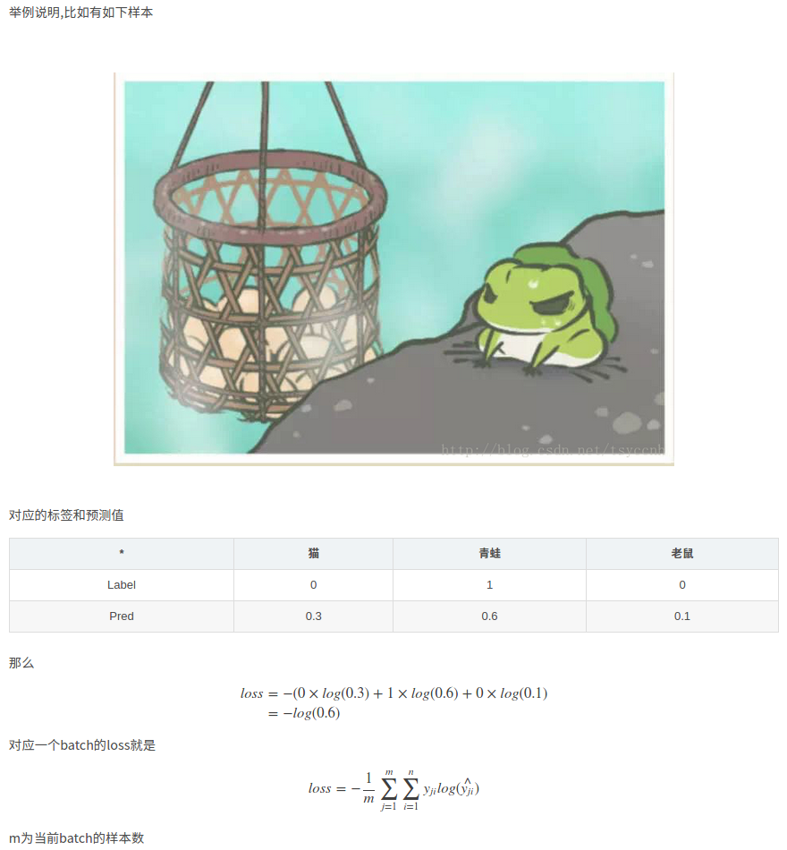

[一文搞懂交叉熵在机器学习中的使用，透彻理解交叉熵背后的直觉](https://blog.csdn.net/tsyccnh/article/details/79163834)
* 交叉熵(cross entropy)，一般用来求**目标**和**预测值**之间的差距。
## 1. 信息量
往往越不可能的事情发生了，则获取的信息量越大；越可能发生的事情发生了，获得的信息量越小。那么如何度量**信息量**和**事件发生的概率**之间的关系呢？    

| 信息量 |
|:-----:|
|  |
| 观察两个极端，当 `P(x) -> 0` 的时候，即 event 不可能发生，如果偏偏发生了，则说明有很大信息量； 当 `P(x) -> 1` 的时候，即使 event 发生了，也说明在情理之中，说明信息量很小。 |

## 2. 熵(entropy)
对于某个 event，有 `n` 种可能的结果，相应的，每种可能性都有一个概率 `p(x)`，则可以根据上述的**信息量**计算出每种可能结果的信息量。而**熵(entropy)** 就是用来表示所有信息量的期望(i.e. 均值)：

| 熵 |
|:-----:|
|  |
| 即熵是多个信息量的期望(i.e.按照权重的加和)。特殊情况就是二项分布。|

## 3. 相对熵(KL散度)
相对熵又称为KL散度。如果对于同一个随机变量 `x` 有两个单独的概率分布 `P(x)` 和 `Q(x)`，则可以使用**KL散度(Kullback-Leibler(KL)) divergence**来衡量这两个分布之间的差异：
> In the context of machine learning, DKL(P‖Q) is often called the information gain achieved if P is used instead of Q.  [即用P分布来描述问题，代替用Q分布描述，能获得的**信息增量**(Information Gain)]

| 相对熵(KL divergence) |
|:-----:|
|  |
| 即`p(x)`代表的是真实的样本分布，`q(x)`代表的是模型的预测分布 |

## 4. 交叉熵(cross-entropy)
如果要评估`label`(i.e.真实分布值) 与 `prediction`(模型预测值)之间的差距，则使用**KL散度**就刚刚好。

| 交叉熵(cross-entropy) |
|:-----:|
|  |
| 即`p(x)`代表的是真实的样本分布(`label`)，`q(x)`代表的是模型的预测分布(`prediction`)。交叉熵越小，则说明 `label` 和 `prediction` 之间的差距越小，也就是 prediction 越准确。 |

## 5. Question
为什么要用交叉熵作为loss函数？在**线性回归问题**中，常常用MSE(Mean Square Error)作为 loss 函数。然而对于**逻辑分类问题**呢？

## 6. 交叉熵在**单分类问题**中的应用
单分类指的是，每个 example 只能有一个 class，比如只能是狗或猫。

| 单分类 |
|:-----:|
|  |
|  |
| 即如果对青蛙的预测概率为`x`，如果`x`很小很接近 0,则说明loss很大；如果`x`很大很接近 1,则说明很接近真实的class，则相应地 loss 就很小。**对于预测错误的项呢？** |

## 7. 交叉熵在**多分类**问题中的应用
多分类指的是，每一个 example 可以有多个 classes，比如同时含有猫和狗。和单分类问题不同的是，多分类的标签是 `n-hot`。

| 多分类 |
|:-----:|
|  |
| 1. Pred不再用 `softmax` 计算，而是用 `sigmoid`。因为每个节点(object)之间是相互独立的，所以所有的 prediction 之和不必为 `1`。2. 对于每个 `object` 都是一个单独**二项分布** |
