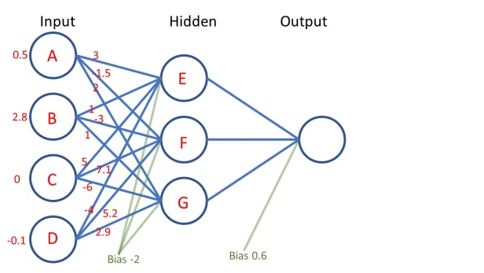

## 1. [Introduction to Neural Networks](https://glassboxmedicine.com/2019/01/17/introduction-to-neural-networks/)
* Feedforward neural network, meaning that information only flows forwards through the neurons. 
* [input layer, [hidden layer(s)], output layer]
* 
* Input Layer: The inputs can be any positive or negative number. Generally, the raw values are “normalized” to squash the values to be small.
    * You choose the size of the input layer based on the size of your data.
* Hidden Layer: The hidden layer captures some intermediate numerical representation that is partway between the input and the output.
    * You also choose the number of hidden layers, and the number of nodes within each of those hidden layers. 
    Usually a good rule of thumb is that there should not be a radical difference between the number of nodes in your input layer 
    and the number of nodes in your hidden layer.
* Output Layer: puts out the final answer. Perhaps this output node produces a probability of hospital admission. 
You can also have multiple output nodes, if you want to predict many different things at the same time.
    * You choose the size of the output layer based on what you want to predict. 
* **Weights:** The blue lines connecting the neurons are the weights of the neural network. They represent multiplication operations.
* **Bias:** The green lines labeled “bias” are the biases of the neural network. They represent addition operations. 
* The most important difference between **weights** and **biases** is that weights indicate multiplication, and biases indicate addition.
* **Training the network:**
    1. **Initialization:** Choose random numbers for each of the weights and biases in the model. At this point the model doesn’t know anything.
    ["Glorot" or "Xavier" initialization](https://jamesmccaffrey.wordpress.com/2017/06/21/neural-network-glorot-initialization/)
    2. **Forward pass:**
    3. **Backward pass:** [Backpropagation](https://en.wikipedia.org/wiki/Backpropagation)
    4. **Repeat the forward pass and the backward pass:**
* **Nonlinearity**
    * When modeling the real world, it’s nice to have more flexibility, because the true relationship between the input and the output might be nonlinear.
    * We add in “nonlinearities”: each neuron applies a nonlinear function to the value it receives. One popular choice is the sigmoid function. 
    * Key Points:
        1. the sigmoid function is not linear, which helps the neural network learn more complicated relationships between the input and output
        2. the sigmoid function squashes its input values to be between 0 and 1.
* **What about the backward pass?**
    * [A Step by Step Backpropagation Example](https://mattmazur.com/2015/03/17/a-step-by-step-backpropagation-example/)

## 2. [How Computers See: Intro to Convolutional Neural Networks](https://glassboxmedicine.com/2019/05/05/how-computers-see-intro-to-convolutional-neural-networks/)
* In practice, color images are represented using three grids of numbers stacked on top of each other: one grid for red, one grid for green, and one grid for blue.
* [RGB color model](https://en.wikipedia.org/wiki/RGB_color_model)
* **The General Idea:**
    * In a CNN, different “filters” (little grids of numbers) slide across an entire image, computing the convolution operation. 
    * Different filters with different numbers in them will detect different aspects of the image, like horizontal vs. vertical edges. 
    * Many different filters are used in a CNN, to identify many different aspects of an image.
* **Parts of a CNN:**
    1. A single layer in a CNN includes three kinds of calculations:
        * **Convolution:** This is the heart of the CNN. The convolution operation uses only addition and multiplication. Convolutional filters scan the image, performing the convolution operation.
        * **Nonlinearity:** This is an equation applied to the output of the convolutional filter. Nonlinearities allow the CNN to learn more complicated relationships (curves instead of lines) between the input image and the output class.
        * **Pooling:** This is often “max pooling” which is just choosing the biggest number out of a small bag of numbers. Pooling reduces the size of the representation, thereby reducing the amount of computation required and making the CNN more efficient.
        * These three kinds of calculations – convolution, a nonlinearity, and pooling – are used to build the “convolutional” part of a CNN model.
        * A CNN that uses only these operations to obtain the final predictions is referred to as a **“fully convolutional network.”** 
        This is *in contrast to* a CNN that uses some fully-connected layers after the convolutional part (fully connected layers are the building blocks of feedforward neural networks.)
            * Case 1: Fully Convolutional Network, 也就是最后的 prediction layer 也使用 CNN;
            * Case 2: Convolutional Network + Feedforward Neural Networks, 也就是最后的 prediction layer 使用 Fully Connected Layers.
* **What Is “Learned”**
    * It’s learning what values to use inside the convolutional filters, in order to predict the desired outputs. 
    CNN 算法学习改变的参数是 filters，因为我们并不直接告诉 filters 要检测什么特征，而是通过学习，让 filters 自己去决定检测什么。
* **A Convolutional Filter** 
* **The Convolution Operation**
* **Nonlinearity**
    * [Rectifier (neural networks)](https://en.wikipedia.org/wiki/Rectifier_(neural_networks))
* **Pooling**
    * The last step is pooling. This step results in shrinking the size of the representation.
* **There Are Many Filters In One Convolutional Layer**
    * In reality, one convolutional layer uses many different filters, all of the same size but with different values.
    * Let’s say that in our first convolutional layer we apply 32 different filters, each of size 2 x 2. Then the overall output size for the whole layer is 2 x 2 x 32. 
    Each filter detects a different aspect of the image, because each filter contains different numbers.
* **There Are Many Layers in a CNN**
    * The key idea behind CNNs with many layers is that the filters in the lower layers (closer to the input image) will learn simple characteristics like where the edges are, 
    while the filters in higher layers (more abstract) will learn complicated characteristics like what human faces look like in photographs or what pneumonia looks like on a chest x-ray.
* **Visualizing Convolutional Filters**
    * [Figure 1 of this article](https://cs231n.github.io/understanding-cnn/) shows how the first-layer filters of a CNN called AlexNet light up when looking at a picture of a cat.
    * [Visualizing CNN filters with keras](https://jacobgil.github.io/deeplearning/filter-visualizations)
    * [How convolutional neural networks see the world](https://blog.keras.io/how-convolutional-neural-networks-see-the-world.html)
    * [Deep Visualization Toolbox](https://www.youtube.com/watch?v=AgkfIQ4IGaM)
* **Additional Resources**    
    * [Convolutional Neural Networks (CNNs): An Illustrated Explanation](https://blog.xrds.acm.org/2016/06/convolutional-neural-networks-cnns-illustrated-explanation/) is an excellent blog post from the Association for Computing Machinery (ACM) providing details on CNN design and implementation.
    * [A Beginner’s Guide to Understanding Convolutional Neural Networks](https://adeshpande3.github.io/A-Beginner%27s-Guide-To-Understanding-Convolutional-Neural-Networks/) is another great post, particularly the section that uses a drawing of a mouse to explain how CNN filters work.
    * [Convolutional Neural Networks (CNNs / ConvNets)](https://cs231n.github.io/convolutional-networks/): this article is from a Stanford course, CS 231n.
    * [vdumoulin/conv_arithmetic on Github](https://github.com/vdumoulin/conv_arithmetic) contains awesome animations showing how different kinds of convolutional filters are applied to images. It includes some “fancy convolution” techniques like  transposed convolution and dilated convolution. 
    For more information on dilated convolution, check out [Understanding 2D Dilated Convolution Operation with Examples in Numpy and Tensorflow with Interactive Code](https://towardsdatascience.com/understanding-2d-dilated-convolution-operation-with-examples-in-numpy-and-tensorflow-with-d376b3972b25)
    * [Chapter 9 of the Deep Learning book](https://www.deeplearningbook.org/contents/convnets.html) by Aaron C. Courville, Ian Goodfellow, and Yoshua Bengio, provides a more technical discussion of CNNs.
    * [Hvass-Labs/TensorFlow-Tutorials/02_Convolutional_Neural_Network.ipynb](https://github.com/Hvass-Labs/TensorFlow-Tutorials/blob/master/02_Convolutional_Neural_Network.ipynb) is a Python notebook with Tensorflow code for a CNN that solves the MNIST handwritten digits classification task.
    * This paper, [On Deep Learning for Medical Image Analysis (JAMA Guide to Statistics and Methods, 2018)](https://jamanetwork.com/journals/jama/article-abstract/2702856), is an overview of CNNs written for medical professionals. It also contains a great video explanation of CNNs. This article is behind a paywall, so if you are at a university you will have to log in to your university’s library resources to access it.

    
    
    
    
    
    
    
    
    
    

  
    
* CNN网络主要用于compute vision.
    * 参数共享(Parameter sharing)
    * 系数链接(Sparsity of connections)
* Padding
    * 上面的卷积操作有两个问题，**每次卷积操作都会缩小图片的尺寸** & **会丢失边缘区域的特征**,所以为了解决这些问题，padding就是把图片扩大一圈，用0填充。
    * 两种convolution操作:
        1. `Valid`: No padding.
        2. `Same`: Pad so that output size is the same as the input size.
    * 这里描述filter一般都是odd，而不会是偶数，直观上讲，如果f是偶数，那么没法对称的padding，而且f是奇数是filter是有中心点的，这个很方便,
    所以filter一般都是3*3，5*5，7*7
* strided convolution
* **cross-correlation** VS **convolution**
* `LeNet-5(60k)` => `AlexNet(60M)` => `VGG(138M)` => `Residual Networks(ResNets)` => `Inception`
    * VGG的特点是结构规整，工业化的思路，我们不去精巧的设计，依赖网络的规模和数据规模来解决问题;
    * 由于这里用same conv，所以conv是不会改变图片size的;
    * 全靠pooling层改变图片size，并且也很有规律;
    * 1*1 convolution，其实就是单像素点，在各个channels上的线性组合.它的作用，主要就是低成本的调节channel数，或depth；
    在不需要调整长宽的情况下，用3*3，5*5，比较耗费性能再者，因为有relu输出，附带一层非线性效果
    * 普通的convolution网络，你要选择用什么样的filter或是用pool层，选择困难怎么办？
        1. Inception的思路就是，都用上，然后把结果stack在一起，让模型去决定
        2. 注意这里要保证输出的size一致，所以这里的pool是same pool，不会压缩尺寸，这是很特殊的pool用法
    * 用上1*1 convolution降低channel后，计算量大大降低; 中间这层称为，bottleneck layer，使用恰当的情况下，降维优化并不会损失算法的performance;
    我个人的理解，由于1*1 convolution是各个channel的线性组合，加上适当数量的filter，并不会丢失太多的信息.
    * `Inception module`, **MAXPOOL?**
* **Object Detection:** 
    * classification with localization
    * sliding windows object detection: 如果一个图里面有多个对象怎么办，这个就是object detection
    * YOLO (You Only Look Once)
* Intersection over union (IOU): 如何判断算出的bounding是否精确？
* **Non-max suppression**: 但是如果有多辆车，我怎么知道哪些grid的bounding box是描述的同一辆车？
这里就要用到交并比，如果两个bounding box的IOU大于0.5，我们就认为是同一辆车
* **Anchor boxes**: anchor box可以人手工设计，也可以用k-means去统计，比如人的平均边界，车的的平均边界
* **Region proposal: R-CNN**, region-cnn会对图片做分块，segmentation，如最右图，这样只需要对不同的色块做分类即可
那么执行分类的candidate变少，性能就提高了
* **Face Recognition**
    * One-shot training
    * Siamese network
    * Triplet losss
* **Neural sytle transfer**   
    * Content cost function, 判断内容是否相似比较直观，和前面脸部识别一样，我们只要把图片encoding成embedding，然后比较相似度就好
    * Style cost function, 这里给出的定义是，对于某个layer，style是各个channel的相关系数

## 
    
## [AndrewNG Deep learning课程笔记 - CNN](https://www.cnblogs.com/fxjwind/p/8732844.html)
## Reference:
1. [6.5 矩阵的运算以及其运算规则](http://www2.edu-edu.com.cn/lesson_crs78/self/j_0022/soft/ch0605.html)
2. [Glass Box](https://glassboxmedicine.com/author/racheldraelos/)
3. [An Intuitive Explanation of Convolutional Neural Networks](https://ujjwalkarn.me/2016/08/11/intuitive-explanation-convnets/)
4. [Convolution Vs Correlation](https://towardsdatascience.com/convolution-vs-correlation-af868b6b4fb5)
5. [Example of 2D Convolution](http://www.songho.ca/dsp/convolution/convolution2d_example.html)
6. [Convolution vs Cross Correlation](https://www.youtube.com/watch?v=C3EEy8adxvc&ab_channel=Udacity)
7. [CNN基础知识——卷积（Convolution）、填充（Padding）、步长(Stride)](https://zhuanlan.zhihu.com/p/77471866)
8. [卷积（convolution）与互相关(cross-correlation)的一点探讨](https://zhuanlan.zhihu.com/p/33194385)
9. [DeepLearning（三·一）卷积神经网络基本原理](https://zhuanlan.zhihu.com/p/31233063)
10. [Correlation and Convolution](https://www.youtube.com/watch?v=tS-ib_mgGbU&ab_channel=ROBOMECHTRIX)

