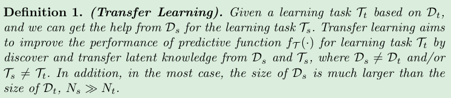
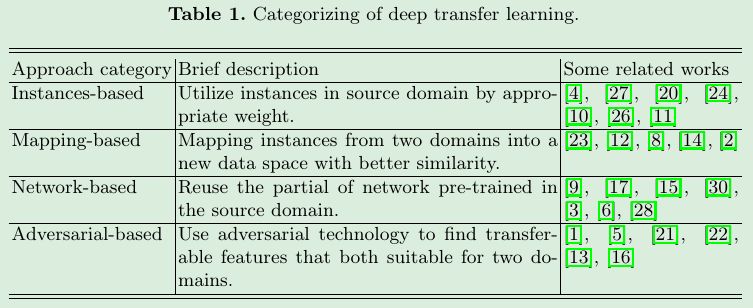
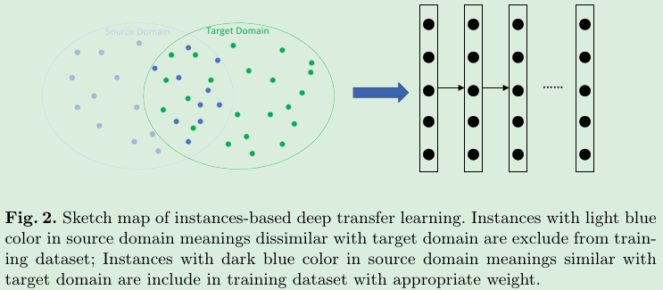
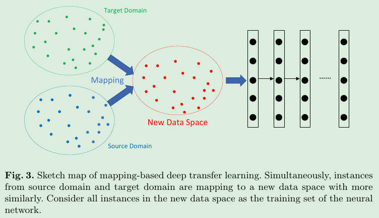
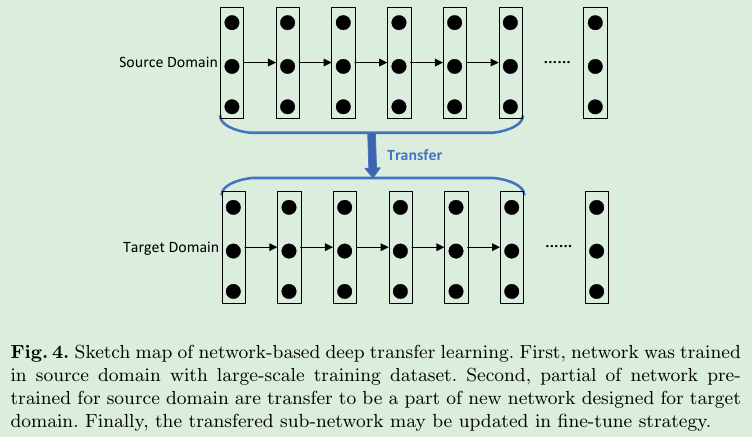
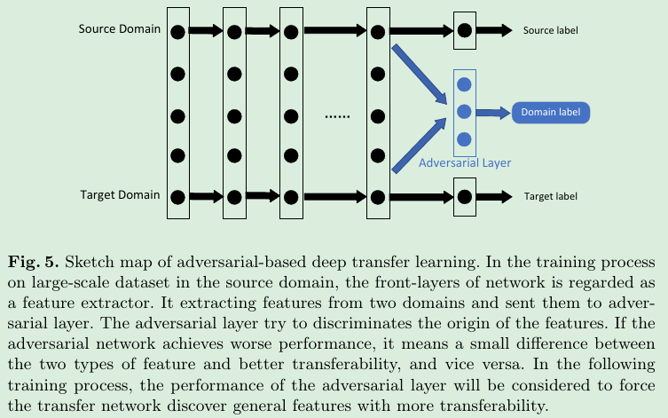

## 0. Abstract
* 迁移学习不要求训练数据必须与测试数据独立且同分布，激发了我们使用迁移学习来解决训练数据不足的问题。

## 1. Introduction
深度学习算法试图从海量数据中学习高级特征，这使得深度学习超越了传统的机器学习。它可以通过无监督或半监督的特征学习算法和分层特征提取来自动提取数据特征。
相比之下，传统的机器学习方法需要手工设计功能，这严重增加了用户的负担。可以说，深度学习是机器学习中基于大规模数据的表示学习算法。

**数据依赖**是深度学习中最严重的问题之一。与传统的机器学习方法相比，深度学习对海量训练数据的依赖性非常强，因为它需要大量的数据来理解数据的潜在模式。

**训练数据不足**是一些特殊领域中不可避免的问题。数据的收集是复杂和昂贵的，这使得构建大规模、高质量的带注释的数据集非常困难。

**迁移学习**放松了训练数据必须与测试数据独立且同分布(i.i.d)的假设，激励我们利用迁移学习来解决训练数据不足的问题。
在迁移学习中，训练数据和测试数据不需要是i.i.d。不需要对目标域内的模型进行从零开始的训练，可以显著降低对目标域内训练数据和训练时间的需求。

## 2. 深度迁移学习
**迁移学习**是机器学习中**解决训练数据不足**这一基本问题的重要工具。它试图通过放松训练数据和测试数据必须是i.i.d的假设，将知识从源域迁移到目标域，这将对许多由于训练数据不足而难以改进的领域产生巨大的积极影响。

* $\Kai$ 代表特征空间(feature space)，$\P(X)$ 代表边缘概率分布(edge probability distribution)。 `X` 代表一个 instance，它有 `n` 个 features 组成。
* Task: 基于 instance `x`，模型会给出预测概率 `f(x)`, (`f(x)` can also be regared as conditional probability function `P(y|x)`)。

* `Source Domain` 代表已有的 or 预训练完成的任务。该过程有其本身的 `Ds` and `Ts`，也可以理解为 Dataset 和 Task。
* `Knowledge` 代表可以测 `Source Domain` 中借来使用的信息(info)。
* `Target Domain` 代表我们真实的、要训练的任务，此时的训练任务`Tt`并不仅仅是基于数据`Dt`，还会借助从 `Source Domain` 中获得的 `latent knowledge`(info)。

* Our learning task `Tt` based on `Dt` can get **latent information** from the source domain.
* In the most case, the size of `Ds` is much larger than the size of `Dt`.

## 3 深度迁移学习的分类
深度迁移学习是通过深度神经网络研究如何利用其他领域的知识。

### 3.1 基于实例的深度迁移学习(Instances-based)
> Utilize instances in source domain by appropriate weight.         
> [基于实例的深度迁移学习是指采用一种特定的权值调整策略，从源域中选择部分实例作为目标域训练集的补充，并为这些选择的实例分配适当的权值。它基于这样的假设:“虽然两个域之间存在差异，但是源域中的部分实例可以被具有适当权重的目标域利用。”]     
> 
* 也就是 Dataset of Target task 不够多，此时从 Dataset of Source task 中**借用**一部分数据，当然需要一些权重的调整来平衡。

> TrAdaBoost use AdaBoost-based technology to filter out instances that are dissimilar to the target domain in source domains.
> Re-weighted instances in source domain to compose a distribution similar to target domain.
> Finally, training model by using the re-weighted instances from source domain and original instances from target domain.      
> [首先通过合适的 filter 剔除与 target domain 不相似的 instances；然后对从 source domain 中筛选出来的 instances 给予合适的权重，使它们与 target domain 中的 instances 有相似的分布；最后用 source domain + target domain 中的 instances 进行训练。]

### 3.2 基于映射的深度迁移学习(Mapping-based)    
> Mapping-based deep transfer learning refers to mapping instances from the source domain and target domain into a new data space. In this new data space, instances from two domains are similarly and suitable for a union deep neural network. 
> It is based on the assumption that ”Although there are different between two origin domains, they can be more similarly in an elaborate new data space.”.     
> [基于映射的深度迁移学习是指将实例从源域和目标域映射到新的数据空间。在这个新的数据空间中，来自两个域的实例是相似的，适合于联合深度神经网络。它基于这样的假设:“尽管两个源域之间存在差异，但它们在一个复杂的新数据空间中可能更相似。”]           
> 

> Transfer component analysis (TCA) and TCA-based methods had been widely used in many applications of traditional transfer learning.           
> [TCA， MMD distance 均未深入]

### 3.3 基于网络的深度迁移学习(Network-based)
> Network-based deep transfer learning refers to the reuse the partial network that pre-trained in the source domain, including its network structure and connection parameters, transfer it to be a part of deep neural network which used in target domain. 
> It is based on the assumption that ”Neural network is similar to the processing mechanism of the human brain, and it is an iterative and continuous abstraction process. The front-layers of the network can be treated as a feature extractor, and the extracted features are versatile.”.       
> [基于网络的深度迁移学习是指将原领域中预先训练好的部分网络，包括其网络结构和连接参数，重新利用，将其转化为用于目标领域的深度神经网络的一部分。它基于“神经网络类似于人脑的处理机制，是一个迭代的、连续的抽象过程”的假设。该网络的前端层可以看作是一个特征提取器，所提取的特征是通用的。]                  
>       

> [17] reuse front-layers trained by CNN on the ImageNet dataset to compute inter-mediate image representation for images in other datasets, CNN are trained to learning image representations that can be efficiently transferred to other visual recognition tasks with limited amount of training data.          
> [在ImageNet数据集上重用CNN训练的前层来计算其他数据集中图像的中间图像表示，CNN被训练来学习图像表示，这些图像表示可以在有限的训练数据下有效地迁移到其他视觉识别任务中。]           

* 联合学习**源域标记数据**和**目标域未标记数据**的自适应分类器和可迁移特征，通过将多个层次插入到深度网络中，参照目标分类器显式学习残差函数。学习域自适应和深度哈希特性在DNN中同时存在。

> Another very noteworthy result is that [28] point out the relationship between network structure and transferability. It demonstrated that some modules may not influence in-domain accuracy but influence the transferability. 
> It point out what features are transferable in deep networks and which type of networks are more suitable for transfer. Given an conclusion that LeNet, AlexNet, VGG, Inception, ResNet are good chooses in network-based deep transfer learning.         
> [另一个非常值得注意的是网络结构和可迁移性之间的关系。结果表明，某些模块可能不会影响域内的精度，但会影响可移植性。指出了深层网络中哪些特征是可迁移的，哪些类型的网络更适合迁移。得出LeNet、AlexNet、VGG、Inception、ResNet是基于网络的深度迁移学习的较好选择的结论。]            

### 3.4 基于对抗的深度迁移学习(Adversarial-based)
> Adversarial-based deep transfer learning refers to introduce adversarial technology inspired by generative adversarial nets (GAN) [7] to find transferable representations that is applicable to both the source domain and the target domain.
> It is based on the assumption that ”For effective transfer, good representation should be discriminative for the main learning task and indiscriminate between the source domain and target domain.”          
> [基于对抗性的深度迁移学习是指在生成对抗性网络(GAN)的启发下，引入对抗性技术，寻找既适用于源域又适用于目标域的可迁移表达。它基于这样的假设:“为了有效的迁移，良好的表征应该是对主要学习任务的区别性，以及对源域和目标域的不加区分。”]            
> 

* 基于对抗的深度迁移学习示意图。在源域大规模数据集的训练过程中，将网络的前端层作为特征提取器。它从两个域中提取特征并将其发送到对抗层。对抗层试图区别特征的来源。如果对抗网络的性能较差，则意味着这两类特征之间的差异较小，可迁移性较好，反之亦然。在接下来的训练过程中，将考虑对抗性层的性能，迫使迁移网络发现更具有可迁移性的一般特征。

## 4 结论

## Reference:
1. [一篇关于深度迁移学习的综述](https://zhuanlan.zhihu.com/p/89951541)

