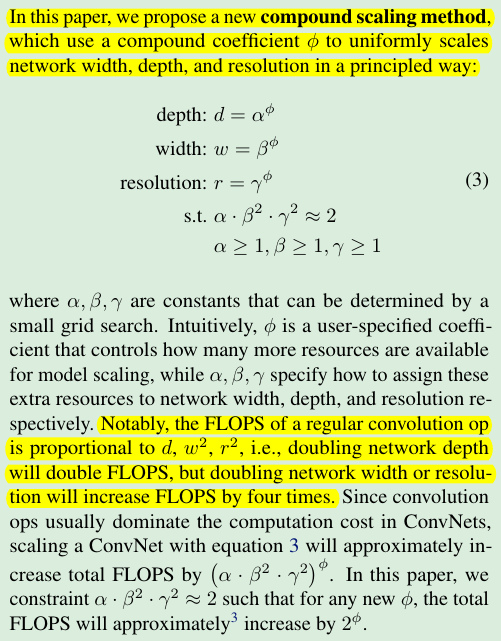
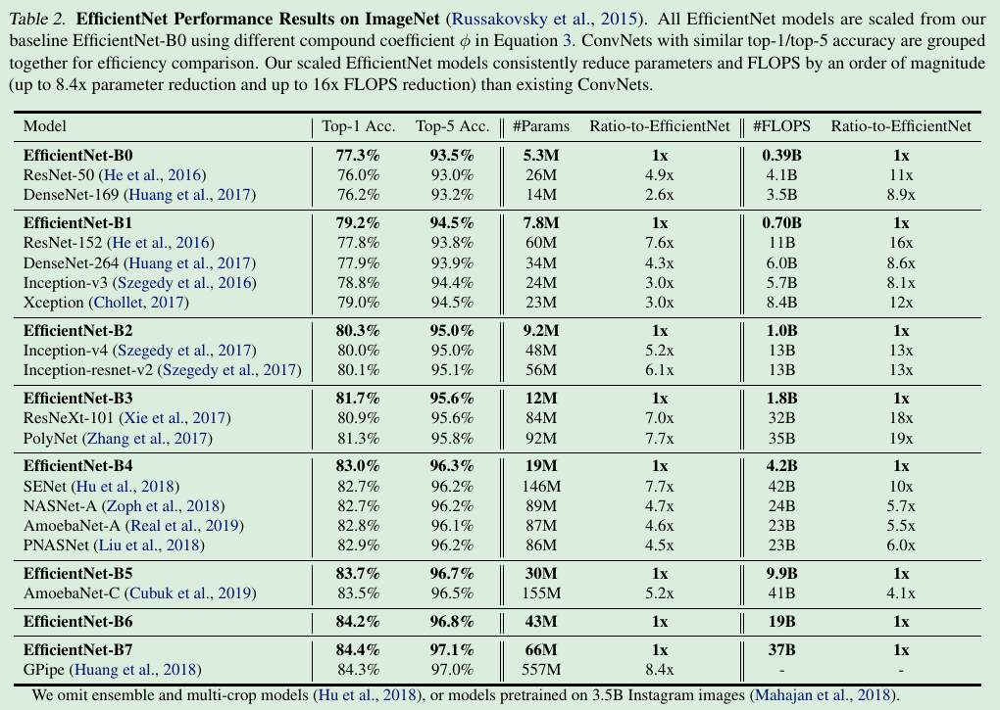
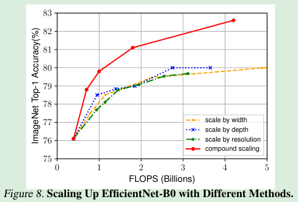
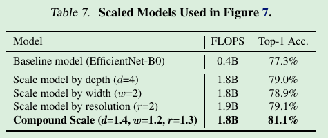

> Based on this observation, we propose a new scaling method that uniformly scales all dimensions of 
> depth/width/resolution using a simple yet highly effective compound coefficient. We demonstrate the effectiveness of 
> this method on scaling up MobileNets and ResNet.
>
> To go even further, we use neural architecture search to design a new baseline network and scale it up to obtain 
> a family of models, called EfficientNets, which achieve much better accuracy and efficiency than previous ConvNets.
>

> ## 1. Introduction
> The most common way is to scale up ConvNets by their depth (He et al., 2016) or width (Zagoruyko & Komodakis, 2016). 
> Another less common, but increasingly popular, method is to scale up models by image resolution (Huang et al., 2018).
> Key Points:
> 1. Scale up by depth and/or width;
> 2. Scale up by image resolution.
>
> Our empirical study shows that it is critical to balance all dimensions of network width/depth/resolution, 
> and surprisingly such balance can be achieved by simply scaling each of them with constant ratio. 
> Based on this observation, we propose a simple yet effective compound scaling method.
>
> In fact, previous theoretical (Raghu et al., 2017; Lu et al., 2018) and empirical results (Zagoruyko & Komodakis, 2016) 
> both show that there exists certain relationship between network width and depth, but to our best knowledge, we are 
> the first to empirically quantify the relationship among all three dimensions of network width, depth, and resolution.

> ## 2. Related Work
> ConvNet Accuracy: AlexNet, GoogleNet, SENet, GPipe
>
> ConvNet Efficiency: SqueezeNets, MobileNets, ShuffleNets
> Model compression (Han et al., 2016; He et al., 2018; Yang et al., 2018) is a common way to reduce model size by trading accuracy for efficiency. 
>
> Model Scaling:
> ResNet (He et al., 2016) can be scaled down (e.g., ResNet-18) or up (e.g.,ResNet-200) by adjusting network depth (#layers), 
> while WideResNet (Zagoruyko & Komodakis, 2016) and MobileNets (Howard et al., 2017) can be scaled by network width (#channels). 

## 3. Compound Model Scaling
### 3.1 Problem Formulation

### 3.2 Scaling Dimensions
> Conventional methods mostly scale ConvNets in one of these dimensions:
> **Depth(d), model 的深度:** Scaling network depth is the most common way used by many ConvNets.
> The intuition is that deeper ConvNet can capture richer and more complex features, and generalize well on new tasks. 
> However, deeper networks are also more difficult to train due to the vanishing **gradient problem**.
> To alleviate **gradient problem**, skip connections and batch normalization. 
> 总体来说，增加 depth，会导致 gradient problem，尽管可以通过 skip connections and/or batch normalization 减缓 gradient problem，
> 但是 accuracy 会下降。
> 
> **Width(w), filter 的长和宽:** Scaling network width is commonly used for small size models. wider networks tend to be able to capture
> more fine-grained features and are easier to train. However, extremely wide but shallow networks tend to have difficulties 
> in capturing higher level features. 
> 总体来说，增加 width，accuracy quickly saturates.
>
> **Resolution(r), 输入图片的 resolution:** *With higher resolution input images, ConvNets can potentially capture more fine-grained patterns.*
>
> *Observation 1:* Scaling up any dimension of network width, depth, or resolution improves accuracy, but the accuracy 
> gain diminishes for bigger models. 通过增加任何一个维度的 scale，都可以提高 accuracy，但是到一定程度，**accuracy gain** diminishes for bigger models.

### 3.3 Compound Scaling
> We empirically observe that different scaling dimensions are not independent. 不同的维度方面存在联系。
> Intuitively：
> **Observation 2:** In order to pursue better accuracy and efficiency, it is critical to balance all dimensions of network
> width, depth, and resolution during ConvNet scaling.
> 
> In this paper, we propose a new compound scaling method, which use a compound coefficient φ to uniformly scales 
> network width, depth, and resolution in a principled way:
> 

## 4. EfficientNet Architecture
> Scaling up method:
> 
> Notably, it is possible to achieve even better performance by searching for α, β, γ directly around a large model, 
> but the search cost becomes prohibitively more expensive on larger models. Our method solves this issue by only doing 
> search once on the small baseline network (step 1), and then use the same scaling coefficients for all other models (step 2).
> **将三维的 search，分成两步的低纬度 search。**

## 5. Experiments
### 5.1 Scaling Up MobileNets and ResNets
> Compared to other single-dimension scaling methods, our compound scaling method improves the accuracy on all these models, 
> suggesting the effectiveness of our proposed scaling method for general existing ConvNets.

### 5.2 ImageNet Results for EfficientNet
> 

### 5.3 Transfer Learning Results for Efficient
> [Table5 & Figure6](images/EfficientNet_Transfer_Learning.png)

## 6. Discussion
> To disentangle the contribution of our proposed scaling method from the EfficientNet architecture, Figure 8 compares 
> the ImageNet performance of different scaling methods for the same EfficientNet-B0 baseline network. 
> 
> 

## 7. Conclusion

