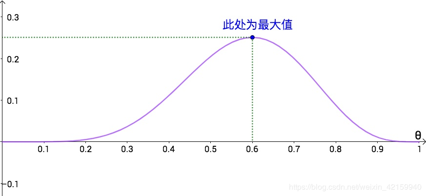

## 1. 贝叶斯公式
$$P(w|x) = \frac{p(x|w)p(w)}{p(x)}$$
其中：
1. $p(w)$    ：为先验概率，表示每种类别分布的概率；
2. $p(x|w)$  ：为类条件概率，表示在某种类别前提下，某事发生的概率；
3. $p(w|x)$  ：为后验概率，表示某事发生了，并且它属于某一类别的概率。有了这个后验概率，我们就可以对样本进行分类。后验概率越大，说明某事物属于这个类别的可能性越大，我们越有理由把它归到这个类别下。

### Bayesian 的问题
**问题：** 实际问题中，我们能获得的数据可能只有有限数目的样本，然而先验概率 $p(w_{i})$ 和类条件概率 $p(x|w_{i})$ 都是未知的。因而，我们无法直接使用贝叶斯公式。
**方法：** 此时，如果我们想要用贝叶斯公式，我们要想办法获得先验概率 $p(w_{i})$ 和类条件概率 $p(x|w_{i})$。一种可行的办法就是对 $p(w_{i})$ 和 $p(x|w_{i})$ 进行估计，然后再套用贝叶斯公式。

* 类条件的估计比较简单：
  1. 每个样本所属的自然状态都是已知的(有监督学习)；
  2. 依靠经验；
  3. 用训练样本中各类出现的频率估计。

* 类条件概率的估计(非常难):
  * 原因如下：
    1. 概率密度函数包含了一个随机变量的全部信息
    2. 样本数据可能不多
    3. 特征向量 `x` 的维度可能很大等等
    总之要直接估计类条件概率的密度函数很难。

  * 解决办法：
    1. 把估计完全未知的概率密度 $p(x|w_{i})$ 转化为估计参数。**这里就将概率密度估计问题转化为参数估计问题，极大似然估计就是一种参数估计方法。** 当然了，概率密度函数的选取很重要，模型正确，在样本区域无穷时，我们会得到较准确的估计值，如果模型都错了，那估计半天的参数，肯定也没啥意义了。
    2. 重要前提：**训练样本的分布能代表样本的真实分布**。每个样本集中的样本都是所谓独立同分布的随机变量 (`iid条件`)，且有充分的训练样本。

  * 极大似然估计：
    1. 目的：**利用已知的样本结果，反推最有可能（最大概率）导致这样结果的参数值**。
    2. 原理：**极大似然估计是建立在极大似然原理的基础上的一个统计方法，是概率论在统计学中的应用。** 极大似然估计提供了一种给定观察数据来评估模型参数的方法，即：“模型已定，参数未知”。通过若干次试验，观察其结果，利用试验结果得到某个参数值能够使样本出现的概率为最大，则称为极大似然估计。

* 极大似然估计(ML估计)
  * 由于样本集中的样本都是独立同分布，可以只考虑一类样本集D，来估计参数向量θ。记已知的样本集为：$D=\{x_{1},x_{2},...,x_{N}\}$
  * **似然函数(Likelihood function)：** 联合概率密度函数 $p(D|\theta)$ 称为相对于 $D=\{x_{1},x_{2},...,x_{N}\}$ 的 $\theta$ 似然函数。
  $$l(\theta)=P(D|\theta)=p(x_{1},x_{2},...,x_{N})=\prod_{i=1}^{N}p(x_{i}|\theta)$$
  * 如果 $\theta'$ 是参数空间中能使似然函数 $l(\theta)$ 最大的 $\theta$ 值，则 $\theta'$ 是**最可能**的参数值，那么 $\theta'$ 就是 $\theta$ 的极大似然估计。
  * ML估计：求使得出现该组样本的概率最大的 $\theta$ 值。
  $$\theta'=\argmax_{\theta}\prod_{i=1}^{N}p(x_{i}|\theta)$$
  * **Def:** 对数似然函数 $H(\theta)=\ln l(\theta)$：
  $$\theta'=\argmax_{\theta}H(\theta)=\argmax_{\theta}\ln l(\theta)=\argmax_{\theta}\prod_{i=1}^{N}\ln p(x_{i}|\theta)$$
  * 方程的求解：
    1. 未知参数只有一个($\theta$ 为标量)
    2. 位置参数有多个($\theta$ 为向量)
  * 方程的解只是一个估计值，只有在样本数趋于无限多的时候，它才会接近于真实值。

* 总结
  * 求解最大似然估计 $\theta'$ 的一般步骤：
    1. 写出似然函数；
    2. 对似然函数取对数，并整理；
    3. 求导数；
    4. 解似然方程。
  * 最大似然估计的特点：
    1. 比其他估计方法更加简单；
    2. 收敛性：无偏或者渐近无偏，当样本数目增加时，收敛性质会更好；
    3. 如果假设的类条件概率模型正确，则通常能获得较好的结果。但如果假设模型出现偏差，将导致非常差的估计结果。

## 2.
### 2.1 概率 vs 似然
* **概率：** 基于已知参数，推测各种情况的可能性，称之为概率。比如硬币**花朝上**的参数为 `0.5`，求出现 5 次**花朝上**的概率是多少。
* **似然：** 基于样本，推测参数。比如说对硬币的参数不清楚，要通过抛硬币的情况去推测硬币的参数，这称之为似然。
* **图像表示：** 如果似然函数用图像表示(横轴 $\theta$，纵轴是似然函数 $L(\theta)$)
  * 
  * 参数为0.6时，概率最大；
  * 参数为0.5 或其他值也是有可能的，但可能性都小一点。
  * 求最大似然估计的问题，就变成了求似然函数的极值。在这里，极值出现在 $\theta$ 为 0.6 时。
* **最大似然估计真正的用途是针对多次实验。**

### 2.2 概率vs似然
1. 比较
  * **概率:** 是在特定环境下某件事情发生的可能性，也就是结果没有产生之前依据环境所对应的参数来预测某件事情发生的可能性，比如抛硬币，抛之前我们不知道最后是哪一面朝上，但是根据硬币的性质我们可以推测任何一面朝上的可能性均为50%，这个概率只有在抛硬币之前才是有意义的，抛完硬币后的结果便是确定的；
  * **似然:** 刚好相反，是在确定的结果下去推测产生这个结果的可能环境（参数），还是抛硬币的例子，假设我们随机抛掷一枚硬币1,000次，结果500次人头朝上，500次数字朝上（实际情况一般不会这么理想，这里只是举个例子），我们很容易判断这是一枚标准的硬币，两面朝上的概率均为50%，这个过程就是我们运用出现的结果来判断这个事情本身的性质（参数），也就是似然。
  * **结果和参数相互对应的时候，似然和概率在数值上是相等的.**
2. 公式
  * **条件概率的表示：** 如果用 $\theta$ 表示环境对应的参数，$x$ 表示结果，则概率可以表示为 $p(x|\theta)$，这是条件概率的表示方法，$\theta$ 是前置条件，理解为在 $\theta$ 的前提下，事件 $x$ 发生的概率。
  * **似然的表示：** 如果用 $L(\theta|x)$ 表示似然，可以理解为已知结果 $x$，参数为 $\theta$ 对应的概率。(在似然函数中，$\theta$ 是变量。)
  * 如果 $L(\theta|x) = p(x|\theta)$，两者虽然数值相等，但是在意义上是不一样的。$L$ 是关于 $\theta$ 的函数，$P$ 是关于 $x$ 的函数，两者从不同角度描述的同一件事情。
*

## Reference
1. [极大似然估计详解](https://blog.csdn.net/zengxiantao1994/article/details/72787849)
2. [如何通俗地理解概率论中的「极大似然估计法」?](https://blog.csdn.net/weixin_42159940/article/details/91077943?utm_medium=distribute.pc_relevant.none-task-blog-BlogCommendFromMachineLearnPai2-8.compare&depth_1-utm_source=distribute.pc_relevant.none-task-blog-BlogCommendFromMachineLearnPai2-8.compare)
3. [如何通俗地理解“最大似然估计法”?](https://www.matongxue.com/madocs/447.html)
4. [怎样用非数学语言讲解贝叶斯定理（Bayes theorem）？](https://www.matongxue.com/madocs/279.html)
5. [似然与极大似然估计](http://fangs.in/post/thinkstats/likelihood/)
6. [极大似然估计的理解与应用](https://www.cnblogs.com/xing901022/p/8418894.html)
7. [[白话解析] 深入浅出极大似然估计 & 极大后验概率估计](https://www.cnblogs.com/rossiXYZ/p/12150015.html)
8. [一文搞懂极大似然估计](https://zhuanlan.zhihu.com/p/26614750)
9. [详解最大似然估计（MLE）、最大后验概率估计（MAP），以及贝叶斯公式的理解](https://blog.csdn.net/u011508640/article/details/72815981)
