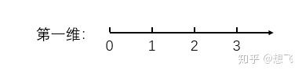
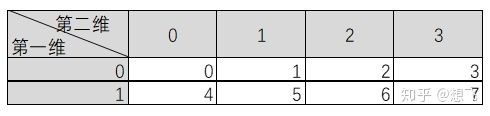

[TOC]

## [NumPy v1.19 Manual](https://numpy.org/doc/stable/index.html)

---
### NumPy - Index
NumPy 中的数组称为 N-dimensions array 或者 ndarray，即 NumPy 的数组是一种多维数组。[axis 的复数形式是 axes]

* 通过 `.ndim` 查看数组的**维度**，通过 `numpy.ndarray.ndim` 查看数组的**维度**。
* 通过 `.shape` 查看数组的**形状**，**形状**是指数组每个维度有多少个元素。
* 在 Interpreter 中 `print(a)` 和 `a`，两种方法的输出结果是不一样的。
    * `print(a)` 是给人类看得结果，显示的是数组的内部内容；
    * 直接敲 `a` 可以理解为是给计算机看的，显示的数组本身的内容。 






* Creating Arrays: NumPy 提供了一些初始化数组的方法：`np.ones()`, `np.zeros()`, and `random.random()`
* Array Arithmetic:
    * array & array
    * array & scalar
    * Aggregation (聚合)
        * In addition to `min`, `max`, and `sum`, you get all the greats like `mean` to get the average,
        `prod` to get the result of multiplying all the elements together, `std` to get standard deviation,
        and [plenty of others](https://jakevdp.github.io/PythonDataScienceHandbook/02.04-computation-on-arrays-aggregates.html).
* Creating Matrices: 可以传递一个 python 列表（多维列表）创建一个矩阵，也可以用初始化方法创建矩阵。
* Matrices Arithmetic:
    * 如果两个矩阵的**行列数相同**，我们可以使用运算符（+ - * /）对矩阵进行运算。NumPy 也是基于位置来进行操作
    * 这些运算符也可以在不同的行列数的矩阵上使用只要不同维度的矩阵是一个一维矩阵（例如，只有一行或一列），在这种形式上， NumPy 使用了 **broadcast** 规则来进行计算。
    * **Dot Product** `dot()`，线性代数中的矩阵乘法，i.e. `(m,n)x(n,l) => (m,l)`
    * Aggregation (聚合): 既可以对所有值进行聚合，也可以在指定维度上。
* Transposing and Reshaping (置换和变形)
    * `ndarray.reshape()`
* NumPy: Slice & Index
    * 我们也可以通过冒号分隔切片参数 `start:stop:step` 来进行切片操作
* 冒号 `:` 的解释
    * 如果只放置一个参数，如 `[2]`，将返回与该索引相对应的单个元素;
    * 如果为 `[2:]`，表示**从该索引开始以后的所有项**都将被提取。
    * 如果使用了两个参数，如 `[2:7]`，那么则提取两个索引(不包括停止索引)之间的项。
* 省略号 `...` 的解释
    * 切片还可以包括省略号 `...`，来使选择元组的长度与数组的维度相同。 如果在行位置使用省略号，它将返回包含行中元素的 ndarray。
* 可以借助切片 `:` 或 `...` 与**索引数组**组合:
    * 对于维数超过 3 的多维数组，还可以通过 `...` 来简化操作 
    ```python
    import numpy as np
    a = np.array([[1,2,3], [4,5,6],[7,8,9]])
    b = a[1:3, 1:3]
    c = a[1:3,[1,2]]
    d = a[...,1:]
    print(b)
    print(c)
    print(d)
  
    arr = np.arange(24).reshape((2, 3, 4))
    print(arr[1, ...])               # 等价于 arr[1, :, :]
    print(arr[..., 1])               # 等价于 arr[:, :, 1]
    ```
* 双冒号 `::`
    * `x[::2]`  # every other element
    * `x[1::2]` # every other element, starting at index 1
    * A potentially confusing case is when the `step` value is negative. In this case, the defaults for
    `start` and `stop` are swapped. This becomes a convenient way to reverse an array.
    * `x[::-1]` reverse array `x`.
* 布尔索引   
* 切片和索引的同异
    * 切片和索引都是访问多维数组中元素的方法，这是两者的共同点，不同之处有:
        1. 切片得到的是原多维数组的一个 视图(view) ，修改切片中的内容会导致原多维数组的内容也发生变化；
        2. 切片得到在多维数组中连续(或按特定步长连续)排列的值，而索引可以得到任意位置的值，自由度更大一些。   
             
      不考虑第一点的话，切片的操作是可以用索引操作来实现的，不过这没有必要就是了。 

References:
* [NumPy - Index](https://numpy.org/doc/stable/genindex.html)
* [A Visual Intro to NumPy and Data Representation](https://jalammar.github.io/visual-numpy/)
* [Numpy和数据展示的可视化介绍](http://www.junphy.com/wordpress/index.php/2019/10/24/visual-numpy/)
* [通过画图彻底理解 NumPy 数组的 dimensions (axes) 和 Index](https://zhuanlan.zhihu.com/p/37099920)
* [Aggregations: Min, Max, and Everything In Between](https://jakevdp.github.io/PythonDataScienceHandbook/02.04-computation-on-arrays-aggregates.html)
* [NumPy 切片和索引](https://www.runoob.com/numpy/numpy-ndexing-and-slicing.html)
* [NumPy 高级索引](https://www.runoob.com/numpy/numpy-advanced-indexing.html)
* [NumPy之四：高级索引和索引技巧](https://blog.csdn.net/wangwenzhi276/article/details/53436694)
* [Numpy 数组基础操作--索引、组合、分割、复制、遍历、转换、序列化（四）](https://blog.csdn.net/mokeding/article/details/17476979)
* [Numpy 笔记(二): 多维数组的切片(slicing)和索引(indexing)](https://www.zmonster.me/2016/03/09/numpy-slicing-and-indexing.html)
* [The Basics of NumPy Arrays](https://jakevdp.github.io/PythonDataScienceHandbook/02.02-the-basics-of-numpy-arrays.html)
* [The Basics of NumPy Arrays](https://jakevdp.github.io/PythonDataScienceHandbook/02.02-the-basics-of-numpy-arrays.html)

---
### Numpy - Copy
Copying array **means**, a new instance in created, and the contents of the original array is copied into this array.

While executing the functions, some of them return **a copy** of the input array, while some return the **view**.
When the contents are physically stored in another location, it is called **copy**. **copy** 提供了另一份同样的数据，和原样并不相互影响。
If on the other hand, a different view of the same memory content is provided, we call it as **view**. **view** 是以不同的视角，看 memory 中的同一个 object。

1. `b = a, c = a[:]`
    * `b = a`, i.e. no copy at all. 此时 `b` 和 `a` 虽是两个 reference，但是都指向同一个 object。
    此时对 `a` 或 `b` 进行操作，都会影响到另一个。**Any changes in either gets reflected in the other.**
    ```python
    a = np.arange(20).reshape(4, 5)
    id(a) == id(b)  # True
    a[0][0] = 10
    b[0][0] = 0
    ```
    * `b = a[:]`，是视图，本质上是一种切片操作(slicing)，所有的切片操作返回的都是试图。具体来说，`b = a[:]` 会创建一个
    新对象 `b` (id(b) != id(a))，但是 `b` 的数据完全来源于 `a`，和 `a` 保持完全一致。换句话说，**'b' 的数据完全由 `a` 保管，**两者之间的数据变化是一致的。
    ```python
    a = np.arange(20).reshape(4, 5)
    c = a[:]
    id(c) == id(a)  # False
    a[0][0] = 10
    c[0][0] = 0
    ```
    * `b = a` 和 `b = a[:]` 的差别就在于后者会创建新的对象，前者不会。两种方式都会使 `a` 和 `b` 相互影响。

2. `ndarray.view()`，也叫浅复制(**shallow copy**)
    * NumPy has `ndarray.view()` method which returns **a new array object** that looks at the same data of the original array.
    Unlink the no copy cases, change in dimensions of the new array doesn’t change dimensions of the original.
    `ndarray.view()` 会创建新的 object，虽然数据一致，但是并不是同一个 object，彼此存在影响。比如 `b = a.view()`，此时 `a` 和 `b`
    都看向 memory 中相同的数据，修改的 `b` 的 shape 不会影响 `a` 的 shape，但是修改 `b` 的数据的时候，会影响 `a` 中的数据。
    ```python
    a = np.arange(20).reshape(4,5)
    b.shape = 5, 4
    id(a) == id(b) # return False
    b[0][0] = 10
    a[0][0] = 0
    ``` 
    * **Slice of an array creates a view.** `b = a[:]`, `b = c[:, 1:3]` or `b = c[:, [0,2]]`
    ```python
    a = np.arange(20).reshape(4,5)
    c = a[:, 1:3]
    a[0][1] = 10
    c[0][0] = 1 
    ```
    * 以上 `b = a`, `b = a[:]` or `b = a.view()` 都没有重新创建 memory 中的数据。
    * **Copies** *owns* its own data, while **views** *does not own* the data.
        * Every NumPy array has the attribute `base` that returns `None` if the array owns the data.
        Otherview, the `base` attribute refers to the original object. 
        当 array object 有自己的数据的时候，它的 `base` 是 None；
        当 array object 只是一个 `view` 而没有自己独立的数据的时候，它的 `base` attribute 指向原本的 object。
        * The copy returns None.
        * The view returns the original array.
    ```python
    a = np.arange(20).reshape(4,5)
    x = a.copy()
    y = a.view()
    print(x.base)
    print(y.base)
    ```
3. `ndarray.copy()`
    * The `ndarray.copy()` function creates a **deep copy**. It is a complete copy of the array and its data,
    and does not share with the original array. 也就是说 **deep copy** 会创建一份新的、完全独立的数据，与原本 array 相互不影响。
    ```python
    a = np.arange(20).reshape(4,5)
    id(a) == id(b) # False
    a.shape = 5, 4
    a[0][1] = 10
    b[0][1] = -1
    ```
4. `np.copy()` 深拷贝
    * `numpy.copy()` 和 `numpy.ndarray().copy()` 有点差别，在于参数 `order`。

References:
* [Python之Numpy基础](https://zhuanlan.zhihu.com/p/32242331)
* [【Python】numpy 中的 copy 问题详解](https://blog.csdn.net/u010099080/article/details/59111207)
* [NumPy - Copies & Views](https://www.tutorialspoint.com/numpy/numpy_copies_and_views.htm)
* Old version Deep Copy: [How to copy data from a numpy array to another](https://stackoverflow.com/questions/6431973/how-to-copy-data-from-a-numpy-array-to-another)
* [The Difference Between Copy and View](https://www.w3schools.com/python/numpy_copy_vs_view.asp)
* [numpy.copy](https://numpy.org/doc/stable/reference/generated/numpy.copy.html)
* [numpy.ndarray.copy](https://numpy.org/doc/stable/reference/generated/numpy.ndarray.copy.html#numpy.ndarray.copy)
* [Difference between array.copy() vs numpy.copy(array)](https://stackoverflow.com/questions/56028405/difference-between-array-copy-vs-numpy-copyarray)
* [copy.copy()、copy.deepcopy()、np.copy()与python普通的等号的区别](http://blog.sina.com.cn/s/blog_154a715de0102zp86.html)


---
### NumPy - Trick
* [numpy.empty](https://numpy.org/doc/stable/reference/generated/numpy.empty.html)
* [Random sampling (numpy.random)](https://numpy.org/doc/stable/reference/random/index.html#module-numpy.random)
* `numpy.unuque()`
* `numpy.isnan()`
* `numpy.any()`, `numpy.all()`

* [Python Numpy之Nan和Inf处理](https://zhuanlan.zhihu.com/p/38712765)
    * `None` 是 python 中用于标识空缺数据
    * `Nan` 是 nunpy 和 pandas 中用于标识空缺数据
    * `None` 是一个 python 特殊的数据类型， 但是`NaN`却是用一个特殊的 float
* [100道练习带你玩转Numpy](https://zhuanlan.zhihu.com/p/76186124)
* [Numpy使用总结，日常够用了](https://zhuanlan.zhihu.com/p/111630396)
* [【python】详解numpy库与pandas库axis=0，axis= 1轴的用法](https://blog.csdn.net/brucewong0516/article/details/79030994)
    * `a.sum(axis=0)` 则第 0 轴会被消除掉。如果 `a.shape = [3, 4]`, 则 `a.sum(axis=0).shape=[4]`, `a.sum(axis=1).shape=[3]`.
* [python numpy中axis的含义](https://blog.csdn.net/yaoqi_isee/article/details/77714570)
    * 通常当我们在这些函数里面指定了axis=n时，那么函数输出的数组当中，原来的第n维就被消除了。
* [彻底理解numpy中的axis](https://blog.csdn.net/m0_37673307/article/details/82118030?utm_medium=distribute.pc_relevant_t0.none-task-blog-BlogCommendFromMachineLearnPai2-1.edu_weight&depth_1-utm_source=distribute.pc_relevant_t0.none-task-blog-BlogCommendFromMachineLearnPai2-1.edu_weight)
    * numpy是个多维数组，**多维数组运算需要指定到底对哪一维操作，因此axis就是用来指定需要操作的维数。** 
    * 对简单的二维数组，通过不同的axis，numpy会沿着不同的方向进行操作：如果不设置，那么对所有的元素操作；如果axis=0，则沿着纵轴进行操作；axis=1，则沿着横轴进行操作。
    * 可以总结为一句话：设axis=i，则numpy沿着第i个下标变化的方向进行操作。
    * **假设axis = i，则numpy沿着第 i 个下标变化的方向进行操作。**
    

---
### `np.mgrid` 用法
```python
np.mgrid[ 第1维，第2维 ，第3维 ， …] 
# dimention 1
a:b:c   # [a,b) with step = c
# dimention 2
a:b:cj  # [a,b] with c points
```
Example
```python
import numpy as np
a = np.mgrid[-2:5:2]
# array([-2,  0,  2,  4])
b = np.mgrid[-4:4:5j]
# array([-4., -2.,  0.,  2.,  4.])
```

Reference:
* [Python的 numpy中 meshgrid 和 mgrid 的区别和使用](https://www.cnblogs.com/shenxiaolin/p/8854197.html)        
* [Ref1](https://www.cnblogs.com/wanghui-garcia/p/10763103.html)  
 
---
* [numpy.histogram](https://numpy.org/doc/stable/reference/generated/numpy.histogram.html)
* [NumPy - Histogram Using Matplotlib](https://www.tutorialspoint.com/numpy/numpy_histogram_using_matplotlib.htm)
* []()
* []()
* []()
* []()
* []()
* []()
* []()
* []()
* []()
* []()
* []()
* []()
* []()
* []()
* []()
* []()
* []()
* []()
* []()


