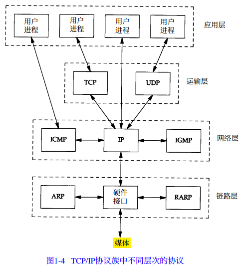
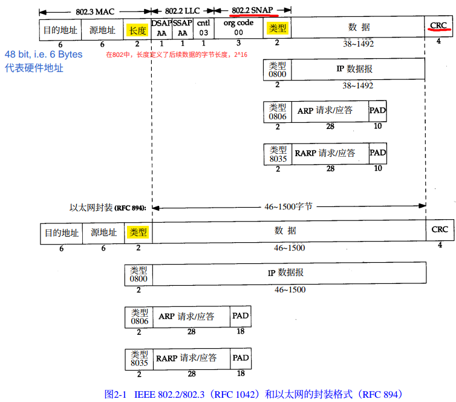
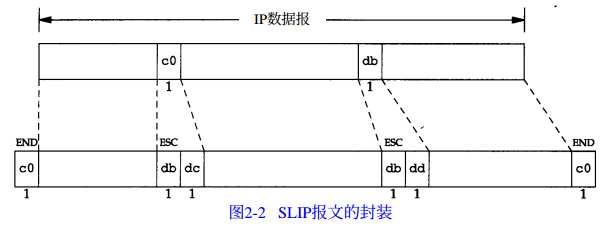
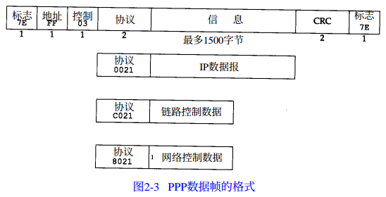

[TOC]

## Chap 02. 链路层

在 TCP/IP 协议族中，链路层主要有三个目的：

1. 为 IP 模块发送和接受 IP 数据报；
2. 为 ARP 模块发送 ARP 请求和接受 APR 应答；
3. 为 RARP 发送 RARP 请求和接收 RARP 应答。

TCP/IP 支持多种不同的链路层协议，这取决于网络所使用的硬件：

* 以太网链路层协议
* 两个串行口链路层协议

### 2.2 以太网和 IEEE 802 封装

**以太网**是当今 T C P / I P采用的主要的局域网技术。它采用一种称作 CSMA/CD 的媒体接入方法，其意思是带冲突检测的载波侦听多路接入(Carrier Sense, Multiple Access with Collision Detection) 。它的速率为10 Mb/s，地址为 48 bit。

802.3 标准定义了针对整个 CSMA/CD 网络。

* 以太网的 IP 数据报的封装是在 RFC 894 中定义；
* IEEE 802 网络的 IP 数据报封装是在 RFC 1042 中定义。

**RFC 894 封装** 与 **RFC 1042 封装**

* The up row is IEEE 802.2/802.3 (i.e. RFC 1042) 封装
* The low row is RFC 894 封装。

### 2.3 尾部封装

### 2.4 SLIP：串行线路 IP

SLIP (i.e. Serial Line IP)，是一种在串行线路上对 IP 数据报进行封装的简单形式，在 RFC 1055 中有详述。

SLIP 协议定义的帧格式：

1.  IP 数据报以一个称作 END(0xc0) 的特殊字符结束。
2. 如果 IP 数据报文中某个字符为 END，那么就要连续传输两个字节 0xdb 和 0xdc 来取代它。
3. 如果 IP 数据报文中某个字符为 SLIP 的 ESC 字符，那么就要连续传输两个字节 0xdb 和 0xdd 来取代它。

SLIP 是一种简单的帧封装方法，还有一些值得一提的缺陷：

1. 每一端必须知道对方的 IP 地址；
2. 数据帧中没有**类型**字段；
3. SLIP 没有在数据帧中加上检验和(类似于以太网中的 CRC 字段)

### 2.5 压缩的 SLIP

### 2.6 PPP：点对点协议

PPP，点对点协议修改了 SLIP 协议中的所有缺陷。 

1. 在串行链路上封装 IP 数据报的方法。PPP 既支持数据为 8位和无奇偶检验的异步模式（如大多数计算机上都普遍存在的串行接口） ，还支持面向比特的同步链接。
2. 建立、配置及测试数据链路的链路控制协议(LCP: Link Control Protocal) 。它允许通信双方进行协商，以确定不同的选项。
3.  针对不同网络层协议的网络控制协议(NCP: Network Control Protocol)体系。当前 RFC 定义的网络层有 IP, OSI 网络层, DECnet 以及 AppleTalk。例如， IP NCP 允许双方商定是否对报文首部进行压缩，类似于 CSLIP（缩写词 NCP 也可用在 TCP 的前面） 。

与 SLIP 类似，由于 PPP 经常用于低速的串行链路，因此减少每一帧的字节数可以降低应用程序的交互时延。

### 2.7 还回接口

* 大多数的产品都支持环回接口(Loopback Interface)，以允许运行在**同一台主机**上的**客户程序**和**服务器程序**通过 TCP/IP 进行通信。 A类网络号 127 就是为环回接口预留的。

* 根据惯例，大多数系统把 IP 地址 127.0.0.1 分配给这个接口，并命名为 localhost。

* 一个传给环回接口的 IP 数据报不能在任何网络上出现。

### 2.8 最大传输单元 MTU

### 2.9 路径 MTU

### 2.10串行线路吞吐量计算

### 2.11 小结

